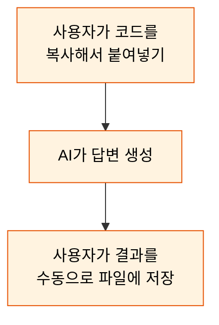
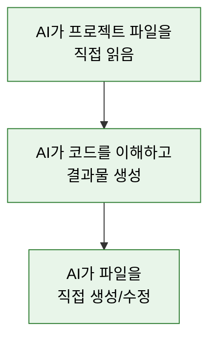
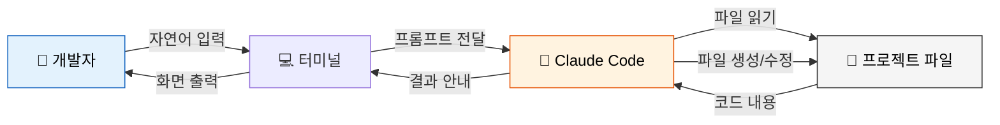
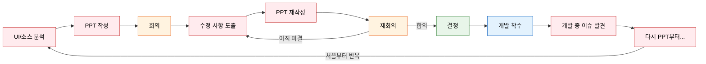
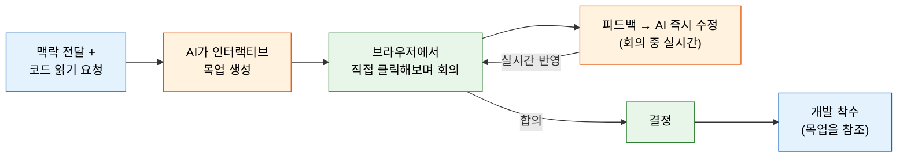
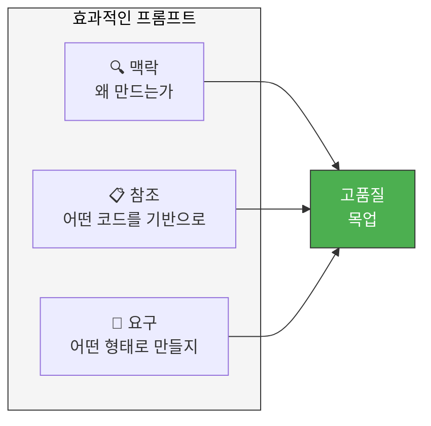
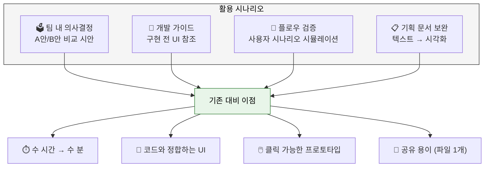

# Claude Code를 활용한 Interactive UI Mockup

## 1. 개요

이 문서는 Claude Code(AI CLI 도구)를 활용하여 **코드베이스 기반의 인터랙티브 UI 목업**을 제작하는 프로세스를 설명합니다.
기존 소스코드를 분석한 AI가, 도메인 지식이 반영된 단일 HTML 목업 파일을 생성하는 방법론입니다.

### 1.1 제작 결과물

| 파일 | 유형 | 내용 |
|------|------|------|
| `admin-oid4vp-mockup.html` | 관리 콘솔 | AS-IS/TO-BE 사이드바 비교, OID4VP Config 편집, DCQL Scope Mapping CRUD, Policy 등록 (5개 화면) |
| `aos-ca-wallet-mock.html` | 모바일 앱 | CA Wallet, DID 생성/VC 발급 플로우 시뮬레이션, 화면 전환 애니메이션 |
| `badge-sample.html` | 플로우 시안 | AS-IS/TO-BE 플로우 비교, Policy 선택 2가지 안(A/B), 프로토콜별 배지, QR 타이머 |

### 1.2 결과물의 특징

- **단일 파일** : HTML + CSS + JS 올인원, 외부 의존성 없음
- **인터랙티브** : 화면 전환, 모달, 타이머, 필터 등 실제 UX 시뮬레이션
- **도메인 정합** : 실제 API 경로, 데이터 모델명, 엔티티 구조가 코드와 일치
- **비교 시안** : AS-IS/TO-BE, A안/B안 등 의사결정용 시각 자료 포함

---

## 2. Claude Code란?

### 2.1 한줄 요약

**터미널(CLI)에서 자연어로 대화하면서 코드를 읽고, 쓰고, 실행할 수 있는 AI 개발 도구**입니다.

### 2.2 일반 AI 채팅과의 차이

<table>
<tr>
<td width="50%">

**일반 AI 채팅 (ChatGPT, Claude 웹)**



</td>
<td width="50%">

**Claude Code (CLI 도구)**



</td>
</tr>
</table>

| 구분 | 일반 AI 채팅 | Claude Code |
|------|-------------|-------------|
| 코드 접근 | 사용자가 복붙해야 함 | AI가 프로젝트 파일을 직접 읽음 |
| 파일 생성 | 답변을 복사해서 저장 | AI가 직접 파일 생성 |
| 프로젝트 이해 | 붙여넣은 코드만 이해 | 엔티티, API, 설정 파일 등 전체 구조 파악 가능 |
| 실행 | 불가 | 빌드, 테스트 등 터미널 명령 실행 가능 |
| 컨텍스트 | 대화 내용만 기억 | 프로젝트 파일 + 대화 내용 모두 활용 |

### 2.3 동작 방식 (간단 흐름)



---

## 3. 기존 프로세스 vs AI 활용 프로세스 비교

### 3.1 기존 토론 프로세스

개선안을 논의할 때, 기존에는 다음과 같은 프로세스를 반복합니다.



**문제점:**
- PPT는 정적 이미지라 실제 UX를 느끼기 어려움 → 회의에서 의견이 갈림
- PPT 수정 → 재회의 루프가 2~3회 이상 반복
- 결정 후 개발 중 "실제로 해보니 다르다" → 다시 처음부터
- **PPT 작성 자체에 수 시간~수 일 소요**

### 3.2 AI 활용 프로세스



**개선점:**
- PPT 대신 **클릭 가능한 목업**으로 회의 → 체감 기반 의사결정
- 회의 중 수정 요청 → **AI가 실시간 반영** → 같은 자리에서 재확인
- PPT 재작성 루프 제거 → **의사결정 속도 대폭 단축**
- 목업이 코드 기반이므로 개발 시 "실제와 다르다" 문제 감소

### 3.3 비교 요약

| 항목 | 기존 프로세스 | AI 활용 프로세스 |
|------|-------------|-----------------|
| 시각 자료 제작 | PPT 수작업 (수 시간) | AI 생성 (수 분) |
| 자료 형태 | 정적 이미지/슬라이드 | 인터랙티브 HTML |
| 수정 반영 | PPT 재작성 → 재회의 | 회의 중 실시간 수정 |
| 의사결정 루프 | 2~3회 반복 | 1회에 수렴 가능 |
| 개발 시 괴리 | 높음 (PPT ≠ 실제 UI) | 낮음 (코드 기반 목업) |
| 총 소요 시간 | 수 일 | 수 시간 이내 |

---

## 4. 실제로 이렇게 만들었습니다

아래는 `badge-sample.html`(VP 제출 플로우 시안)이 만들어지는 과정을 재현한 대화 흐름입니다.
AI에게 **어떤 말을 해야** 원하는 결과물이 나오는지에 집중해서 읽어주세요.

### 4.1 1단계: 기존 코드를 읽혀서 현황 파악

> 첫 대화에서 가장 중요한 것은 **AI에게 기존 코드를 읽히는 것**입니다.
> 이것이 일반 AI 채팅과의 핵심 차이점입니다.

```
👤 사람:
  데모 서버의 VP 제출 플로우를 개선하려고 해.
  기존 플로우가 어떻게 되어있는지 먼저 파악해줘.
  이 파일들 읽어봐:
  - did-demo-server/.../templates/qrPush.html
  - did-demo-server/.../DemoController.java

🤖 AI:
  [qrPush.html 읽기]
  [DemoController.java 읽기]

  기존 플로우를 분석했습니다:
  1. 프로토콜 탭 선택 (VP / ZKP)
  2. [Search] 버튼 클릭
  3. API 호출하여 Policy 목록 조회
  4. Policy 선택 팝업
  5. [Select] 클릭하여 Policy 저장 API 호출
  6. [Submit your ID] 클릭
  7. QR 코드 생성 팝업
  총 7단계입니다.
```

### 4.2 2단계: 개선 방향을 함께 논의

> AI가 코드를 이해한 상태이므로, **도메인 맥락을 공유하며 방향을 논의**할 수 있습니다.

```
👤 사람:
  너무 단계가 많아. OID4VP 프로토콜도 추가되면 탭이 3개가 되는데,
  이걸 간소화하고 싶어. 어떻게 하면 좋을까?

🤖 AI:
  두 가지 안을 제안합니다:

  A안 - 전체 목록 + 배지:
    탭 없이 모든 Policy를 한 목록에 보여주고,
    프로토콜 종류를 배지(DID VP, OID4VP, mDL)로 구분

  B안 - 필터 칩 + 배지:
    상단에 프로토콜 필터 칩을 두고,
    클릭하면 해당 프로토콜 Policy만 표시

  두 안 모두 플로우가 3단계로 줄어듭니다:
  [Submit your ID] → Policy 선택 → QR 생성
```

### 4.3 3단계: 목업 생성 요청

> 방향이 정해지면 **구체적인 요구사항과 참조 대상**을 함께 전달합니다.
> 이때 3가지를 포함하면 품질이 높아집니다: **맥락**(왜 만드는가), **참조**(어떤 코드 기반), **요구**(어떤 형태로).

```
👤 사람:
  좋아. 두 안을 비교할 수 있는 인터랙티브 HTML 목업 만들어줘.
  AS-IS / TO-BE 플로우 비교도 같이 넣어줘.
  기존 qrPush.html 스타일 참고하고.

🤖 AI:
  badge-sample.html을 생성했습니다.
  브라우저에서 열어보세요.
  - 상단: AS-IS(7단계) vs TO-BE(3단계) 플로우 비교
  - 중단: A안 데모 (Submit your ID → 전체 목록 팝업 → QR)
  - 하단: B안 데모 (Submit your ID → 필터 칩 팝업 → QR)
  - QR 팝업에 3분 카운트다운 타이머 포함
```

### 4.4 4단계: 브라우저에서 확인 → 피드백 → 즉시 수정

> 결과물을 확인하고 **구체적인 수정 요청**을 하면 AI가 바로 반영합니다.
> 이 루프를 2~3회 반복하면 90% 이상 완성도에 도달합니다.

```
👤 사람:
  QR 팝업에 어떤 프로토콜인지 표시해줘.
  그리고 프로토콜별로 실제 플로우가 다르잖아.
  DID VP는 Profile → VP Submit이고,
  OID4VP는 Authorization Request → VP Token이니까
  그 차이도 팝업에 보여줘.

🤖 AI:
  수정했습니다.
  - QR 팝업에 프로토콜 배지 추가 (선택한 Policy에 따라 자동 변경)
  - 프로토콜별 플로우 안내 텍스트 추가:
    DID VP: "① Profile → ② VP Submit (E2E) → ③ Confirm"
    OID4VP: "① Authorization Request → ② VP Token → ③ Verify"
```

### 4.5 프롬프트 작성 TIP: 3요소

위 대화에서 사용한 프롬프트를 분석하면, 효과적인 요청에는 3가지 요소가 있습니다.



### 4.6 더 많은 프롬프트 예시

<details>
<summary><b>예시 A: 관리 콘솔 목업</b> (클릭하여 펼치기)</summary>

```
[맥락]
OID4VP 프로토콜을 기존 Verifier 관리 콘솔에 통합하려고 해.
현재 관리 콘솔은 React(MUI + Toolpad)로 되어있는데,
새로 추가될 OID4VP 관련 메뉴와 화면을 팀에 공유할 목업이 필요해.

[참조 대상 - AI에게 읽히는 코드]
- 기존 사이드바 메뉴 구조: source/did-verifier-admin/frontend/src/
- OID4VP 설정 엔티티: Oid4vpConfig.java, DcqlScopeMapping.java
- SDK 설정 구조: OID4VPConfig.java (baseUrl, clientId, endpoints 등)
- 기존 Policy 엔티티: Policy.java

[요구하는 결과물]
단일 HTML 파일로 다음 화면들을 만들어줘:
1. AS-IS / TO-BE 사이드바 메뉴 구조 비교
2. OID4VP Config 편집 화면 (SDK 설정 필드 기반)
3. DCQL Scope Mapping 목록/등록 화면
4. OID4VP Policy 등록 화면
- 상단에 화면 전환 탭 넣어줘
- 기존 관리 콘솔의 다크 사이드바 스타일 유지
```

</details>

<details>
<summary><b>예시 B: 모바일 앱 목업</b> (클릭하여 펼치기)</summary>

```
[맥락]
OID4VP 프로토콜을 지원하는 AOS 월렛 앱의 VP 제출 플로우를
시뮬레이션하는 목업이 필요해.
기존 DID VP 방식과 OID4VP 방식의 차이를 보여줘야 해.

[참조 대상]
- 기존 Demo 앱 화면: did-demo-server/src/main/resources/templates/qrPush.html
- OID4VP SDK 플로우: InitiationService.java (Authorization Request 생성)
- AuthorizationService.java (VP Token 처리)
- 기존 월렛 앱의 색상/스타일 참고

[요구하는 결과물]
모바일 폰 프레임 안에 다음 플로우를 시뮬레이션해줘:
1. 메인 화면 (Credential 카드 표시)
2. QR 스캔 → Authorization Request 수신
3. VP 제출 동의 화면
4. 제출 완료 화면
- 각 화면 전환은 버튼 클릭으로
- DeepLink, CredentialManager API 진입도 보여줘
```

</details>

<details>
<summary><b>예시 C: 플로우 비교 시안</b> (클릭하여 펼치기)</summary>

```
[맥락]
데모 서버의 VP 제출 플로우를 간소화하려고 해.
기존 플로우(AS-IS)와 개선안(TO-BE) 두 가지를 비교하는 시안이 필요해.
여러 프로토콜(DID VP, OID4VP, mDL)을 하나의 UI로 통합해야 해.

[참조 대상]
- 기존 데모 서버 플로우: qrPush.html (Search → Policy 선택 → QR 생성)
- 통합 API 설계: POST /v2/initiate (policyId 기반)
- 프로토콜 종류: DID_VP, OID4VP, mDL

[요구하는 결과물]
1. AS-IS / TO-BE 플로우 단계 비교 다이어그램
2. TO-BE A안: 전체 Policy 목록에 프로토콜 배지 표시
3. TO-BE B안: 프로토콜별 필터 칩 + 배지
4. Policy 선택 → QR 팝업 전환 (인터랙티브)
- 두 안을 같은 페이지에서 비교할 수 있게
```

</details>

---

## 5. 활용 시나리오



---

## 6. 시작하기

### 6.1 준비물

| 항목 | 설명 |
|------|------|
| Claude Code 설치 | `npm install -g @anthropic-ai/claude-code` |
| 프로젝트 디렉토리 | 목업의 기반이 될 소스코드가 있는 프로젝트 |
| 터미널 | macOS Terminal, iTerm2, VS Code 터미널 등 |

### 6.2 첫 번째 목업 만들어보기

```bash
# 1. 프로젝트 디렉토리로 이동
cd ~/workspace/my-project

# 2. Claude Code 실행
claude

# 3. 아래와 같이 자연어로 요청
```

첫 프롬프트 예시 (복사해서 사용 가능):

```
우리 프로젝트의 관리자 화면 목업을 만들고 싶어.

먼저 이 파일들을 읽어봐:
- src/main/java/.../.../domain/User.java
- src/main/java/.../.../domain/Order.java
- src/main/resources/templates/admin.html

읽은 내용을 기반으로, 단일 HTML 파일로 관리자 대시보드 목업을 만들어줘.
- User 목록 테이블
- Order 상태별 통계 카드
- 기존 admin.html의 스타일 참고
```

### 6.3 기대할 수 있는 결과


- 첫 결과물: 70~80% 완성도 (구조와 기본 스타일)
- 피드백 2~3회 후: 90% 이상 (세부 스타일, 인터랙션, 데이터 정합)
- Figma나 직접 코딩 대비 **5~10배 빠른 속도**
