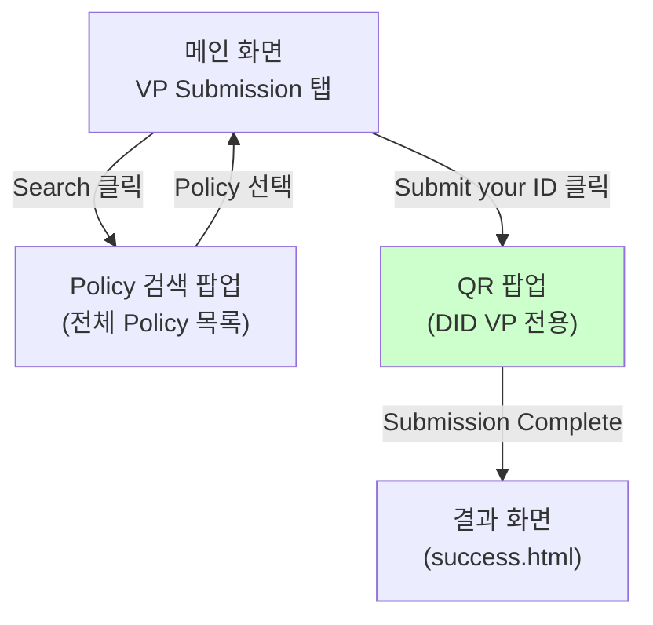
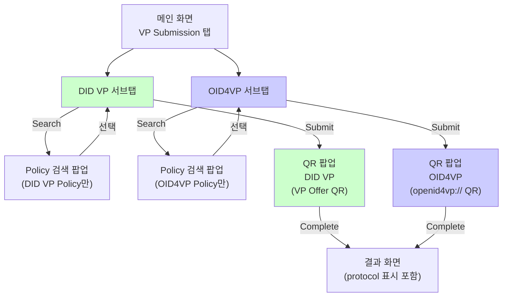
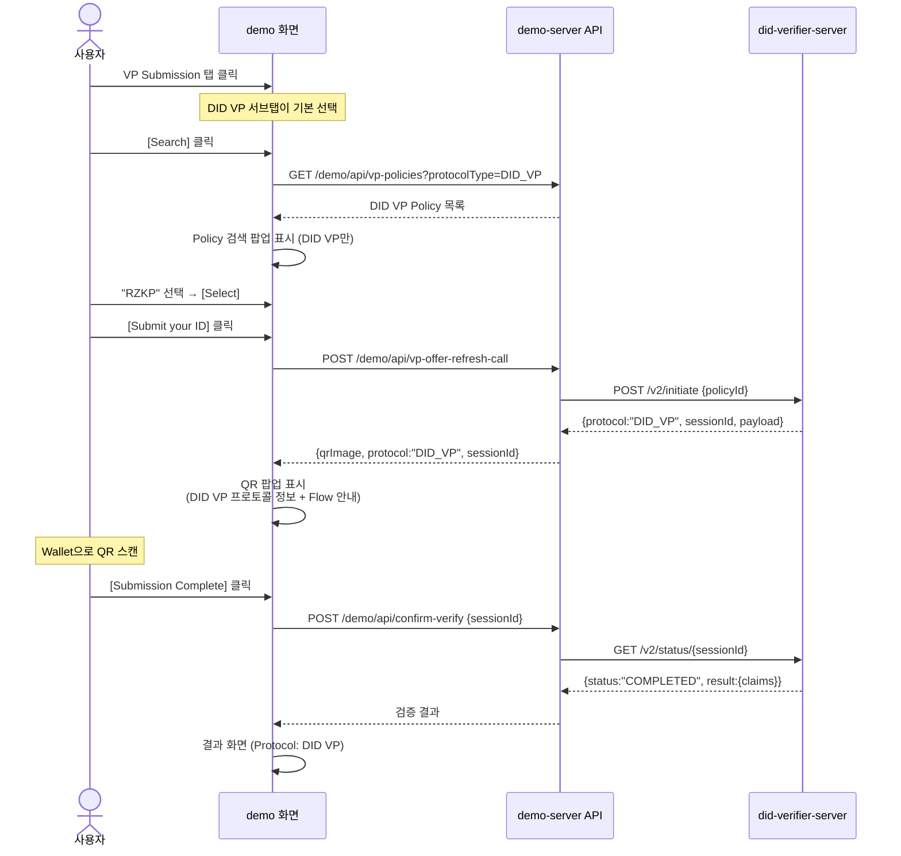
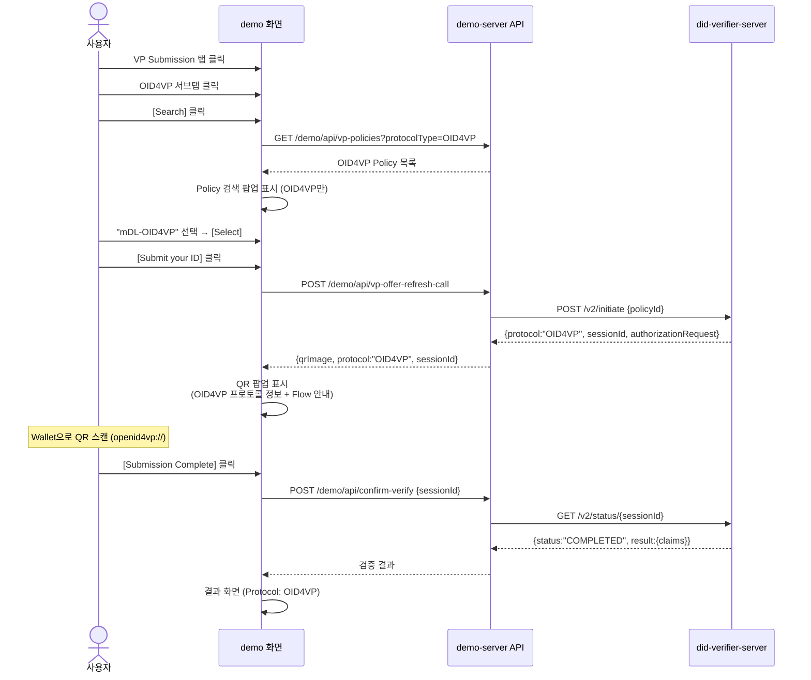

# Demo Server UI 설계 — 방안 C: 프로토콜 탭 분리

> **목적**: VP Submission 화면에서 DID VP / OID4VP 프로토콜을 탭으로 구분하여 표시
> **기반**: 현행 demo-server UI (Vanilla JS + Thymeleaf)
> **작성일**: 2026-03-11

---

## 1. 현행 화면 구조 (AS-IS)

### 메인 화면 — VP Submission 탭

```
┌─────────────────────────────────────────────────────────┐
│                    OpenDID Demo                          │
├────────────┬────────────┬──────────┬───────────────┬────┤
│VC Issuance │VP Submission│Enter Info│Server Settings│    │
├────────────┴────────────┴──────────┴───────────────┴────┤
│                                                          │
│                                                          │
│  VP Policy *                                             │
│  ┌──────────────────────────────────┐                    │
│  │ RZKP                      [Search]│                   │
│  └──────────────────────────────────┘                    │
│                                                          │
│                                                          │
│           ┌─────────────────────┐                        │
│           │   Submit your ID    │                        │
│           └─────────────────────┘                        │
│                                                          │
│                                                          │
└──────────────────────────────────────────────────────────┘
```

### Policy 검색 팝업 (AS-IS)

```
┌──────────────────────────────────┐
│        Select VP Policy          │
│                                  │
│  [Search VP policy...       ]    │
│                                  │
│  ┌────────────────────────────┐  │
│  │ ○  RZKP                   │  │
│  │ ○  SDk2Poli               │  │
│  │ ○  SDKpolicy              │  │
│  └────────────────────────────┘  │
│                                  │
│     [Cancel]      [Select]       │
└──────────────────────────────────┘
```

### QR 팝업 (AS-IS)

```
┌──────────────────────────────────┐
│       Submit a certificate       │
│                                  │
│         ┌──────────┐             │
│         │          │             │
│         │ QR Code  │             │
│         │          │             │
│         └──────────┘             │
│           04:30                  │
│         [  Renew  ]             │
│                                  │
│                                  │
│   [ Close ]  [ Submission Complete ] │
└──────────────────────────────────┘
```

---

## 2. 목표 화면 구조 (TO-BE)

### 메인 화면 — VP Submission 탭 + 프로토콜 서브탭

```
┌─────────────────────────────────────────────────────────┐
│                     OpenDID Demo                         │
├────────────┬─────────────┬──────────┬──────────────┬────┤
│VC Issuance │VP Submission │Enter Info│Server Settings│   │
├────────────┴─────────────┴──────────┴──────────────┴────┤
│                                                          │
│  ┌──────────┐ ┌──────────┐                               │
│  │▶ DID VP  │ │  OID4VP  │                               │
│  └──────────┘ └──────────┘                               │
│  ════════════════════════                                │
│                                                          │
│  ┌────────────────────────────────────────────────────┐  │
│  │                                                    │  │
│  │  VP Policy *                                       │  │
│  │  ┌──────────────────────────────────┐              │  │
│  │  │ RZKP                      [Search]│             │  │
│  │  └──────────────────────────────────┘              │  │
│  │                                                    │  │
│  │  DID VP 프로토콜                                    │  │
│  │  4단계 검증: Profile → Verify → Confirm             │  │
│  │  E2E 암호화 적용                                    │  │
│  │                                                    │  │
│  │           ┌─────────────────────┐                  │  │
│  │           │   Submit your ID    │                  │  │
│  │           └─────────────────────┘                  │  │
│  │                                                    │  │
│  └────────────────────────────────────────────────────┘  │
│                                                          │
└──────────────────────────────────────────────────────────┘
```

### OID4VP 서브탭 선택 시

```
┌─────────────────────────────────────────────────────────┐
│                     OpenDID Demo                         │
├────────────┬─────────────┬──────────┬──────────────┬────┤
│VC Issuance │VP Submission │Enter Info│Server Settings│   │
├────────────┴─────────────┴──────────┴──────────────┴────┤
│                                                          │
│  ┌──────────┐ ┌──────────┐                               │
│  │  DID VP  │ │▶ OID4VP  │                               │
│  └──────────┘ └──────────┘                               │
│  ════════════════════════                                │
│                                                          │
│  ┌────────────────────────────────────────────────────┐  │
│  │                                                    │  │
│  │  VP Policy *                                       │  │
│  │  ┌──────────────────────────────────┐              │  │
│  │  │ mDL-OID4VP                [Search]│             │  │
│  │  └──────────────────────────────────┘              │  │
│  │                                                    │  │
│  │  OID4VP 프로토콜                                    │  │
│  │  2단계 검증: Authorization Request → VP Token       │  │
│  │  JWT 서명 기반                                      │  │
│  │                                                    │  │
│  │           ┌─────────────────────┐                  │  │
│  │           │   Submit your ID    │                  │  │
│  │           └─────────────────────┘                  │  │
│  │                                                    │  │
│  └────────────────────────────────────────────────────┘  │
│                                                          │
└──────────────────────────────────────────────────────────┘
```

---

### Policy 검색 팝업 (TO-BE) — DID VP 탭에서 호출 시

```
┌──────────────────────────────────┐
│     Select VP Policy (DID VP)    │
│                                  │
│  [Search VP policy...       ]    │
│                                  │
│  ┌────────────────────────────┐  │
│  │ ○  RZKP          [DID VP] │  │
│  │ ○  SDk2Poli      [DID VP] │  │
│  │ ○  SDKpolicy     [DID VP] │  │
│  └────────────────────────────┘  │
│                                  │
│     [Cancel]      [Select]       │
└──────────────────────────────────┘
```

### Policy 검색 팝업 (TO-BE) — OID4VP 탭에서 호출 시

```
┌──────────────────────────────────┐
│    Select VP Policy (OID4VP)     │
│                                  │
│  [Search VP policy...       ]    │
│                                  │
│  ┌────────────────────────────┐  │
│  │ ○  mDL-OID4VP    [OID4VP] │  │
│  │ ○  National-ID   [OID4VP] │  │
│  └────────────────────────────┘  │
│                                  │
│     [Cancel]      [Select]       │
└──────────────────────────────────┘
```

> 서브탭에 따라 해당 protocolType의 Policy만 필터링하여 표시

---

### QR 팝업 — DID VP (TO-BE)

```
┌──────────────────────────────────────┐
│        Submit a certificate          │
│                                      │
│  Policy:    RZKP                     │
│  Protocol:  DID VP                   │
│  ──────────────────────────          │
│                                      │
│           ┌──────────┐               │
│           │          │               │
│           │ QR Code  │               │
│           │ (VP Offer│               │
│           │  Payload)│               │
│           └──────────┘               │
│             04:30                    │
│           [  Renew  ]               │
│                                      │
│  ┌────────────────────────────────┐  │
│  │ Flow                           │  │
│  │  ① Profile 요청                │  │
│  │  ② VP 제출 (E2E 암호화)        │  │
│  │  ③ 검증 확인                   │  │
│  └────────────────────────────────┘  │
│                                      │
│   [ Close ]  [ Submission Complete ] │
└──────────────────────────────────────┘
```

### QR 팝업 — OID4VP (TO-BE)

```
┌──────────────────────────────────────┐
│        Submit a certificate          │
│                                      │
│  Policy:    mDL-OID4VP               │
│  Protocol:  OID4VP                   │
│  ──────────────────────────          │
│                                      │
│           ┌──────────┐               │
│           │          │               │
│           │ QR Code  │               │
│           │(openid4vp│               │
│           │ ://...   │               │
│           └──────────┘               │
│             04:30                    │
│           [  Renew  ]               │
│                                      │
│  ┌────────────────────────────────┐  │
│  │ Flow                           │  │
│  │  ① Authorization Request 수신  │  │
│  │  ② VP Token 제출               │  │
│  └────────────────────────────────┘  │
│                                      │
│   [ Close ]  [ Submission Complete ] │
└──────────────────────────────────────┘
```

---

### 결과 화면 (TO-BE) — 프로토콜 표시 추가

```
┌──────────────────────────────────────┐
│                                      │
│            ✅ 검증 성공               │
│                                      │
│  ┌────────────────────────────────┐  │
│  │ Protocol │ DID VP              │  │
│  ├──────────┼─────────────────────┤  │
│  │ Policy   │ RZKP                │  │
│  ├──────────┼─────────────────────┤  │
│  │ VC       │ NationalID          │  │
│  ├──────────┼─────────────────────┤  │
│  │ Issuer   │ did:omn:issuer001   │  │
│  ├──────────┼─────────────────────┤  │
│  │ Name     │ 홍길동               │  │
│  ├──────────┼─────────────────────┤  │
│  │ Birth    │ 1990-01-01          │  │
│  └──────────┴─────────────────────┘  │
│                                      │
│           [  Go Home  ]              │
│                                      │
└──────────────────────────────────────┘
```

---

## 3. 화면 전환 흐름

### AS-IS 흐름



### TO-BE 흐름



---

## 4. 사용자 시나리오

### 시나리오 A: DID VP 검증



### 시나리오 B: OID4VP 검증



---

## 5. 데이터 변경

### config.json (TO-BE)

```json
{
  "vpPolicies": [
    {
      "policyId": "a2b330a8-b60e-4df0-9efc-bf8131a16153",
      "policyTitle": "RZKP",
      "protocolType": "DID_VP"
    },
    {
      "policyId": "e0a08911-9677-4792-a156-385b1f838721",
      "policyTitle": "SDk2Poli",
      "protocolType": "DID_VP"
    },
    {
      "policyId": "f3c21b44-8a92-4e17-b3d1-9c5a8e7f1234",
      "policyTitle": "mDL-OID4VP",
      "protocolType": "OID4VP"
    },
    {
      "policyId": "d7e45c89-1f56-4abc-9012-3d4e5f678901",
      "policyTitle": "National-ID",
      "protocolType": "OID4VP"
    }
  ],
  "currentVpPolicy": "a2b330a8-b60e-4df0-9efc-bf8131a16153"
}
```

### Verifier 응답 Policy DTO (TO-BE)

```json
// GET /admin/v1/policies/all
[
  {
    "policyId": "a2b330a8-...",
    "policyTitle": "RZKP",
    "protocolType": "DID_VP"
  },
  {
    "policyId": "f3c21b44-...",
    "policyTitle": "mDL-OID4VP",
    "protocolType": "OID4VP"
  }
]
```

---

## 6. 구현 변경 범위

### demo-server 프론트엔드

| 파일 | 변경 내용 |
|------|---------|
| **index.html** | VP Submission 영역에 DID VP / OID4VP 서브탭 HTML 추가 |
| **index.js** `searchVpPolicy()` | 현재 서브탭의 protocolType으로 Policy 필터링 |
| **index.js** `refreshImage()` | initiate 응답의 protocol에 따라 QR 팝업 내용 분기 |
| **index.js** (신규) | `switchProtocolTab(type)` — 서브탭 전환 + Policy 입력 초기화 |
| **vpPopup.html** | Policy명, Protocol 타입, Flow 안내 영역 추가 |
| **success.html** | Protocol 행 추가 |
| **index.css** | 서브탭 스타일 (`.protocol-tab`, `.protocol-tab.active`) |

### demo-server 백엔드

| 파일 | 변경 내용 |
|------|---------|
| **VerifierFeign.java** | `initiate(policyId)` 메서드 추가 |
| **DemoServiceImpl.java** | `initiateVerification()` — /v2/initiate 호출, protocol 분기 QR 생성 |
| **ConfigController.java** | `GET /demo/api/vp-policies` — protocolType 쿼리 파라미터 필터 지원 |
| **ConfigService.java** | `getVpPoliciesByProtocol(type)` — protocolType 필터 메서드 |
| **config.json** | vpPolicies 항목에 `protocolType` 필드 추가 |

---

## 7. 서브탭 상태 관리

```javascript
// index.js — 신규 추가

const ProtocolTab = {
    current: 'DID_VP',  // 기본값

    switch(type) {
        this.current = type;

        // 탭 UI 전환
        document.querySelectorAll('.protocol-tab').forEach(tab => {
            tab.classList.toggle('active', tab.dataset.protocol === type);
        });

        // Policy 입력 초기화
        document.getElementById('vpPolicySubmission').value = '';
        document.getElementById('vpPolicySubmission').removeAttribute('data-id');

        // 프로토콜별 안내 텍스트 전환
        const info = document.getElementById('protocolInfo');
        if (type === 'DID_VP') {
            info.textContent = '4단계 검증: Profile → Verify → Confirm / E2E 암호화 적용';
        } else {
            info.textContent = '2단계 검증: Authorization Request → VP Token / JWT 서명 기반';
        }
    },

    getCurrent() {
        return this.current;
    }
};
```

```html
<!-- index.html — VP Submission 영역에 추가 -->

<div class="protocol-tabs">
    <button class="protocol-tab active" data-protocol="DID_VP"
            onclick="ProtocolTab.switch('DID_VP')">
        DID VP
    </button>
    <button class="protocol-tab" data-protocol="OID4VP"
            onclick="ProtocolTab.switch('OID4VP')">
        OID4VP
    </button>
</div>
<p id="protocolInfo" class="protocol-description">
    4단계 검증: Profile → Verify → Confirm / E2E 암호화 적용
</p>
```

```css
/* index.css — 서브탭 스타일 */

.protocol-tabs {
    display: flex;
    gap: 0;
    margin-bottom: 16px;
}

.protocol-tab {
    padding: 8px 20px;
    border: 1px solid #ddd;
    background: #f5f5f5;
    cursor: pointer;
    font-size: 14px;
    transition: all 0.2s;
}

.protocol-tab:first-child {
    border-radius: 6px 0 0 6px;
}

.protocol-tab:last-child {
    border-radius: 0 6px 6px 0;
}

.protocol-tab.active {
    background: #2F325E;
    color: #fff;
    border-color: #2F325E;
}

.protocol-description {
    font-size: 12px;
    color: #888;
    margin-bottom: 12px;
}
```

---

**문서 버전**: 1.0
**최종 업데이트**: 2026-03-11
