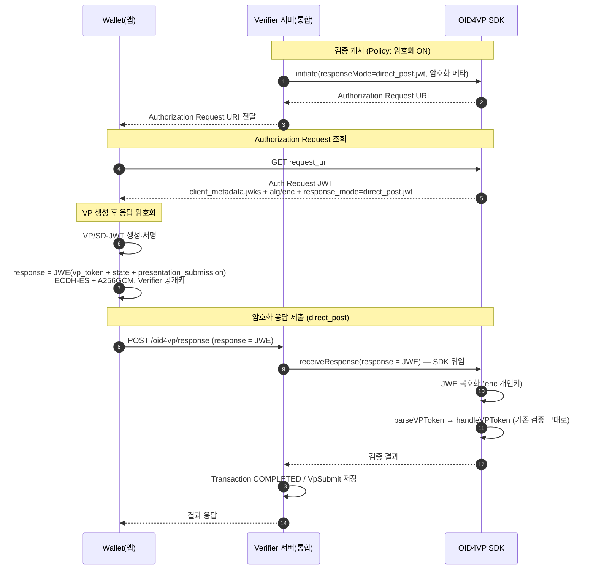

# OID4VP 응답 E2E 암호화 (JWE) — 설계 (결정 반영본)

> **상태**: 설계 확정 (논의 5건 + 트랙 결정 완료) · **적용 범위**: **비-mdoc(SD-JWT / JSON-VP) 우선**. **mdoc + JWE는 후속(deferred)** — JWE 암호화 인프라는 전부 공유하고, mdoc 전용 `apu`/SessionTranscript 연동만 §12에서 나중에 얹는다(재설계 아님). · **다음 단계**: 구현 (Wallet 측 구현 합의 병행)
> **전제**: SDK(`did-oid4vp-sdk-server`) **수정 가능**(원본 소스 보유, 디컴파일 아님). JWE 복호화·`direct_post.jwt` 등 **논리상 SDK가 담당해야 하는 변경은 SDK에서 직접** 처리한다 → **트랙 A 확정**(§11). 메인 앱 우회(트랙 B)는 부적합으로 폐기.
> **목적**: OID4VP 흐름에서 Wallet → Verifier 로 제출되는 VP 응답을 **전송 구간에서 암호화(JWE)** 하기 위한
> 설계. 데이터/흐름의 **AS-IS → TO-BE**, 컴포넌트별 책임 분배, **구간별 개발 범위·가능성 판단**(§10–§11)을 정의한다.
>
> **실측 반영(2026-06-26)**: 실제 SDK 패키지는 `org.omnione.did.oid4vc.oid4vp`(문서 초안의 `org.omnione.did.oid4vp` 아님). `nimbus-jose-jwt:9.37.4`·`bcpkix-jdk18on:1.80`이 SDK에 **이미 의존성으로 존재**. `clientMetadata` 주입(deepMerge) 경로가 **이미 열려 있어** jwks/enc 노출은 SDK 무수정으로 가능. 기존 `VPTokenEncryptor`는 **대칭키(AES-GCM) 세션 저장용**으로 본 설계의 비대칭 전송 JWE와 무관.

---

## 1. 배경 / 문제 정의

- 기존 **OpenDID VP**: Holder가 ECDH(Secp256r1)+AES-256-CBC로 VP를 암호화해 `encVp`로 제출 → **페이로드 기밀성 있음**.
- 현재 **OID4VP**: `response_mode = direct_post` 로 `vp_token`이 **평문(form-urlencoded)** 전송.
  - SD-JWT는 `issuerJwt~disclosure~...~kbJwt` 형태로 **서명만 되고 암호화는 안 됨** → claim(PII) 평문 노출.
  - TLS 종단 이후(로그/리버스 프록시/response_uri 노출 등) 노출 위험 → OpenDID `encVp` 대비 **기밀성 공백**.

> **설계 목표**: OID4VP 표준 메커니즘(`direct_post.jwt` + JWE)으로 OpenDID `encVp` 수준의 전송 기밀성을 확보한다.
> 검증 로직·기존 평문 경로는 건드리지 않고, **암호화 레이어만 앞단에 추가**한다.

---

## 2. 설계 개념 (AS-IS → TO-BE 한눈에)

```
[AS-IS]
  Wallet ──(vp_token 평문 + state + presentation_submission, direct_post)──▶ Verifier
                                                                              └─ 검증(handleVPToken)

[TO-BE]
  Verifier ──(Authorization Request: client_metadata.jwks + alg/enc, response_mode=direct_post.jwt)──▶ Wallet
  Wallet ──(response = JWE{ vp_token + state + presentation_submission }, direct_post)──▶ Verifier
                                                                  └─ JWE 복호화 ─▶ 기존 검증(handleVPToken)
```

- **암호화 대상**: 개별 SD-JWT가 아니라 **Authorization Response 객체 전체**(`vp_token` + `presentation_submission` + `state`).
- **방식**: Wallet이 Verifier 공개키로 JWE 암호화 → `response` **단일 파라미터**로 `direct_post` 전송.
- **권장 알고리즘**: 키 합의 `ECDH-ES`(또는 `ECDH-ES+A256KW`), 콘텐츠 `A256GCM`, enc 키 EC P-256. (비대칭)

### 2.1 시퀀스 (TO-BE)



> 회색 박스(SDK 내부)가 JWE 복호화~검증을 모두 캡슐화한다. 서버는 `response`(JWE)를 받아 **그대로 SDK에 위임**할 뿐, JWE를 직접 풀지 않는다.

---

## 3. 책임 분배 (Responsibility)

> 원칙: **JOSE/JWE의 모든 책임은 SDK에 캡슐화**한다. 서버는 "언제/어떤 정책으로 암호화할지"와 라우팅만 담당한다.
> (서버가 직접 JWE를 풀면 SDK 경계 누수 → 과거 통합 버그 패턴. 이를 피하는 것이 본 설계의 핵심.)

| 구분 | 책임 | 비고 |
|---|---|---|
| **Wallet (앱)** | Authorization Request의 jwks/alg/enc로 **응답 객체를 JWE 암호화**해 전송 | 외부 주체, 합의 필요 |
| **SDK** | ① `direct_post.jwt` 수용 ② `client_metadata`에 enc jwks/alg/enc **노출** ③ 수신 `response`(JWE) **복호화** ④ 복호화 결과를 **기존 검증 경로(`parseVPToken`/`handleVPToken`)에 투입** | **JWE 전 구간 캡슐화** |
| **Verifier 서버 (통합)** | ① 전체 OID4VP 일괄 암호화(#3 결정) ② SDK initiate에 `responseMode`/암호화 메타 전달 ③ Controller에서 `response`(JWE) **수신 → 복호화 위임** ④ Transaction/VpSubmit 매핑(기존) | 오케스트레이션 |
| **enc 키 소유** | **결정됨(B안, §5.3)** — Verifier 서버가 **file wallet**에 enc 키쌍 보관, 복호화 시 개인키 주입. 기존 OpenDID `encVp`의 file wallet 패턴과 동일. | #2·#5 결정 |

---

## 4. 데이터 변경 (AS-IS → TO-BE)

### 4.1 Authorization Request — `client_metadata`
**AS-IS**
```json
{
  "client_metadata": {
    "client_name": "OpenDID Verifier",
    "vp_formats_supported": { "dc+sd-jwt": {}, "opendid_vc": {} }
  }
}
```
**TO-BE** (암호화 키/알고리즘 노출 추가)
```json
{
  "response_mode": "direct_post.jwt",
  "client_metadata": {
    "client_name": "OpenDID Verifier",
    "vp_formats_supported": { "dc+sd-jwt": {}, "opendid_vc": {} },
    "jwks": { "keys": [ { "kty": "EC", "crv": "P-256", "use": "enc", "alg": "ECDH-ES", "kid": "verifier-enc-1", "x": "…", "y": "…" } ] },
    "encrypted_response_enc_values_supported": ["A256GCM"]
  }
}
```
> **표준 주의(OID4VP 1.0)**: 키 합의 `alg`(`ECDH-ES`)는 **별도 메타 파라미터가 아니라 JWK의 `alg` 멤버**로 노출하며 필수(MUST). JWE `alg`는 선택된 JWK의 `alg`와 **일치(MUST equal)**. 콘텐츠 `enc`만 `encrypted_response_enc_values_supported`로 노출하며 기본값 `A128GCM` → `A256GCM`은 비기본이라 **명시 필수**. 각 JWK는 `kid` 필수.

### 4.2 Authorization Response (전송 페이로드)
| | AS-IS | TO-BE |
|---|---|---|
| 형식 | `application/x-www-form-urlencoded` | 동일(form) |
| 파라미터 | `vp_token=…&state=…&presentation_submission=…` | **`response=<JWE Compact>`** (단일) |
| 평문/암호 | 평문 | JWE(payload에 vp_token/state/presentation_submission 포함) |

### 4.3 응답 수신 컨트롤러 파라미터 (`OID4VPController.receiveResponse`)
| | AS-IS | TO-BE |
|---|---|---|
| 입력 | `@RequestParam vp_token, state, presentation_submission, error…` | **`@RequestParam response`(JWE) 분기 추가** (평문 파라미터 분기는 코드상 유지) |
| 처리 | 그대로 서비스 전달 | `response` 있으면 SDK 복호화 경로로 위임. `response` 없이 평문(`vp_token` 등)만 오면 **거부**(`invalid_request`) — 암호화 강제 |

### 4.4 `response_mode` 값
| | AS-IS | TO-BE |
|---|---|---|
| 값 | `direct_post` | **`direct_post.jwt`** (OID4VP 전체 일괄, 암호화 강제). 평문 `direct_post` 응답은 거부 |
| SDK 화이트리스트 | `["direct_post","dc_api"]` | `["direct_post","direct_post.jwt","dc_api"]` (auth request 생성 검증용 — `direct_post.jwt` 추가) |

### 4.5 키/설정 데이터 (enc 키 보관)
| | AS-IS | TO-BE |
|---|---|---|
| enc 키 | 없음 | EC P-256 키쌍 신규 (서명키와 분리, `use:"enc"`) |
| 보관 위치 | — | (§5.3 옵션) SDK config/wallet **또는** 서버 보관 후 주입 |
| 공개키 노출 | — | `client_metadata.jwks`(inline) 또는 `jwks_uri` |

---

## 5. 컴포넌트별 변경 상세

### 5.1 SDK 변경 (패키지: `org.omnione.did.oid4vc.oid4vp`)
> **트랙 A 확정** — 표준 `direct_post.jwt` + SDK 복호화. JWE는 논리상 SDK가 캡슐화하는 게 맞다(§3·§11).

| 위치(실측) | AS-IS | TO-BE |
|---|---|---|
| `AuthorizationService.requiresResponseUri:487` | `List.of("direct_post","dc_api").contains(rm)` | `direct_post.jwt` 추가 → auth request JWT에 `response_uri` 포함되게 |
| `InitiationService.requiresResponseUri:312-314` | `"direct_post".equals(rm)` | `direct_post.jwt` 추가 (by_value 경로 대비) |
| `OID4VPHelperService:61-63` 상수 | `direct_post`/`fragment`/`dc_api` | `RESPONSE_MODE_DIRECT_POST_JWT` 상수 추가 |
| `ClientMetadataService.createClientMetadata:34` | `client_name`,`vp_formats_supported`만 | **수정 불필요** — `InitiationService:143-152` **deepMerge가 이미 jwks/enc 주입을 지원**. 통합서버가 `clientMetadata` 파라미터로 넣으면 됨 |
| `AuthorizationService.receiveResponse:234` (신규 오버로드) + **JWE 복호화 유틸 신규** | 평문 `vpTokenMap`만 입력(`handleVPToken` 호출) | `response`(JWE) → 복호화 → `parseVPToken`→`handleVPToken` **재사용** |
| **복호화 유틸 출력 형태(C3)** | — | **평문 payload + JWE protected header(`apu`/`apv`)를 함께 반환**. 비-mdoc은 header를 버려도 무방, **mdoc은 `apu`(=mdoc_generated_nonce)를 SessionTranscript에 써야 하므로 header 보존이 필수 확장점**(§12). 시그니처를 처음부터 `{plaintext, header}`로 잡아 mdoc 추가 시 호출부 연쇄 수정 방지 |
| 의존성 `nimbus-jose-jwt:9.37.4`, `bcpkix-jdk18on:1.80` (`build.gradle:60-61`) | **이미 존재** | 추가 불필요 |
| 참고: `VPTokenEncryptor`(AES-256-GCM 대칭) | 세션 at-rest 저장용 | **본 설계와 무관**(비대칭 ECDH-ES 신규). GCM/Base64 패턴만 참고 |

> 핵심: 복호화 후에는 **기존 `handleVPToken` 검증 경로를 그대로 탄다** → 검증 로직 무변경, 경계 누수 없음.
> 발견: jwks/enc 노출은 SDK 무수정(주입)만으로 충분. `direct_post.jwt` 화이트리스트·JWE 복호화는 SDK에서 직접 처리(논리상 SDK 책임).
> **진입점 주의(실측)**: 현재 `OID4VPService.receiveResponse:169-190`은 **mdoc일 때 `oid4VPHelperService.handleVPToken(...)`을 직접 호출**하고, 비-mdoc일 때만 `authorizationService.receiveResponse(...)`를 탄다(**두 갈래**). 본 단계 C3는 **비-mdoc 경로(`authorizationService.receiveResponse`)에만** 적용한다. mdoc 진입점(`handleVPToken`)의 JWE 연동은 §12(후속).

### 5.2 Verifier 서버(통합) 변경 (책임: 오케스트레이션·키)
| 위치(실측) | AS-IS | TO-BE |
|---|---|---|
| `Oid4vpProtocolHandler.initiate:57-63` | `responseMode="direct_post"`, `clientMetadata=null` | `responseMode="direct_post.jwt"`(또는 우회 시 `direct_post`) + `clientMetadata`에 **file wallet enc 공개키 JWK + enc 메타** JSON 주입 |
| **clientMetadata 전달 경로(실측 전제)** | initiate(`null`)와 request JWT 빌드(`getAuthorizationRequest`)가 **분리된 호출** | initiate에서 주입한 `clientMetadata`가 **세션에 저장**돼, 이후 `getAuthorizationRequest`의 JWT 빌드 **두 경로 모두**(`buildDidAuthorizationRequest`=DID 서명 / `buildX509AuthorizationRequest`=x509_san_dns, mdoc)에 반영되는지 **확인 필요**. deepMerge가 "이미 열려 있다"의 실제 적용 지점은 여기 |
| `OID4VPController.receiveResponse:44-49` | 평문 `vp_token/state/...` 폼 파라미터 | `@RequestParam response`(JWE) 분기 추가. 평문 파라미터 분기는 코드상 유지하되 `response` 없이 평문만 오면 **거부**(`invalid_request`) |
| `Oid4vpResponseRequest`(DTO) | `vpToken/state/presentationSubmission/error/...` | `response`(JWE compact) 필드 추가 |
| `OID4VPService.receiveResponse:137` | `parseVPToken`→`authorizationService.receiveResponse(평문)` | `response` 있으면 **① SDK 복호화 위임 → ② 평문에서 `state` 추출 → ③ state로 세션 매핑 조회 → ④ 기존 평문 흐름 재사용**. **순서 역전 주의**: 현재 코드는 `state`로 세션을 **먼저** 조회(`:141`)하지만, JWE에서는 `state`가 봉투 안이라 **복호화가 선행**해야 한다 |
| **enc 키 선택** | 없음 | `state`에 의존 불가(봉투 안). #3 전체 일괄 → **단일 전역 enc 키**로 선택하거나, JWE 헤더 `kid`로 매칭(§5.3). 세션 조회 전에 키가 정해져야 함 |
| **복호화 실패 경계 케이스** | — | 복호화 실패 시 `state`를 못 얻음 → Transaction/audit 매핑 불가. **처리 방침 §5.5 확정**: `invalid_request` 400 + VpSubmit 미기록(보안 로그만), 복호화는 transaction 조회 **앞**에서 별도 try-catch(현 catch는 transaction 가정 → NPE 주의) |
| **enc 키 로딩(신규)** | 없음 | `FileWalletService` 확장 또는 신규 로더 — file wallet에서 EC P-256 enc 키쌍 로드(공개키=노출용 JWK, 개인키=복호화용) |
| Config | 암호화 개념 없음 | enc 키 ID/별칭, alg/enc 기본값(`ECDH-ES`/`A256GCM`) 설정. #3 전체 일괄·**암호화 강제(평문 거부)**이므로 정책별 on/off 플래그 불필요 |

> `OID4VPService`는 이미 `FileWalletService`를 주입받아 서명에 사용 중(`buildDidAuthorizationRequest`) → **enc 키도 동일 file wallet에서 로드**하는 게 자연스럽다(#2·#5 결정과 정합).

### 5.3 enc 키 소유권 — **결정됨: B안 (Verifier file wallet 보관)**
| 항목 | 결정 |
|---|---|
| 키 보관 | **Verifier 서버의 file wallet** (기존 OpenDID `encVp` 패턴 그대로) |
| 키 타입 | EC P-256, `use:"enc"`, 서명키와 분리 |
| 공개키 노출 | `client_metadata.jwks`(inline) — 통합서버가 initiate 시 주입. JWK에 **`kty:"EC"`·`crv:"P-256"`·`use:"enc"`·`alg:"ECDH-ES"`·`kid`** 포함(표준 §4.1·§9.1: `alg`·`kid` 모두 MUST, JWE `alg`는 JWK `alg`와 일치) |
| **키 선택(복호화 시) — 결정됨: 단일 키 + 표준 kid 부여** | jwks에 **단일 enc JWK**만 노출하고, **보유한 유일한 개인키로 복호화**(키 선택 분기 없음). 단 JWK에는 **표준대로 `kid`를 부여**(MUST이며 Wallet이 JWE 헤더에 기록). `state` 기반 선택은 불가(봉투 안). **`kid` 기반 다중 키 조회는 회전 도입 시 후속**(JWK에 이미 `kid`가 있어 무중단 확장) |
| 복호화 실행 위치 | **SDK 내부**(트랙 A) — 통합서버가 file wallet enc 개인키를 SDK에 주입, SDK가 복호화 |
| 거버넌스 | 파일 관리, 회전/HSM/KMS **미고려**(#5). 키 교체 시 진행 중 세션은 구 키로 발급된 jwks를 쓰므로 **구·신 키 동시 보유 기간** 필요(향후, `kid` 다중 조회로 전환) |

> A안(SDK가 키 생성·보관)은 file wallet 제약·기존 패턴과 맞지 않아 폐기. enc 키는 **서버가 들고 있는다**.

### 5.4 Wallet 변경 (외부 주체 · #1 미지원 → 신규)
- Authorization Request에서 `direct_post.jwt`(또는 우회 시 `direct_post`+jwks 존재) 인식 + `client_metadata`의 jwks/alg/enc 파싱
- 응답 객체(`vp_token`+`state`+`presentation_submission`)를 **JWE 암호화(ECDH-ES + A256GCM, Verifier 공개키)** → `response` 단일 파라미터로 전송
- **Nested(서명+암호화) 미적용**(#4 결정) — JWE only. vp_token 내부 서명에 출처보증 위임

### 5.5 복호화 실패 처리 (결정)

> **원칙**: 봉투(JWE)를 못 연 것은 **"제출이 성립하지 않은 것"** → VpSubmit(제출 이력)에 기록하지 않고 보안 로그만 남긴다. 복호화에 성공해 **검증 단계에 도달한 것만 제출로 간주**해 성공·실패 모두 VpSubmit에 기록한다(부인방지). VP History "실제 제출 이력만, placeholder 금지" 원칙과 정합.

**핵심 제약**: `direct_post.jwt`에서 `state`는 **JWE 봉투 안**에 있으므로 **복호화 전에는 세션/Transaction을 특정할 수 없다.** 따라서 복호화 단계 실패는 세션 단위 기록이 원천적으로 불가능하다.

| 단계 | 실패 유형 | 세션(`state`) 식별 | HTTP 응답 | VpSubmit / Transaction |
|---|---|---|---|---|
| 0 | 평문 제출(`response` 없이 평문 파라미터) — 정책 위반 | (평문 state 있으나 무시) | 400 `invalid_request` "encryption required" | 미기록 / 건드리지 않음(PENDING→만료) |
| 1 | JWE 봉투 파싱 실패(형식 오류) | 불가 | 400 `invalid_request` | 미기록 / 로그만 |
| 2 | 복호화 실패(키·`alg` 불일치, 인증 태그 검증 실패) | 불가 | 400 `invalid_request` | 미기록 / 로그만 |
| 3 | 복호화 OK지만 payload 무효(JSON 아님·`state`/`vp_token` 누락) | 불가/부분 | 400 `invalid_request` | 미기록 / 로그만 |
| 4 | `state`는 얻었으나 세션 매핑 없음 | state 有, 매핑 無 | 400 (기존 `OID4VP_SESSION_MAPPING_NOT_FOUND`) | 미기록(Transaction 특정 불가) |
| 5 | 복호화 OK, **VP 검증 실패**(서명·nonce·holder binding 등) | 식별됨 | 400 FAILED (기존) | **recordFailure + Transaction FAILED**(기존 유지) |

- **응답 형식**: 봉투 단계(0~3) 실패는 모두 `HTTP 400` + OAuth 에러 객체 `{"error":"invalid_request","error_description":"..."}`. 사유는 `error_description`으로만 구분하고, 키/alg 등 내부 정보 노출은 최소화한다.
- **로그(보안 모니터링)**: 복호화 실패는 내용을 못 읽으므로 **PII가 없다** → JWE 헤더 `kid`/`alg`, 실패 사유, 수신 시각을 로그로 남겨 다운그레이드·오설정·공격 탐지에 활용.
- **Transaction 정리**: 0~4에서 Transaction은 PENDING으로 남아 `expired_at` 만료로 **자연 정리**(별도 FAILED 전이 없음). 검증 단계(5)에 도달해야만 COMPLETED/FAILED로 확정.

**구현 주의(트랙 A·실측)**:
- SDK 복호화 유틸은 실패 시 명시적 예외를 던진다(신규 `ErrorCode.OID4VP_RESPONSE_DECRYPTION_FAILED` 등).
- ⚠️ 현재 `OID4VPService.receiveResponse`의 catch 블록(`:214-229`)은 **transaction을 이미 확보한 상태**를 가정하고 `recordFailure(transaction.getId()...)`를 호출한다. 복호화 실패는 transaction 조회 **이전** 단계라 이 catch에 들어가면 **NPE 위험**. → **복호화는 `state` 추출·세션 조회보다 앞에서 별도 try-catch**로 처리하고, 실패 시 audit/Transaction 매핑을 시도하지 않는다.

---

## 6. 영향 없음 / 암호화 강제

- **검증 로직 무변경**: 서명·nonce·holder binding은 복호화 **이후** 기존 경로 재사용.
- **암호화 강제 (평문 거부)**: OID4VP는 #3대로 **전체 일괄 암호화**한다. 평문 `direct_post` 제출(`response` 없이 `vp_token` 등만 온 경우)은 **거부**한다 — 평문 허용은 다운그레이드로 §1 기밀성 목적을 무력화하기 때문. 제출 Wallet은 #1에서 신규 개발이므로 처음부터 JWE 전용으로 만들면 되고, **레거시 평문 Wallet 호환 부담이 없다**(마이그레이션 기간 평문 허용 불필요).
  > **코드 vs 정책 구분**: 컨트롤러의 평문 파라미터 분기는 코드에 **유지**(기존 구조 비파괴)하되, OID4VP 흐름에서 `response`(JWE) 없이 들어오면 **거부 응답**(`invalid_request`)으로 처리한다.
- **포맷 — 비-mdoc(SD-JWT/JSON-VP) 공통**: JWE는 포맷 분기 앞단에서 풀리므로 이 둘은 복호화 결과만으로 기존 경로 재사용.
  > **mdoc은 예외(후속, §12)**: mdoc은 `apu`(=mdoc_generated_nonce)가 SessionTranscript 재구성에 필요해 "복호화 후 봉투 폐기"가 성립하지 않는다. 본 단계 범위에서 제외하고, 복호화 유틸이 protected header를 보존하도록(§5.1 C3) 확장점만 남긴다.

---

## 7. 논의 포인트 — **결정 완료 (2026-06-26)**

| # | 항목 | 결정 | 함의 |
|---|---|---|---|
| 1 | **Wallet 지원** | **미지원 → 신규 개발 필요** (최대 제약) | 제출 Wallet에 `direct_post.jwt` 인식 + JWE 암호화 구현 추가. Verifier와 **양쪽 동시 작업**. 사실상 본 작업의 본체(§10 A) |
| 2 | **enc 키 소유권** | **B안 — Verifier 서버 file wallet 보관** | 제출 Wallet은 키 없음(공개키로 암호화만). enc 개인키는 서버가 보관(기존 `encVp` 패턴). 복호화 위치는 트랙 A/B(§11) |
| 3 | **적용 범위** | **전체 OID4VP 일괄** | 정책별 on/off 플래그 불필요 → 설계 단순화 |
| 4 | **서명+암호화** | **JWE only** (Nested 미채택) | 출처보증은 vp_token 내부 서명(issuerJwt+kbJwt)에 위임. 봉투 레벨 서명 생략 → 표준 "unsigned encrypted JWT" 경로 |
| 5 | **키 거버넌스** | **파일(file wallet)** | 회전/HSM/KMS 미고려. Wallet 자체가 file 구성 |

**#3 보충 — "전체 일괄" = 암호화 강제 (확정)**
- OID4VP는 정책 플래그 없이 **전체 일괄 암호화**한다. 평문 `direct_post` 제출은 **거부**(다운그레이드 차단, §6).
- 제출 Wallet은 신규(#1)라 레거시 평문 호환 부담이 없으므로, 마이그레이션 기간 평문 허용은 두지 않는다.

**#4 보충 — 기밀성 vs 출처보증**
- 기밀성(JWE=암호화): 제3자 **도청 차단**. 단 공개키는 공개돼 있어 **사칭은 못 막음**.
- 출처보증(JWS=서명): **위조·변조 차단**. 단 내용은 평문.
- OID4VP에선 `vp_token`(SD-JWT)이 이미 `issuerJwt`(발급자 서명)+`kbJwt`(holder binding, nonce 포함)로 서명되어 **PII 변조·holder 사칭·replay가 내부에서 차단**됨 → 봉투 레벨 Nested 서명 불필요. 그래서 **JWE only**로 확정.

---

## 8. 작업 체크리스트 (결정 반영)

**결정 완료**
- [x] ~~enc 키 소유권 결정~~ → B안(서버 file wallet) 확정
- [x] ~~Nested 여부~~ → JWE only
- [x] ~~트랙 선택~~ → **트랙 A(표준 `direct_post.jwt` + SDK 복호화) 확정**
- [x] ~~포맷 범위~~ → **비-mdoc(SD-JWT/JSON-VP) 우선, mdoc+JWE는 후속(§12)**
- [x] ~~적용 강제 시점~~ → **전체 일괄 암호화 강제, 평문 `direct_post` 제출 거부**
- [x] ~~enc 키 선택 방식~~ → **단일 키 복호화 + 표준 `kid` 부여**(다중 키 조회는 회전 도입 시 후속, §5.3)
- [x] ~~복호화 실패 처리~~ → **봉투 단계 실패는 `invalid_request` 400 + VpSubmit 미기록(보안 로그만), Transaction은 만료로 정리. 검증 단계 도달분만 기록(§5.5)**

**결정 필요(구현 전)**
- [ ] alg/enc/키타입 **Wallet 합의**: `ECDH-ES`(JWK `alg`) + `A256GCM`(`enc`) + EC P-256 — 우리 측은 확정, Wallet과 합의만 남음

**구현 — 비-mdoc 범위**
- [ ] file wallet에 enc 키쌍(EC P-256, `use:"enc"`) 발급 + 로더 (`FileWalletService` 확장)
- [ ] 통합서버: `Oid4vpProtocolHandler` clientMetadata에 jwks/enc 주입 (SDK 무수정) — **세션 저장→request JWT 빌드 반영 확인(§5.2)**
- [ ] 통합서버: `OID4VPController`/`Oid4vpResponseRequest`/`OID4VPService`에 `response`(JWE) 경로 추가 — **복호화 선행→state 추출→세션 조회 순서(§5.2)**
- [ ] SDK: `direct_post.jwt` 화이트리스트(C1·C2) + JWE 복호화 진입점·유틸(C3, **출력에 protected header 보존**)
- [ ] **테스트 하니스**: JWE를 생성하는 테스트용 암호화 클라이언트(SDK 헬퍼/픽스처) — Wallet 합의 전 Verifier 단독 검증용
- [ ] Wallet: `direct_post.jwt` 인식 + 응답 JWE 암호화 (#1 신규)
- [ ] E2E 테스트 (Wallet→Verifier 암호화 제출 → 복호화 → 검증 성공)

**후속(deferred) — §12**
- [ ] mdoc+JWE: 복호화 시 보존한 `apu`(mdoc_generated_nonce)를 SessionTranscript에 주입
- [ ] mdoc 진입점(`handleVPToken` 직접 호출)에 JWE 복호화 분기 연동

---

## 9. 표준 및 참고 사례

### 9.1 관련 표준
| 표준 | 내용 | 링크 |
|---|---|---|
| **OpenID4VP 1.0** | "Response Encryption" — 응답을 unsigned **encrypted JWT(JWE)** 로 암호화. Verifier 공개키는 `client_metadata.jwks`, `enc`는 `encrypted_response_enc_values_supported`(기본 `A128GCM`), JWK `alg`와 JWE `alg` 일치 + `kid` 매칭 필수 | [openid.net](https://openid.net/specs/openid-4-verifiable-presentations-1_0.html) |
| **JARM** (JWT Secured Authorization Response Mode) | 응답을 JWT(JWS/JWE/Nested)로 보안 처리하는 기반. OID4VP 1.0은 JARM 참조를 JWT 직접 참조로 정리([Issue #463](https://github.com/openid/OpenID4VP/issues/463)) | [openid.net](https://openid.net/specs/oauth-v2-jarm.html) |
| **RFC 7516 / 7518 / 7519** | JWE / JWA(ECDH-ES, A256GCM) / JWT — 암호화 컨테이너·알고리즘 | [RFC 7516](https://datatracker.ietf.org/doc/html/rfc7516) |
| **HAIP** (High Assurance Interoperability Profile) | SD-JWT VC + OID4VP 고보증 프로파일, 응답 보안 요구 | [dzone 해설](https://dzone.com/articles/haip-1-0-securing-verifiable-presentations) |

### 9.2 실제 구현 사례 (JWE 응답 암호화 사용 중)
| 사례 | 역할 | 저장소 | 암호화 |
|---|---|---|---|
| **EUDI Wallet** Verifier endpoint | Verifier | [eudi-srv-verifier-endpoint](https://github.com/eu-digital-identity-wallet/eudi-srv-verifier-endpoint) | **ECDH-ES(기본) + A256GCM** (+A128/192/256KW) |
| **EUDI** OpenID4VP lib (JVM/Kotlin) | Wallet | [eudi-lib-jvm-openid4vp-kt](https://github.com/eu-digital-identity-wallet/eudi-lib-jvm-openid4vp-kt) | JWE 지원 |
| **EUDI** OpenID4VP lib (iOS/Swift) | Wallet | [eudi-lib-ios-openid4vp-swift](https://github.com/eu-digital-identity-wallet/eudi-lib-ios-openid4vp-swift) | JWE 지원 |
| **walt.id** Verifier2 | Verifier | [OpenID metadata 문서](https://docs.walt.id/enterprise-stack/services/verifier2-service/configurations/openid-metadata) | 암호화 메타 노출 |
| **MOSIP Inji** | Wallet | [inji-openid4vp-ios-swift](https://github.com/inji/inji-openid4vp-ios-swift) | OID4VP |

> **시사점**: `direct_post.jwt` + JWE(**ECDH-ES / A256GCM**)는 OID4VP 1.0 표준이며, EUDI Wallet 레퍼런스 구현이 **본 설계의 권장 알고리즘과 동일한 조합**을 이미 운영 중이다. → 비표준 자체 방식이 아니라 검증된 표준 경로다.

---

## 10. 구간별 개발 범위 · 가능성 판단 (실측 기반)

> 목적: **"정말 가능한가 + 어디를 얼마나 고치는가"** 를 실제 코드 위치로 못박는다. 난이도는 S(작음)/M/L(큼).
> 종합 결론: **기술적으로 가능**. JWE 라이브러리(nimbus/bcpkix)·clientMetadata 주입 경로가 이미 있어 신규 인프라 부담이 작다. SDK 수정도 가능(트랙 A 확정). **남은 최대 변수는 Wallet 측 신규 구현 합의(#1) 하나.**

### 구간 A — Wallet (외부 주체, #1 미지원 → **신규**) · 난이도 L
| 작업 | 내용 | 비고 |
|---|---|---|
| Auth Request 파싱 | `response_mode=direct_post.jwt` 인식, `client_metadata.jwks`/`encrypted_response_*` 파싱 | 우회 트랙이면 `direct_post`+jwks 존재로 판단 |
| 응답 JWE 암호화 | `{vp_token, state, presentation_submission}`를 ECDH-ES+A256GCM으로 Verifier 공개키 암호화 → `response` | EUDI Wallet 레퍼런스와 동일 조합 |
| 전송 | `response=<JWE>` 단일 파라미터 `direct_post` POST | — |
| **가능성** | **합의 시 가능** — 표준 경로, 레퍼런스 다수(§9.2). 단 **제출 Wallet 측 구현·배포가 전제** → 이 합의가 안 되면 전체 무산 | **최대 제약** |

### 구간 B — 통합서버 (우리 코드, **수정 가능**) · 난이도 M
| # | 위치(실측) | 작업 | 난이도 |
|---|---|---|---|
| B1 | `Oid4vpProtocolHandler.initiate:57-63` | `responseMode` 변경 + `clientMetadata` 인자에 enc JWK/메타 JSON 주입(현재 `null`) | S |
| B2 | `OID4VPController.receiveResponse:44-49` | `@RequestParam response`(JWE) 분기 추가(기존 평문 유지) | S |
| B3 | `Oid4vpResponseRequest` DTO | `response` 필드 추가 | S |
| B4 | `OID4VPService.receiveResponse:137` | JWE 분기: `response`+enc 개인키를 **SDK 복호화 오버로드(C3)에 위임** → **복호화 평문에서 `state` 추출 후 세션 조회**(순서 역전, §5.2) → 검증 결과를 기존 Transaction/VpSubmit 매핑에 연결. **비-mdoc 경로(`authorizationService.receiveResponse`)만** 대상 | M |
| B5 | enc 키 로더(신규) | file wallet에서 EC P-256 enc 키쌍 로드. 공개키→JWK(B1 주입), 개인키→복호화 | M |
| B6 | config | enc 키 별칭, alg/enc 기본값 | S |
| **가능성** | **높음** — `OID4VPService`가 이미 `FileWalletService` 주입·서명에 사용 중이라 enc 키 로딩 자연스러움. B1의 clientMetadata 주입은 **SDK가 deepMerge로 이미 지원**(`InitiationService:143-152`) | — |

### 구간 C — SDK (`did-oid4vp-sdk-server`, **수정 가능**·원본 소스 보유) · 난이도 M
| # | 위치(실측) | 작업 |
|---|---|---|
| C0 | clientMetadata jwks/enc 노출 | **수정 불필요** (B1 주입 + 기존 deepMerge가 처리) |
| C1 | `AuthorizationService.requiresResponseUri:487` | 화이트리스트에 `direct_post.jwt` 추가(auth request JWT에 `response_uri` 포함) |
| C2 | `InitiationService:312-314`, `OID4VPHelperService:61-63` | `direct_post.jwt` 상수/판정 추가 |
| C3 | `AuthorizationService.receiveResponse:234` | JWE 입력 오버로드 + 복호화 유틸 신규(nimbus ECDH-ES, enc 개인키 주입). **출력은 `{평문 payload, protected header}`** — header 보존이 mdoc 확장점(§12) |
| **가능성** | **높음** — 수정 3곳 모두 국소적. nimbus/bcpkix 이미 존재. 복호화 후 기존 `handleVPToken` 재사용으로 **검증 로직 무변경** |
| **범위 주의** | C3는 **비-mdoc 진입점만** 적용. mdoc은 `handleVPToken` 직접 호출 경로라 별도(§12 후속) |

### 구간 D — 키/설정 (file wallet) · 난이도 S
- file wallet에 EC P-256 enc 키쌍 추가(서명키와 분리, `use:"enc"`). 발급 도구/스크립트.
- 노출은 inline `client_metadata.jwks`. `jwks_uri` 미사용.

---

## 11. 트랙 결정 — **트랙 A 확정** (표준 `direct_post.jwt` + SDK 복호화)

> JWE의 수용/복호화는 **논리상 SDK(OID4VP 프로토콜 계층)의 책임**이다. SDK 수정이 가능한 이상, 메인 앱에서 우회 복호화하는 것은 책임 경계를 흐리는 부적합한 설계다. 따라서 트랙 A로 확정한다.

**확정 근거**
- **표준 적합**: `direct_post.jwt`는 OID4VP 1.0 정석 경로(§9). 비표준 신호로 우회할 이유 없음.
- **책임 경계(§3)**: JWE 복호화를 SDK가 캡슐화 → 복호화 후 기존 `handleVPToken` 검증 경로 그대로 재사용, 경계 누수 없음.
- **비용 작음**: SDK 수정은 국소 3곳(C1·C2·C3)뿐이고 nimbus/bcpkix가 이미 있어 신규 인프라 불필요.
- **키는 서버(B안)**: SDK가 키를 보관하는 게 아니라, **통합서버 file wallet의 enc 개인키를 SDK에 주입**해 SDK가 복호화. 키 거버넌스는 서버, 복호화 실행은 SDK.

**폐기 — 트랙 B (서버 우회 복호화)**: `direct_post` 유지 + 통합서버 복호화. SDK는 안 건드리지만 ① response_mode가 비표준 신호 ② JWE 처리 책임이 프로토콜 계층 밖으로 새어나감. 억지 무수정이라 채택하지 않음.

> 정리: SDK 수정 3곳 + 통합서버 + Wallet 신규 + file wallet enc 키. 남은 외부 변수는 **Wallet 측 구현 합의(#1)** 뿐.

---

## 12. mdoc + JWE — 후속(deferred) 메모

> mdoc(mso_mdoc)은 **정식 반영 전**이므로 본 단계 범위에서 제외한다. 다만 **JWE를 두 번 설계하지 않도록** 무엇이 공유되고 무엇만 나중에 추가되는지 여기에 못박는다.

### 12.1 왜 재설계가 아닌가 — 공유 vs mdoc 전용
| 항목 | 비-mdoc(SD-JWT/JSON-VP) | mdoc | 공유 여부 |
|---|---|---|---|
| 알고리즘(ECDH-ES + A256GCM, EC P-256) | ● | ● | **공유** |
| enc 키 보관(file wallet) | ● | ● | **공유** |
| `client_metadata.jwks` 노출 | ● | ● | **공유** |
| `direct_post.jwt` 화이트리스트(C1·C2) | ● | ● | **공유** |
| `response`(JWE) 수신 컨트롤러/DTO(B2·B3) | ● | ● | **공유** |
| JWE 복호화 유틸(C3) | ● | ● | **공유** |
| 복호화 후 `apu`→SessionTranscript 주입 | 불필요 | **필요** | **mdoc 전용(후속)** |

→ mdoc 추가 시 신규 작업은 **사실상 "보존한 `apu`를 mdoc 검증에 넘기는 한 가닥"** 뿐. 암호화 인프라 재설계 없음.

### 12.2 재설계를 유발하는 단 하나의 함정 → 지금 차단
- 함정: 복호화 유틸(C3)이 **평문 payload만 반환**하고 JWE 봉투 헤더를 버리면, mdoc 추가 시 `apu`가 필요해 시그니처를 바꿔야 하고 호출부가 연쇄로 깨진다.
- 차단(본 단계에 포함): C3 출력을 **`{plaintext, protected header}`** 로 잡는다(§5.1·§10-C). 비-mdoc은 header를 버리고, mdoc은 나중에 꺼내 쓴다.

### 12.3 후속 단계에서 할 일 (지금 하지 않음)
1. mdoc의 SessionTranscript 재구성 시 `apu`(=mdoc_generated_nonce) + client_id + response_uri + nonce 조합 정의 (ISO 18013-7 / OID4VP).
2. mdoc 진입점(`OID4VPService.receiveResponse`의 `handleVPToken` 직접 호출, `:169-190`)에 JWE 복호화 분기 연동.
3. 평문 `direct_post` mdoc 흐름에서 mdoc_generated_nonce를 어떻게 운반했는지와의 정합 확인.

---

## 부록 — 레이어 구분

| 항목 | 보호 구간 | 키 | 소유 | 상태 |
|---|---|---|---|---|
| OpenDID `encVp` | 전송(in-transit) | ECDH+AES (대칭 세션키 유도) | Holder↔Verifier | 동작 중 |
| **OID4VP JWE (본 문서)** | **전송(in-transit)** | **ECDH-ES + A256GCM (비대칭)** | **Wallet↔Verifier (enc 키는 Verifier file wallet)** | **설계 확정·미구현 (트랙 A 확정, §11)** |
