# 프로토콜 라우팅 통합 설계

## 📌 개요

K-Verifier는 현재 DID 기반 VP 프로토콜과 OID4VP 프로토콜을 각각 독립된 URL로 분리 운영 중입니다.
이 문서는 두 프로토콜을 Policy 중심으로 통합하고, 관련된 세 주체(demo-server, Wallet, did-verifier-server)가 각각 어떻게 변화해야 하는지를 분석하며, 처리해야 할 과업을 도출하기 위한 논의 자료입니다.

**대상 컴포넌트**: demo-server, did-verifier-server, Wallet 

**영향 범위**: QR 노출 흐름, API Layer, Application Layer, Domain Layer, Database Schema

---

## 🔍 현행 구조 분석

### 전체 시스템 관계도 (현행)

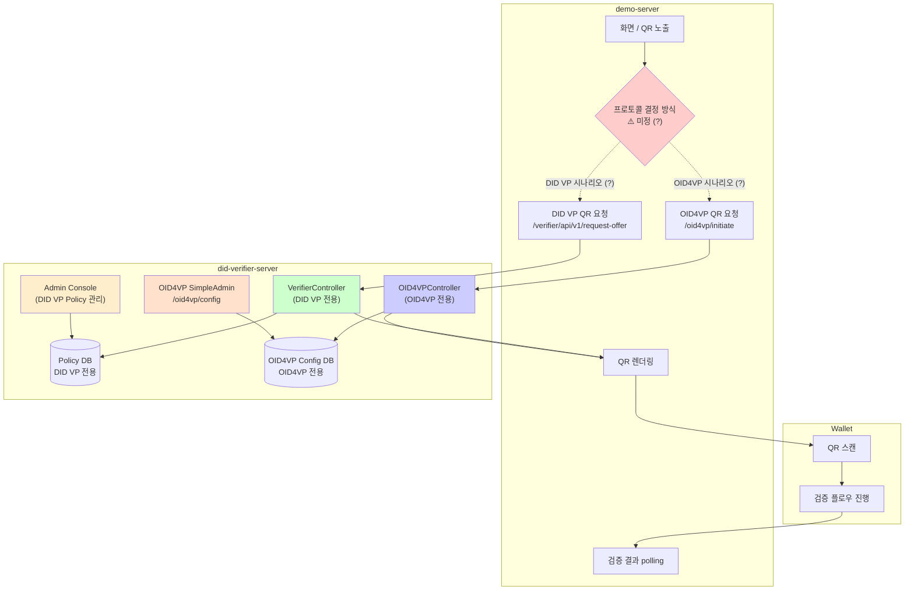

---

### demo-server 관점

demo-server는 현재 **2개 프로토콜 시나리오가 미구현** 상태입니다. 어느 시점에 어느 프로토콜을 호출할지 결정 방식이 정해지지 않았으며, 각 프로토콜 API를 독립적으로만 접근 가능한 구조입니다.

**현재 demo-server의 문제:**
- 두 프로토콜을 어떻게 선택/전환할지 결정 방식 미정 (?)
- 프로토콜별 Verifier API URL이 다르며, 통합 진입점이 없음
- QR 내용 형태가 DID VP와 OID4VP가 달라, 렌더링 로직이 프로토콜에 종속
- 검증 완료 후 결과를 수신하는 방식도 프로토콜에 따라 다를 수 있음

---

### Wallet(앱) 관점

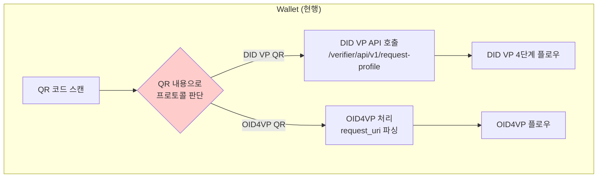

**현재 Wallet의 문제:**
- QR 내용을 파싱해 프로토콜 종류를 직접 판단
- 각 프로토콜별 URL, 요청/응답 포맷, 플로우 로직을 각각 구현
- 프로토콜이 추가되면 앱 코드 수정 및 릴리즈 필수

---

### did-verifier-server 관점

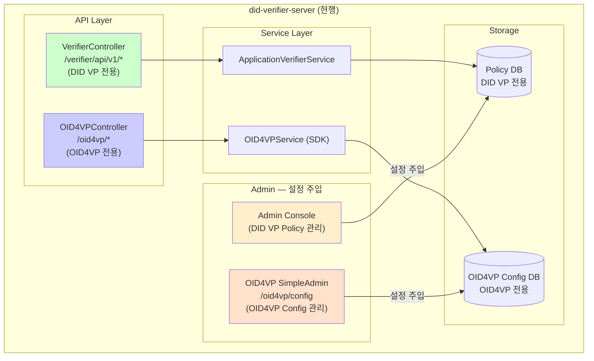

**현재 서버의 문제:**
- 두 프로토콜이 논리적 결합 없이 URL 단위로 공존 (라우팅 로직 없음)
- 각 프로토콜이 독립된 DB/Config 사용 → 통합 관리 불가
- Admin이 두 곳으로 분리 (DID VP Admin vs OID4VP SimpleAdmin) → 운영 복잡도 증가
- Policy에 프로토콜 정보 없음 → 어떤 Policy가 어떤 프로토콜인지 파악 불가
- 프로토콜 전환을 위해 코드 배포 필요

---

## 🚨 핵심 문제 정의

| 관점 | 문제 | 영향 |
|------|------|------|
| **demo-server** | 프로토콜 결정 책임이 demo-server에 있음 | Verifier 프로토콜 변경 시 demo-server도 수정/배포 필요 |
| **demo-server** | 프로토콜별 API URL을 코드에서 직접 선택 | 시나리오 추가 시 URL 매핑 코드 증가 |
| **Wallet** | QR 파싱으로 프로토콜 직접 판단 | 프로토콜 추가 시 앱 릴리즈 강제 |
| **Wallet** | 프로토콜별 플로우 코드 중복 구현 | 유지보수 비용 증가 |
| **서버** | Policy에 프로토콜 정보 부재 | 운영 중 프로토콜 파악/변경 불가 |
| **서버** | 컨트롤러가 프로토콜별로 분리 | 새 프로토콜 추가 시 컨트롤러 신설 필요 |
| **운영** | Admin UI에서 프로토콜 제어 불가 | 개발자 개입 없이 전환 불가 |

---

## 🎯 설계 목표

1. **프로토콜 결정 책임을 서버로 이전**: demo-server와 Wallet은 policyId만 전달
2. **단일 진입점**: 프로토콜에 무관한 통합 API 엔드포인트
3. **Policy 중심 관리**: Policy 설정만으로 프로토콜 선택 및 전환
4. **Admin 콘솔 제어**: 재배포 없이 운영 중 프로토콜 변경
5. **확장성**: 향후 새로운 프로토콜 추가가 용이한 구조

---

## 📐 설계 방안

Policy에 `protocolType` 필드를 추가하여 서버가 프로토콜을 결정하고(Policy 기반 라우팅), 서버 내부는 `ProtocolHandler` 인터페이스와 `ProtocolRegistry`로 구조화(Protocol Registry 패턴)합니다. 두 가지를 조합하여 외부에는 단일 진입점을, 내부에는 프로토콜 간 의존성이 없는 구조를 제공합니다.

---

## 🏆 설계 방향

서버 내부는 Protocol Registry 패턴으로 구조화하고, 외부에는 Policy 기반 단일 진입점을 제공합니다.

### Admin 통합 방향

현행 k-verifier PoC에서는 DID VP 관리용 Admin Console과 OID4VP 전용 SimpleAdmin(`/oid4vp/config`)이 분리되어 있습니다. 실제 Verifier-server에서는 **단일 통합 Admin**으로 구현하며, Policy 및 ProtocolConfig(DID VP / OID4VP 설정 모두)를 하나의 Admin UI/API에서 관리합니다.

### 패키지 구조 방향

기존 프로토콜별 패키지(`v1`, `oid4vp`)는 참고용이며, 실제 Verifier-server는 아래 구조로 신규 설계합니다:

```
org.omnione.did.verifier/
├── protocol/            ← 통합 레이어 (신규)
│   ├── api/             (UnifiedVerificationController)
│   ├── orchestrator/    (VerificationOrchestrator)
│   ├── handler/         (ProtocolHandler 인터페이스, DidVpHandler, Oid4vpHandler)
│   └── registry/        (ProtocolRegistry)
├── didvp/               ← DID VP 도메인 서비스
├── oid4vp/              ← OID4VP 도메인 서비스
└── admin/               ← 통합 Admin API
```

### 계층별 책임

| 계층 | 컴포넌트 | 책임 |
|------|---------|------|
| **Presentation** | UnifiedVerificationController | 단일 진입점 (`/verifier/api/v2/initiate`) |
| **Application** | VerificationOrchestrator | 프로토콜 결정 및 라우팅 총괄 |
| **Application** | PolicyProtocolResolver | Policy.protocolType 조회 |
| **Application** | ProtocolRegistry | Handler 관리 (Factory) |
| **Adapter** | ProtocolHandler (Interface) | `initiate()` 전용 — 후속 플로우는 프로토콜별 독립 처리 |
| **Adapter** | DidVpProtocolHandler | DID VP 프로토콜 래핑 |
| **Adapter** | Oid4vpProtocolHandler | OID4VP 프로토콜 래핑 |
| **Domain** | Policy + ProtocolConfig | 프로토콜 타입 정의 및 설정 |

---

## 🎯 목표 구조

### 전체 시스템 관계도 (목표)

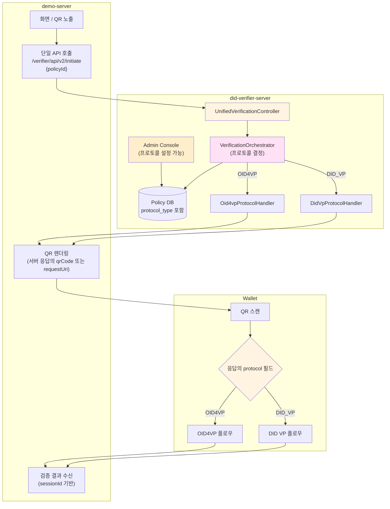

---

### demo-server 관점 — 변화 후

**변화 포인트:**
- 프로토콜 결정 책임이 서버로 이전 → demo-server는 `policyId`만 전달
- 어떤 시나리오에서 어떤 `policyId`를 쓸지만 관리하면 됨
- QR 렌더링은 서버 응답의 `qrCode` 또는 `requestUri` 필드를 그대로 사용
- 검증 결과 수신은 `sessionId` 기반으로 단일화

**남아있는 demo-server의 책임:**

| 책임 | 내용 |
|------|------|
| policyId 선택 | 어떤 화면/시나리오에서 어떤 policyId를 사용할지 결정 |
| QR 렌더링 | 서버 응답 기반으로 QR 이미지 생성 및 노출 |
| 검증 결과 수신 | sessionId로 Verifier에 polling 또는 callback 수신 |
| 프로토콜 힌트 전달 | 특정 시나리오에서 특정 프로토콜 강제가 필요한 경우 파라미터 전달 |

---

### Wallet(앱) 관점 — 변화 후

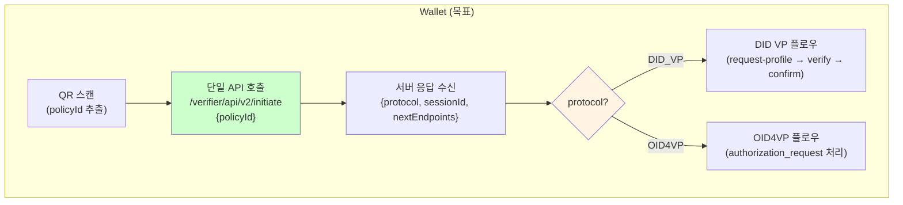

**변화 포인트:**
- QR에서 프로토콜 판별 로직 제거, `policyId` 추출만 수행
- 서버 응답의 `protocol` 필드로 이후 플로우 분기
- 후속 단계 엔드포인트도 서버 응답(`nextEndpoints`)에 포함

---

### did-verifier-server 관점 — 변화 후

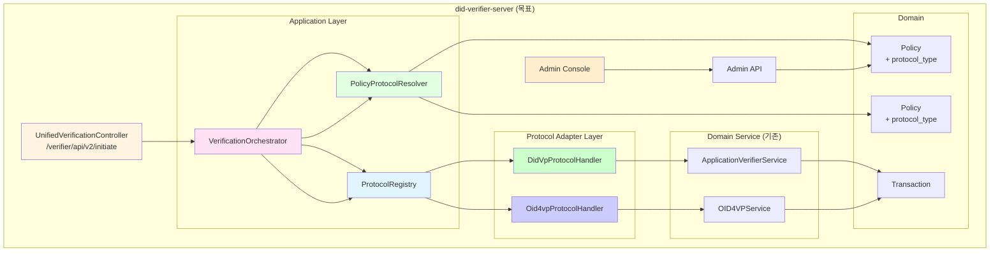

---

## 🔄 프로세스 흐름

### 전체 검증 흐름 (demo-server → Wallet → Verifier)

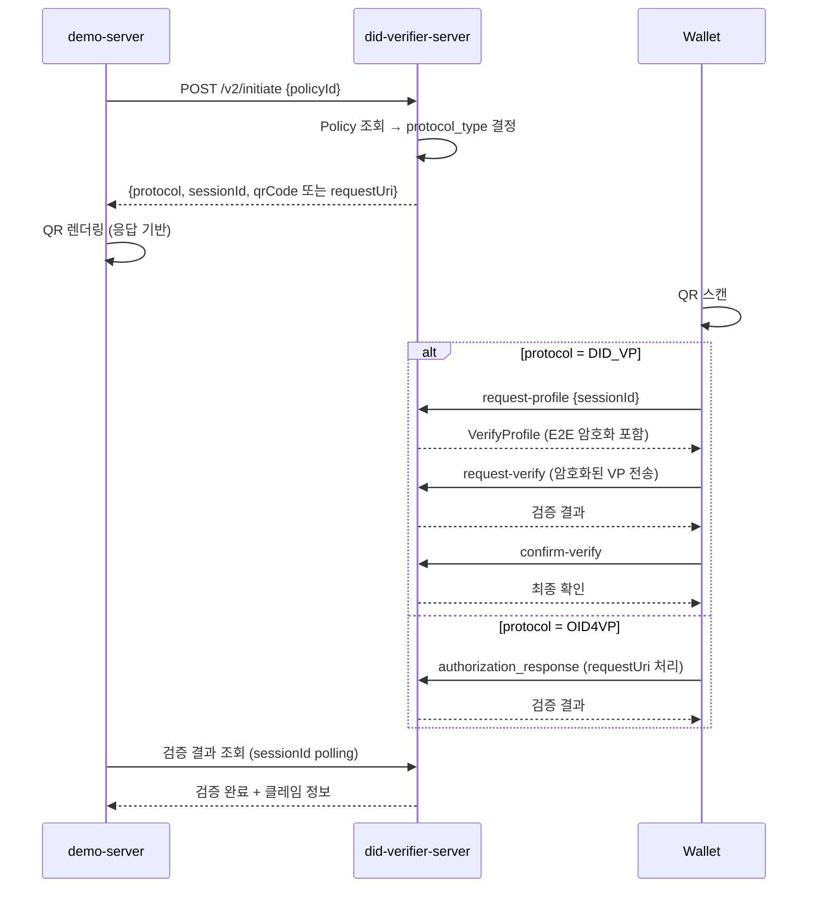

---

### 통합 initiate 내부 처리 흐름 (서버)

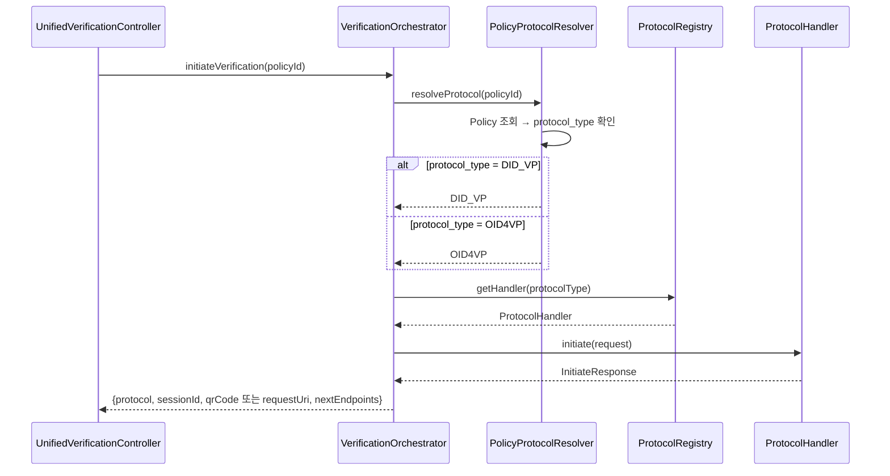

---

## 🔗 ProtocolHandler 인터페이스 설계

### 설계 결정: initiate 전용

DID VP는 4단계(offer → profile → verify → confirm), OID4VP는 2단계(initiate → response)로 후속 플로우의 단계 수와 파라미터 구조가 근본적으로 다르다. 이를 하나의 인터페이스에 `verify()`, `confirm()` 등으로 억지 통합하면:

- OID4VP에서 `confirm()`이 no-op이 되는 등 빈 메서드 발생
- 프로토콜별 고유 파라미터(E2E vs JWT)를 억지 추상화해야 함
- 인터페이스 변경 시 모든 Handler에 영향 → 확장성 저하

따라서 **`ProtocolHandler`는 `initiate()` 하나만 정의**하고, 후속 플로우는 프로토콜별 기존 엔드포인트를 그대로 유지한다.

```java
public interface ProtocolHandler {
    ProtocolType getProtocolType();
    InitiateResponse initiate(InitiateRequest request);
}
```

### 후속 플로우 엔드포인트 — 프로토콜별 독립 유지

| 프로토콜 | 후속 엔드포인트 | 역할 |
|----------|----------------|------|
| **DID VP** | `POST /verifier/api/v1/request-profile` | VP 프로필 요청 |
| **DID VP** | `POST /verifier/api/v1/request-verify` | 암호화된 VP 제출 |
| **DID VP** | `POST /verifier/api/v1/confirm-verify` | 검증 확인 및 결과 수신 |
| **OID4VP** | `GET /oid4vp/request/{requestId}` | JAR(JWT-Secured Authorization Request) 조회 |
| **OID4VP** | `POST /oid4vp/response` | VP Token 제출 및 검증 |

> 이 엔드포인트들은 initiate 응답의 `nextEndpoints` 필드를 통해 Wallet에 동적으로 전달된다.

---

## 📡 통합 initiate API 상세 스펙

### 요청

```
POST /verifier/api/v2/initiate
Content-Type: application/json
```

```json
{
  "policyId": "policy-uuid-001"
}
```

### 응답 — DID_VP인 경우

```json
{
  "protocol": "DID_VP",
  "sessionId": "txId-uuid-001",
  "payload": {
    "offerId": "offer-uuid-001",
    "type": "VerifiablePresentation",
    "validUntil": "2026-03-10T12:00:00Z",
    "payload": { /* VpOfferPayload 기존 구조 그대로 */ }
  },
  "nextEndpoints": {
    "requestProfile": "/verifier/api/v1/request-profile",
    "requestVerify": "/verifier/api/v1/request-verify",
    "confirmVerify": "/verifier/api/v1/confirm-verify"
  }
}
```

> DID VP의 `sessionId`는 기존 `txId`를 그대로 사용한다. Wallet은 후속 호출에서 이 값을 `txId`로 전달한다.

### 응답 — OID4VP인 경우

```json
{
  "protocol": "OID4VP",
  "sessionId": "txId-uuid-002",
  "authorizationRequest": "openid4vp://?client_id=...&request_uri=https://verifier.example.com/oid4vp/request/req-uuid-001",
  "nextEndpoints": {
    "authorizationRequest": "/oid4vp/request/{requestId}",
    "authorizationResponse": "/oid4vp/response"
  }
}
```

> OID4VP의 경우, `authorizationRequest` 필드에 Wallet이 처리할 전체 URI가 포함된다. `sessionId`는 verifier-server 내부에서 OID4VP SDK의 세션과 매핑된다.

### 공통 에러 응답

```json
{
  "code": "VERIFIER_ERR_POLICY_NOT_FOUND",
  "message": "Policy not found: policy-uuid-999"
}
```

---

## 🔄 컴포넌트별 처리 흐름 상세

### demo-server 처리 흐름

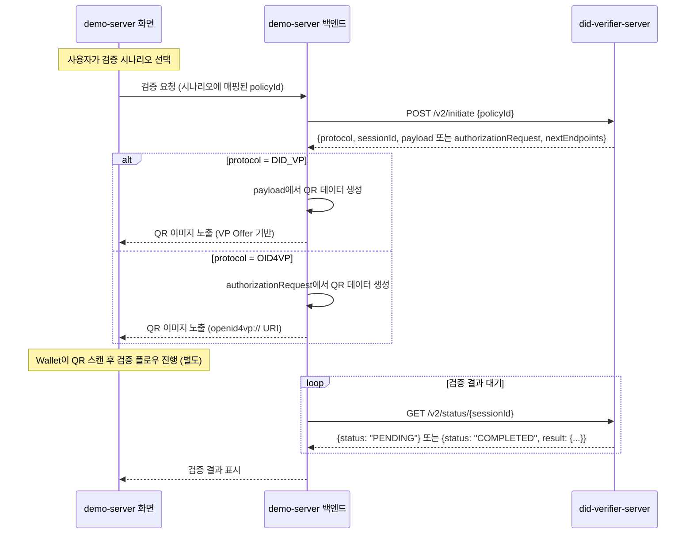

**demo-server 핵심 처리 로직:**

1. **initiate 호출**: `policyId` 하나만 전달. 프로토콜을 알 필요 없음
2. **QR 생성 분기**: 응답의 `protocol` 필드로 QR 내용 형태 결정
   - `DID_VP` → `payload` 객체를 QR로 인코딩
   - `OID4VP` → `authorizationRequest` 문자열을 QR로 인코딩
3. **결과 대기**: `sessionId`로 `/v2/status/{sessionId}` 폴링. 프로토콜에 무관하게 동일한 방식
4. **프로토콜 비인지**: demo-server는 QR 렌더링 시점에만 protocol 분기하고, 이후 검증 결과 수신은 단일 방식

### Wallet 처리 흐름

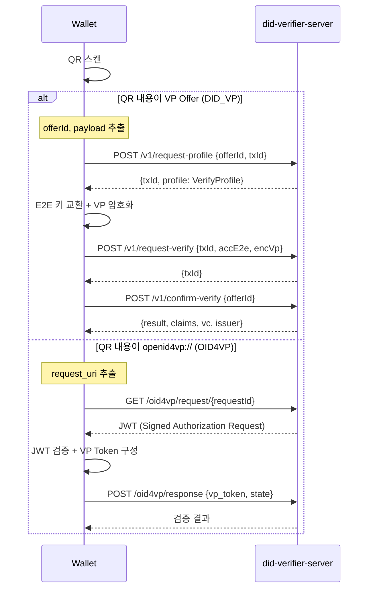

**Wallet 핵심 처리 로직:**

1. **QR 파싱으로 분기**: QR 내용 자체가 프로토콜을 결정한다
   - VP Offer 구조 → DID VP 플로우 진입
   - `openid4vp://` scheme → OID4VP 플로우 진입
2. **후속 엔드포인트**: initiate 응답의 `nextEndpoints`를 사용하거나, QR에 포함된 URL을 직접 사용
3. **프로토콜별 독립 처리**: 각 플로우는 기존 구현을 그대로 사용

> **참고**: Wallet이 `/v2/initiate`를 직접 호출하지 않는다. initiate는 demo-server가 호출하고, Wallet은 QR 스캔 후 후속 엔드포인트만 사용한다.

### verifier-server 내부 처리 — initiate 이후

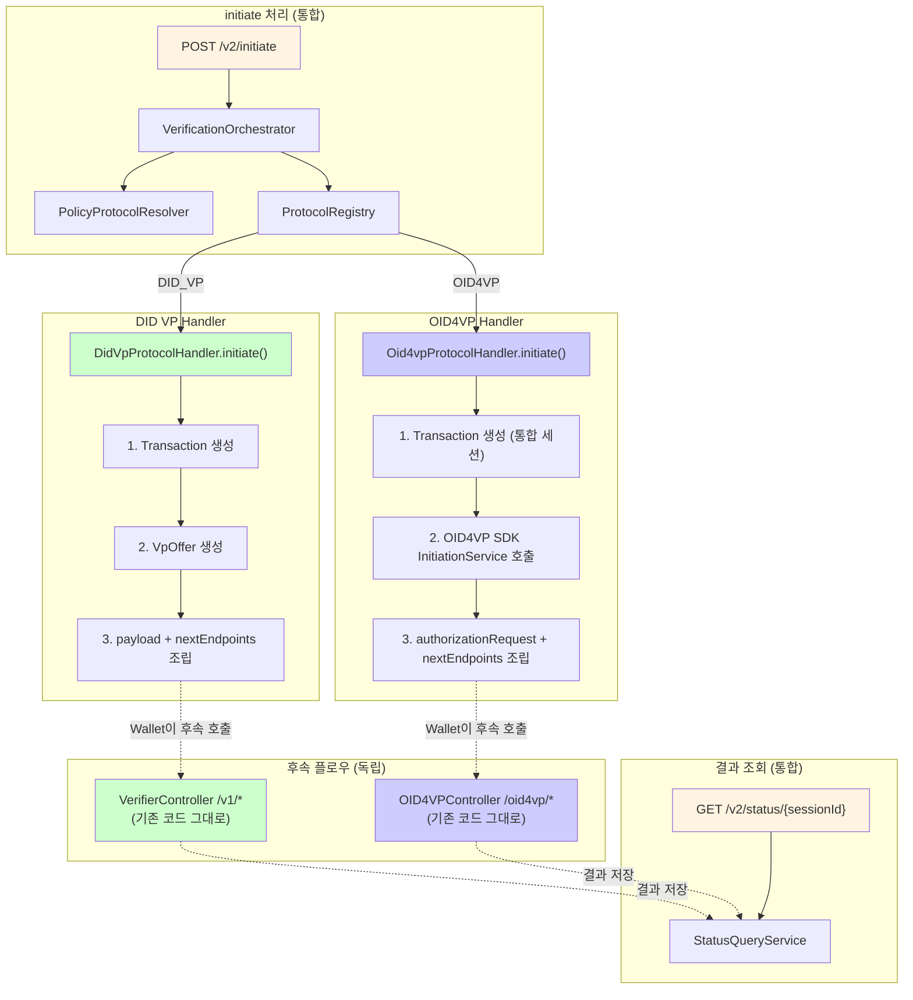

**verifier-server 핵심 처리:**

1. **initiate 단계에서만 통합**: `ProtocolHandler.initiate()`로 프로토콜 라우팅
2. **후속 플로우는 기존 컨트롤러 재사용**: `/v1/*`과 `/oid4vp/*` 엔드포인트를 수정 없이 유지
3. **결과 조회 통합**: `/v2/status/{sessionId}`를 신규 추가. 두 프로토콜 모두 `Transaction` 테이블 기반으로 결과 상태 관리

---

## 🔑 세션 ID 통합 설계

### 문제

- DID VP: `txId` (Transaction 테이블의 UUID)
- OID4VP SDK: `transactionId` (SDK 내부 VerificationSession, In-Memory 기본)

두 시스템의 세션 식별자가 다르며, demo-server는 프로토콜에 무관하게 단일 `sessionId`로 결과를 조회해야 한다.

### 해결: Transaction 테이블 통합 + OID4VP 세션 매핑

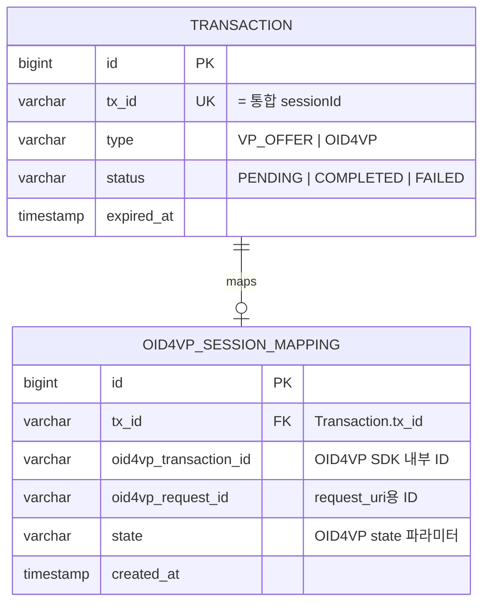

**처리 방식:**

| 단계 | DID VP | OID4VP |
|------|--------|--------|
| initiate 시 | Transaction 생성 → `txId`가 곧 `sessionId` | Transaction 생성 + OID4VP SDK 세션 생성 → `txId`를 `sessionId`로, SDK 내부 ID를 매핑 테이블에 저장 |
| 후속 플로우 | Wallet이 `txId`로 기존 `/v1/*` 호출 | Wallet이 QR의 `request_uri`로 `/oid4vp/*` 호출. 서버 내부에서 매핑 테이블로 Transaction 연결 |
| 결과 저장 | `VpSubmit` 테이블 (기존) | OID4VP SDK 검증 결과를 `VpSubmit` 또는 별도 결과 테이블에 저장 |
| 결과 조회 | `/v2/status/{sessionId}` → `txId`로 Transaction + VpSubmit 조회 | `/v2/status/{sessionId}` → `txId`로 Transaction + 매핑 → 결과 조회 |

---

## 📊 검증 결과 수신 설계

### demo-server의 결과 수신

```
GET /verifier/api/v2/status/{sessionId}
```

**응답 (진행 중):**
```json
{
  "sessionId": "txId-uuid-001",
  "protocol": "DID_VP",
  "status": "PENDING"
}
```

**응답 (완료):**
```json
{
  "sessionId": "txId-uuid-001",
  "protocol": "DID_VP",
  "status": "COMPLETED",
  "result": {
    "verified": true,
    "claims": [
      { "code": "name", "value": "홍길동" },
      { "code": "birthDate", "value": "1990-01-01" }
    ],
    "holder": "did:omn:holder123",
    "verifiedAt": "2026-03-10T10:30:00Z"
  }
}
```

**응답 (실패):**
```json
{
  "sessionId": "txId-uuid-001",
  "protocol": "OID4VP",
  "status": "FAILED",
  "error": {
    "code": "VP_VERIFICATION_FAILED",
    "message": "VP signature verification failed"
  }
}
```

### 결과 수신 흐름 (전체)

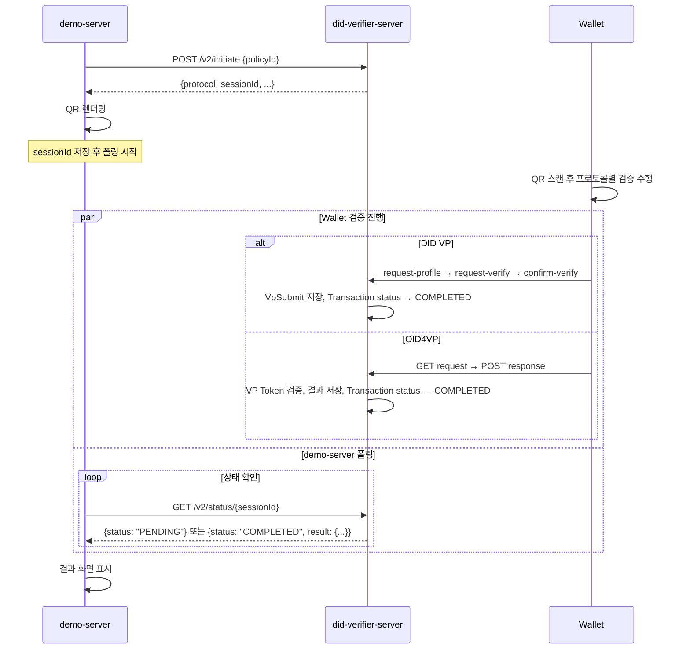

> **참고**: 폴링 주기는 demo-server가 결정한다 (권장: 2~3초). 향후 WebSocket 또는 SSE로 전환 가능하나, 초기 구현은 폴링으로 충분하다.

---

## 🔧 SDK 모듈 통합 설계

### 현행 문제: did-oid4vp-sdk-server Fat JAR

`did-oid4vp-sdk-server`는 현재 fat JAR로 빌드된다 (모든 runtime 의존성을 JAR에 포함). 이 JAR을 verifier-server의 dependency로 가져오면 BouncyCastle, Gson 등의 클래스가 이중 적재되어 클래스 충돌이 발생한다.

### 의존성 충돌 지점

| 라이브러리 | verifier-server | did-oid4vp-sdk-server | 충돌 여부 |
|-----------|----------------|----------------------|----------|
| BouncyCastle | 1.78.1 | 1.80 | **충돌** (fat JAR에 두 버전 공존) |
| Gson | 2.8.9 | 2.10.1 | **충돌** |
| nimbus-jose-jwt | 없음 | 9.37.4 | 신규 추가 필요 |
| OpenDID libs | core, crypto, datamodel, common, zkp (2.0.0) | oid4vc-formatter, sd-jwt-vc, opendid-vc (3.0.0) | **겹치지 않음** |

### 해결: Composite Build (thin JAR) 전환

`verifier-sdk`와 동일한 방식으로 통합한다.

**1) `did-oid4vp-sdk-server/build.gradle` 수정 — fat JAR → thin JAR**

```groovy
jar {
    enabled = true
    archiveBaseName = 'did-oid4vp-sdk-server'
    // fat JAR의 from { ... } 블록 삭제
}
```

**2) `settings.gradle`에 Composite Build 추가**

```groovy
rootProject.name = 'did-verifier-server'
includeBuild('verifier-sdk')
includeBuild('did-oid4vp-sdk-server')  // 추가
```

**3) `build.gradle` (메인)에 의존성 추가 + 버전 통일**

```groovy
// OID4VP SDK (Composite Build)
implementation 'org.omnione.did:did-oid4vp-sdk-server'

// BouncyCastle 버전 통일 (1.80)
implementation 'org.bouncycastle:bcpkix-jdk18on:1.80'

// nimbus-jose-jwt 추가 (OID4VP JWT 처리용)
implementation 'com.nimbusds:nimbus-jose-jwt:9.37.4'
```

**4) Spring Bean 자동 등록**

OID4VP SDK의 `@Service`/`@Component` 클래스(8개)는 `org.omnione.did.oid4vc` 패키지에 위치하며, 메인 앱의 component scan(`org.omnione.did`)에 의해 자동 등록된다. `OID4VPRepositoryAutoConfiguration`은 `@ConditionalOnMissingBean`이므로, verifier-server에서 JPA 구현체를 제공하면 In-Memory 대신 해당 구현체를 사용한다.

---

## 💾 데이터베이스 스키마 변경

### 방법 1: Policy 테이블 확장 (우선 적용)

`policy` 테이블에 `protocol_type` 컬럼 추가.
허용값: `DID_VP`, `OID4VP` / 기본값: `DID_VP`

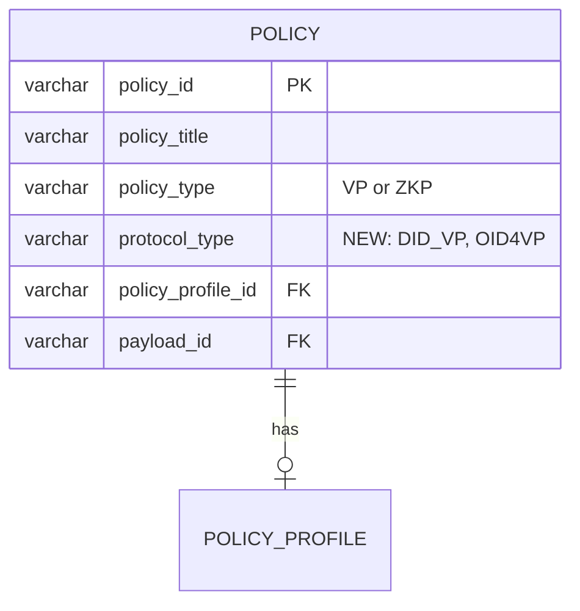

> **결정**: 방법 1 적용 — Policy 테이블에 `protocol_type` 컬럼 추가. 하나의 Policy는 하나의 프로토콜 타입만 가진다.

### OID4VP 세션 매핑 테이블 (신규)

OID4VP SDK의 내부 세션과 통합 Transaction을 연결하기 위한 매핑 테이블:

```sql
CREATE TABLE oid4vp_session_mapping (
    id            BIGSERIAL PRIMARY KEY,
    tx_id         VARCHAR(40)  NOT NULL REFERENCES transaction(tx_id),
    oid4vp_transaction_id VARCHAR(100) NOT NULL,
    oid4vp_request_id     VARCHAR(100) NOT NULL,
    state         VARCHAR(100) NOT NULL,
    created_at    TIMESTAMP    NOT NULL DEFAULT NOW()
);

CREATE INDEX idx_oid4vp_mapping_tx_id ON oid4vp_session_mapping(tx_id);
CREATE INDEX idx_oid4vp_mapping_state ON oid4vp_session_mapping(state);
```

---

## 📋 도출 과업

### demo-server 과업

| 우선순위 | 과업 | 내용 |
|---------|------|------|
| P1 | 통합 API 호출 방식으로 전환 | 프로토콜별 API 직접 호출 → `POST /v2/initiate {policyId}` 단일 호출로 변경 |
| P1 | QR 렌더링 분기 구현 | 응답의 `protocol` 필드로 분기: DID_VP → `payload` 기반 QR, OID4VP → `authorizationRequest` 기반 QR |
| P1 | 결과 폴링 구현 | `GET /v2/status/{sessionId}` 폴링 (2~3초 간격). 프로토콜 무관 단일 방식 |
| P1 | sessionId 관리 | initiate 응답의 `sessionId`를 저장하고, 결과 조회에 사용 |
| P2 | 프로토콜 힌트 파라미터 정의 | 특정 시나리오에서 프로토콜 강제 지정이 필요한 경우 처리 방식 합의 |

---

### did-verifier-server 과업

| 우선순위 | 과업 | 내용 |
|---------|------|------|
| P1 | Policy 스키마 설계 | `policy` 테이블 `protocol_type` 컬럼 추가 (Liquibase) |
| P1 | OID4VP 세션 매핑 테이블 설계 | `oid4vp_session_mapping` 테이블 신규 생성 (Liquibase) |
| P1 | Policy 도메인 모델 구현 | `ProtocolType` Enum, `Policy` Entity 수정, `Oid4vpSessionMapping` Entity |
| P1 | did-oid4vp-sdk-server 모듈 통합 | `settings.gradle`에 Composite Build 추가, OID4VP SDK Bean 등록 |
| P1 | ProtocolHandler 인터페이스 정의 | `initiate()` 메서드만 정의 (후속 플로우는 프로토콜별 독립) |
| P1 | DidVpProtocolHandler 구현 | 기존 `VpOfferApplicationService` 래핑, Transaction 생성 + VpOffer 생성 |
| P1 | Oid4vpProtocolHandler 구현 | OID4VP SDK `InitiationService` 래핑, Transaction 생성 + 세션 매핑 |
| P1 | ProtocolRegistry 구현 | ProtocolType → Handler 매핑 및 조회 팩토리 |
| P1 | PolicyProtocolResolver 구현 | Policy 조회 후 ProtocolType 결정 |
| P1 | VerificationOrchestrator 구현 | 프로토콜 결정 및 Handler 위임 |
| P1 | UnifiedVerificationController 구현 | `POST /v2/initiate` 단일 진입점 |
| P1 | StatusQueryService + Controller 구현 | `GET /v2/status/{sessionId}` — 프로토콜 무관 결과 조회 |
| P1 | OID4VP 후속 엔드포인트 구현 | `GET /oid4vp/request/{requestId}`, `POST /oid4vp/response` |
| P1 | 통합 응답 DTO 설계 | `InitiateResponse` (protocol, sessionId, payload/authorizationRequest, nextEndpoints) |
| P1 | Admin API 구현 | Policy의 protocolType 설정 관리 (기존 Policy CRUD 확장) |

---

### Wallet(앱) 과업

| 우선순위 | 과업 | 내용 |
|---------|------|------|
| P1 | 통합 initiate API 연동 | `/v2/initiate` 호출 및 응답 처리 구현 |
| P1 | 응답 기반 프로토콜 분기 처리 | 응답의 `protocol` 필드로 이후 플로우 결정 |
| P1 | DID VP 후속 플로우 연결 | 기존 4단계 플로우를 새 응답 포맷(`nextEndpoints`)에 맞게 연결 |
| P1 | OID4VP 후속 플로우 연결 | `requestUri` 기반 플로우를 새 응답 포맷에 맞게 연결 |
| P2 | QR 코드 처리 로직 단순화 | 프로토콜 판별 로직 제거, `policyId` 추출만 수행 |
| P2 | 에러 응답 처리 통일 | 두 프로토콜의 에러 처리를 단일 방식으로 통합 |

---

### Admin / 운영 과업

| 우선순위 | 과업 | 내용 |
|---------|------|------|
| P1 | Admin UI — Policy 등록/수정 화면 | `protocolType` 선택 드롭다운 추가 (DID_VP / OID4VP) |
| P2 | Admin UI — Policy 목록에 프로토콜 타입 표시 | 운영 중 프로토콜 파악 용이하도록 |

---

## 💬 논의 아젠다

### ✅ 아젠다 1: demo-server의 policyId 관리 방식 — 해결

> demo-server에 이미 policyId 선택 기능이 구현되어 있음. 별도 작업 불필요.

---

### ✅ 아젠다 2: 검증 결과 수신 방식 — 결정

> **polling 미사용**. confirm 단계에서 검증 결과를 직접 수신하는 방식으로 처리.

---

### ✅ 아젠다 3: 프로토콜 타입 관리 방식 — 결정

> Policy 테이블에 `protocol_type` 컬럼 추가. 하나의 Policy는 `DID_VP` 또는 `OID4VP` 중 하나만 지정.
> 같은 검증 시나리오를 두 프로토콜로 운영하려면 Policy를 2개 만든다.

---

### ✅ 아젠다 4: ProtocolHandler 공통 인터페이스 설계 방향 — 결정

> **initiate 전용 인터페이스 채택**. `ProtocolHandler`는 `initiate()` 메서드만 정의한다.
> DID VP(4단계)와 OID4VP(2단계)의 후속 플로우는 단계 수와 구조가 본질적으로 다르므로 공통 인터페이스로 강제 통일하지 않는다. 후속 엔드포인트는 프로토콜별 독립 컨트롤러가 처리하며, initiate 응답의 `nextEndpoints`로 Wallet에 안내한다.

---

### ⏳ 아젠다 5: 통합 응답 포맷 스펙 합의 — 진행 필요

> demo-server와 Wallet이 대응해야 하는 통합 응답 포맷을 3자 합의해야 함.

- `protocol`, `sessionId`, `qrCode/requestUri`, `nextEndpoints` 최소 필드 합의 선행 필요
- 서버, demo-server, Wallet 3자 합의 후 동시 개발 진행

---

### ✅ 아젠다 6: API 버전 전략 — 결정

> **`/v2` 신설**. 기존 `/v1` 엔드포인트는 유지하고 신규 통합 API를 `/verifier/api/v2/`로 운영.

---

## ⚠️ 주의사항

### 1. 트랜잭션 및 세션 일관성

- DID VP와 OID4VP는 서로 다른 세션 저장 구조를 사용
- 동일 `sessionId` 체계로 통합할 것인지 별도 관리할 것인지 설계 필요

### 2. E2E 암호화 처리 분리

- DID VP: 커스텀 E2E 암호화(ECDH + AES-256-CBC) 사용
- OID4VP: 표준 JWT 서명/암호화 사용
- 각 ProtocolHandler 내부에서 독립 처리, 공통화 시도 주의

### 3. QR 내용 형태 차이

- DID VP QR: VP Offer 정보 포함 (DID 프로토콜 scheme)
- OID4VP QR: `openid4vp://...` scheme 또는 `request_uri` URL
- demo-server와 Wallet 모두 서버 응답 필드를 그대로 사용하도록 설계해야 함

---

## ✅ 결정 및 실행 체크리스트

- [x] 아젠다 1: demo-server policyId 관리 방식 — 기존 기능 활용
- [x] 아젠다 2: 검증 결과 수신 방식 — confirm 단계 직접 수신 (polling 미사용)
- [x] 아젠다 3: Policy별 단일 프로토콜 타입 — protocol_type 컬럼 추가
- [x] 아젠다 4: ProtocolHandler 인터페이스 — `initiate()` 전용, 후속 플로우는 프로토콜별 독립
- [x] 아젠다 5: 통합 응답 포맷 스펙 — InitiateResponse + StatusResponse 정의 완료 (상세 스펙 섹션 참조)
- [x] 아젠다 6: API 버전 전략 — `/v2` 신설
- [x] 세션 ID 통합 설계 — Transaction 테이블 기반 + OID4VP 세션 매핑 테이블
- [x] 검증 결과 수신 — `GET /v2/status/{sessionId}` 폴링 방식
- [ ] DB 스키마 설계 확정 (Liquibase 마이그레이션 작성)
- [ ] 성능 영향 분석 (Policy 조회 추가에 따른 캐싱 전략)
- [ ] did-oid4vp-sdk-server 모듈 통합 방식 확정 (Composite Build vs JAR)

---

## 📚 참고 문서

- [VERIFIER_ARCHITECTURE.md](./VERIFIER_ARCHITECTURE.md) - 기존 아키텍처 문서
- [SDK_GUIDE.md](./verifier-sdk/docs/SDK_GUIDE.md) - Verifier SDK 사용 가이드
- [OID4VP Specification](https://openid.net/specs/openid-4-verifiable-presentations-1_0.html)

---

---

## 🚀 프로토타입 구현 계획

### 목표

**최소 동작하는 E2E 프로토타입**: demo 화면에서 Policy 선택 → QR 생성 → (시뮬레이션) 스캔 → VP 제출 → 결과 확인까지의 전체 흐름을 DID VP와 OID4VP 두 프로토콜 모두에서 동작시킨다.

### 프로토타입 범위 (하드코딩 허용)

| 항목 | 프로토타입 처리 방식 |
|------|-------------------|
| **VC / VP** | 임의의 더미 VC/VP JSON을 하드코딩. 실제 서명 검증 스킵 |
| **Policy** | 2개 고정 생성: `policy-didvp-demo` (DID_VP), `policy-oid4vp-demo` (OID4VP) |
| **Policy 초기 데이터** | data.sql로 더미 Policy 삽입 (DID_VP 1개, OID4VP 1개) |
| **E2E 암호화** | DID VP 플로우에서 암호화 스킵 (평문 VP 전송) |
| **JWT 서명** | OID4VP Authorization Request의 서명을 고정 키페어로 처리 |
| **DID Document** | 하드코딩된 더미 DID Document 반환 |
| **Wallet** | 실제 앱 대신 demo 화면에서 Wallet 역할을 시뮬레이션 (QR 스캔 → 후속 API 직접 호출) |
| **Admin** | 프로토타입에서 제외. Policy/Config는 초기 데이터로 고정 |
| **DB** | H2 In-Memory (sample 프로파일) |

### 구현 단계

```
Phase 1 — 기반 (SDK 통합 + DB + Domain)
├── did-oid4vp-sdk-server Composite Build 전환
├── Liquibase: policy.protocol_type 컬럼, protocol_config 테이블, oid4vp_session_mapping 테이블
├── ProtocolType Enum, Policy 엔티티 수정, Oid4vpSessionMapping 엔티티
└── 초기 데이터 (data.sql): 더미 Policy 2개 (DID_VP, OID4VP 각 1개)

Phase 2 — 통합 진입점 (initiate + 라우팅)
├── ProtocolHandler 인터페이스
├── DidVpProtocolHandler (기존 VpOfferApplicationService 래핑, 서명 검증 스킵)
├── Oid4vpProtocolHandler (OID4VP SDK InitiationService 래핑, 고정 키페어)
├── ProtocolRegistry, PolicyProtocolResolver
├── VerificationOrchestrator
└── UnifiedVerificationController (POST /v2/initiate)

Phase 3 — 후속 플로우 (프로토콜별)
├── DID VP: 기존 /v1/* 엔드포인트에서 서명 검증 스킵 모드 추가
├── OID4VP: GET /oid4vp/request/{requestId}, POST /oid4vp/response 구현
├── 더미 VP/VC 응답 처리
└── 결과 저장 (Transaction status → COMPLETED)

Phase 4 — 결과 조회 + Demo 화면
├── GET /v2/status/{sessionId} 구현
├── Demo 화면: Policy 선택 드롭다운 → initiate 호출 → QR 표시
├── Demo 화면: Wallet 시뮬레이션 버튼 (QR 스캔 대신 후속 API 직접 호출)
└── Demo 화면: 결과 폴링 → 검증 완료 표시
```

### Demo 화면 시나리오

```
┌─────────────────────────────────────────────────┐
│  Unified Verifier - 프로토타입 Demo              │
│                                                  │
│  Policy 선택: [policy-didvp-demo ▼]              │
│                                                  │
│  [검증 시작]                                      │
│                                                  │
│  ┌──────────────┐   상태: 대기 중                 │
│  │              │                                │
│  │   QR Code    │   protocol: DID_VP             │
│  │              │   sessionId: txId-xxx          │
│  └──────────────┘                                │
│                                                  │
│  [Wallet 시뮬레이션: VP 제출]  ← QR 스캔 대체     │
│                                                  │
│  ─── 검증 결과 ───                                │
│  ✅ 검증 성공                                     │
│  이름: 홍길동                                     │
│  생년월일: 1990-01-01                             │
│  holder: did:omn:holder-demo                     │
└─────────────────────────────────────────────────┘
```

**Wallet 시뮬레이션 버튼 동작:**

1. DID_VP 선택 시 → `request-profile` → `request-verify` (더미 VP) → `confirm-verify` 순차 호출
2. OID4VP 선택 시 → `GET /oid4vp/request/{id}` → `POST /oid4vp/response` (더미 VP Token) 호출

### 프로토타입 전용 설정

```yaml
# application-prototype.yml
spring:
  profiles:
    active: sample, prototype

verifier:
  prototype:
    skip-signature-verification: true
    skip-e2e-encryption: true
    dummy-holder-did: "did:omn:holder-demo"
    dummy-vc: |
      {
        "@context": ["https://www.w3.org/2018/credentials/v1"],
        "type": ["VerifiableCredential"],
        "credentialSubject": {
          "name": "홍길동",
          "birthDate": "1990-01-01"
        }
      }
```

### 프로토타입 제외 항목

- Admin UI (Policy protocolType CRUD)
- 실제 VC 서명 검증
- 실제 E2E 암호화 (ECDH + AES-256-CBC)
- 실제 블록체인/TAS 연동
- OID4VP SDK의 JPA Repository 교체 (In-Memory 사용)

---

## 📝 프로토타입 작업 명세

### verifier-server 백엔드 — 신규 파일 (~22개)

**DB 마이그레이션 (2개)**

| 파일 | 내용 |
|------|------|
| `set.3/protocol-add_protocol_type.xml` | policy 테이블에 `protocol_type` VARCHAR(20) 추가 (기본값 `DID_VP`) |
| `set.3/protocol-create_oid4vp_session_mapping.xml` | `oid4vp_session_mapping` 테이블 생성 |

**Domain 엔티티/Enum (3개)**

| 파일 | 내용 |
|------|------|
| `base/db/constant/ProtocolType.java` | Enum: `DID_VP`, `OID4VP` |
| `base/db/domain/Oid4vpSessionMapping.java` | Entity: txId, oid4vpTransactionId, requestId, state |
| `base/db/repository/Oid4vpSessionMappingRepository.java` | `findByTxId()`, `findByState()`, `findByOid4vpRequestId()` |

**Protocol 레이어 (7개)**

| 파일 | 주요 함수/역할 |
|------|--------------|
| `protocol/handler/ProtocolHandler.java` | 인터페이스: `getProtocolType()`, `initiate(InitiateRequest): InitiateResponse` |
| `protocol/handler/DidVpProtocolHandler.java` | `initiate()` → `VpOfferApplicationService.requestVpOfferbyQR()` 호출 → `InitiateResponse` 변환. payload + nextEndpoints 조립 |
| `protocol/handler/Oid4vpProtocolHandler.java` | `initiate()` → Transaction 생성 → `InitiationService.initiateVerification()` 호출 → Oid4vpSessionMapping 저장 → authorizationRequest + nextEndpoints 조립 |
| `protocol/registry/ProtocolRegistry.java` | `getHandler(ProtocolType)` — `Map<ProtocolType, ProtocolHandler>` 기반 |
| `protocol/resolver/PolicyProtocolResolver.java` | `resolve(String policyId): ProtocolType` — PolicyRepository.findByPolicyId() → policy.getProtocolType() 반환 |
| `protocol/orchestrator/VerificationOrchestrator.java` | `initiate(String policyId): InitiateResponse` — resolver → registry → handler 체인 |
| `protocol/orchestrator/StatusQueryService.java` | `getStatus(String sessionId): StatusResponse` — Transaction 상태 + VpSubmit/OID4VP 결과 조회 |

**Controller / DTO (5개)**

| 파일 | 내용 |
|------|------|
| `protocol/api/UnifiedVerificationController.java` | `POST /v2/initiate` → VerificationOrchestrator.initiate() 위임, `GET /v2/status/{sessionId}` → StatusQueryService.getStatus() 위임 |
| `protocol/api/OID4VPController.java` | `GET /oid4vp/request/{requestId}` → AuthorizationService.getAuthorizationRequest() 래핑, `POST /oid4vp/response` → AuthorizationService.receiveResponse() 래핑 + Transaction 상태 업데이트 |
| `protocol/api/dto/InitiateRequest.java` | `policyId: String` |
| `protocol/api/dto/InitiateResponse.java` | `protocol, sessionId, payload(DID VP용), authorizationRequest(OID4VP용), nextEndpoints: Map<String,String>` |
| `protocol/api/dto/StatusResponse.java` | `sessionId, protocol, status, result{verified, claims, holder, verifiedAt}, error{code, message}` |

**설정 / 프로토타입 (5개)**

| 파일 | 내용 |
|------|------|
| `protocol/config/OID4VPIntegrationConfig.java` | `OID4VPConfig` Bean 생성 (baseUrl, clientId, endpoints 설정), 고정 키페어 Bean (프로토타입) |
| `protocol/config/ProtocolLayerConfig.java` | `ProtocolRegistry` Bean 생성, Handler 목록 주입 |
| `application-prototype.yml` | 프로토타입 플래그: skip-signature-verification, skip-e2e-encryption, 더미 VC/DID |
| `data-prototype.sql` | 더미 Policy 2개 + Payload + PolicyProfile 초기 데이터 |
| `base/property/PrototypeProperty.java` | `@ConfigurationProperties("verifier.prototype")` — 스킵 플래그, 더미 데이터 바인딩 |

### verifier-server 백엔드 — 수정 파일 (~10개)

**빌드 설정 (3개)**

| 파일 | 변경 내용 |
|------|---------|
| `settings.gradle` | `includeBuild('did-oid4vp-sdk-server')` 추가 |
| `build.gradle` | `implementation 'org.omnione.did:did-oid4vp-sdk-server'` 추가, BouncyCastle → 1.80, nimbus-jose-jwt 추가 |
| `did-oid4vp-sdk-server/build.gradle` | fat JAR → thin JAR (`from { ... }` 블록 제거) |

**Domain (3개)**

| 파일 | 변경 내용 |
|------|---------|
| `base/db/domain/Policy.java` | `protocolType` 필드 추가 (`@Enumerated(EnumType.STRING)`, `@Builder.Default = ProtocolType.DID_VP`) |
| `base/db/constant/TransactionType.java` | `OID4VP` 값 추가 |
| `base/constants/UrlConstant.java` | V2 엔드포인트 상수 추가 (`INITIATE = "/initiate"`, `STATUS = "/status"`), OID4VP 엔드포인트 상수 |

**프로토타입 스킵 모드 (4개)** — 각 서비스에서 `PrototypeProperty.isSkip*()` 체크 후 분기

| 파일 | 스킵 대상 | 대체 처리 |
|------|---------|---------|
| `VpOfferApplicationService.java` | `verifierService.requestVpOffer()` | 더미 VpOfferPayload 직접 생성 (SDK 호출 스킵) |
| `VpProfileApplicationService.java` | `e2eSessionProvider.createSession()`, `proofSigningService.signVerifyProfile()` | 더미 E2E 세션 + 서명 없는 VerifyProfile 반환 |
| `VpVerificationApplicationService.java` | `verifyAccE2eProof()`, `verifierService.verifyPresentation()` | AccE2e 검증 스킵 + 더미 VP 파싱 후 VpSubmit 저장 |
| `VpConfirmApplicationService.java` | `verifierService.confirmVerification()` | 더미 ConfirmVerifyResDto 직접 생성 (claims 하드코딩) |

---

### React 프론트엔드 (demo-server 역할) — 신규 파일 (~6개)

> 현재 프론트엔드는 Admin Console 전용이며, QR 라이브러리도 없고 `/v2` 프록시도 없음. Demo 페이지를 신규 추가한다.

**API (1개)**

| 파일 | 함수 |
|------|------|
| `apis/verification-api.ts` | `initiateVerification(policyId): InitiateResponse` — `POST /verifier/api/v2/initiate` 호출, `getVerificationStatus(sessionId): StatusResponse` — `GET /verifier/api/v2/status/{sessionId}` 호출, `simulateDidVpWallet(sessionId, offerId)` — `/v1/request-profile` → `/v1/request-verify` → `/v1/confirm-verify` 순차 호출, `simulateOid4vpWallet(requestId)` — `GET /oid4vp/request/{id}` → `POST /oid4vp/response` 순차 호출 |

**페이지 (3개)**

| 파일 | 역할 |
|------|------|
| `pages/verification-demo/VerificationDemoPage.tsx` | 메인 Demo 페이지: Policy 드롭다운 → [검증 시작] → QR 표시 → [Wallet 시뮬레이션] → 결과 폴링 → 결과 표시 |
| `pages/verification-demo/QRCodeDisplay.tsx` | QR 코드 렌더링 컴포넌트: protocol에 따라 payload 또는 authorizationRequest를 QR로 변환 |
| `pages/verification-demo/VerificationResult.tsx` | 검증 결과 표시 컴포넌트: status, claims, holder, error 표시 |

**타입 (1개)**

| 파일 | 내용 |
|------|------|
| `apis/models/VerificationDto.ts` | `InitiateResponse`, `StatusResponse`, `VerificationResult`, `Claim` 타입 정의 |

### React 프론트엔드 — 수정 파일 (~4개)

| 파일 | 변경 내용 |
|------|---------|
| `vite.config.ts` | 프록시 규칙 추가: `/verifier/api/v2` → `http://localhost:8092`, `/verifier/api/v1` → `http://localhost:8092`, `/oid4vp` → `http://localhost:8092` |
| `main.tsx` | 라우트 추가: `/verification-demo` → `VerificationDemoPage` |
| `config/navigationConfig.tsx` | 네비게이션 메뉴에 "검증 Demo" 항목 추가 |
| `package.json` | `qrcode.react` 의존성 추가 |

---

### 전체 작업량 요약

```
                        신규        수정        합계
verifier-server 백엔드    22개        10개        32개
React 프론트엔드           6개         4개        10개
────────────────────────────────────────────────
합계                      28개        14개        42개
```

**복잡도별 분류:**

| 복잡도 | 파일 수 | 예시 |
|--------|---------|------|
| **상** (로직 복잡, SDK 연동) | 6개 | Oid4vpProtocolHandler, OID4VPController, OID4VPIntegrationConfig, VpVerificationApplicationService 스킵, VerificationDemoPage, verification-api.ts |
| **중** (구조적이지만 명확) | 14개 | DidVpProtocolHandler, VerificationOrchestrator, StatusQueryService, UnifiedVerificationController, 나머지 스킵 서비스 3개, 마이그레이션 2개, 엔티티 2개 |
| **하** (단순 정의/설정) | 22개 | DTO 4개, Enum 1개, Repository 1개, Config 2개, 빌드 설정 3개, 프론트 설정/타입 4개, 프론트 컴포넌트 2개, data.sql, yml |

---

**문서 버전**: 9.0
**최종 업데이트**: 2026-03-10
