# AS-IS / TO-BE 시나리오 비교

> **목적**: 프로토콜 라우팅 통합 전/후 시나리오를 컴포넌트별로 비교하여 팀원 논의 자료로 활용
> **대상 컴포넌트**: demo-server, did-verifier-server, Wallet
> **관련 문서**: [PROTOCOL_ROUTING_DESIGN.md](./PROTOCOL_ROUTING_DESIGN.md)
> **작성일**: 2026-03-11

---

## 1. 전체 시스템 흐름 비교

### 1-1. AS-IS: 전체 흐름

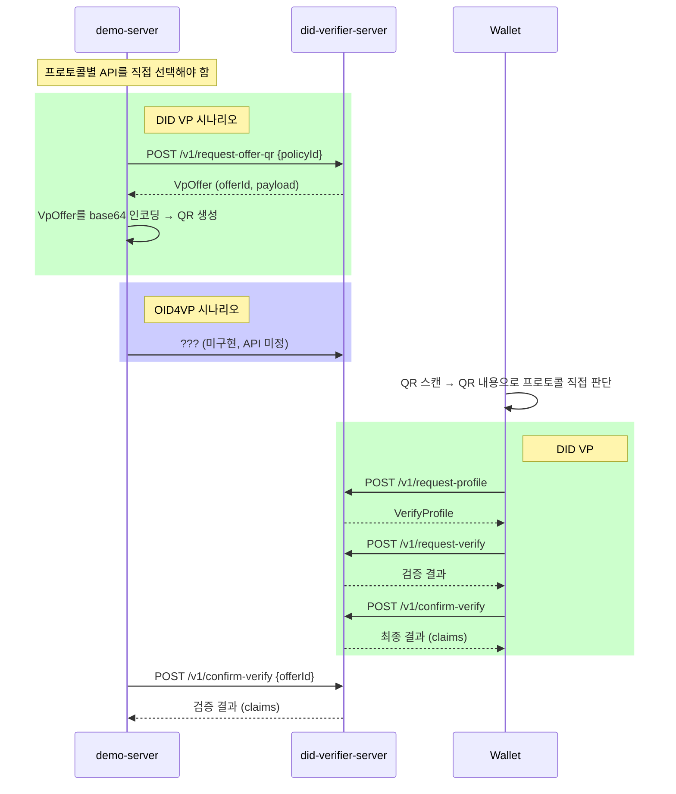
```mermaid
sequenceDiagram
    participant Demo as demo-server
    participant Verifier as did-verifier-server
    participant Wallet as Wallet

    Note over Demo: 프로토콜별 API를 직접 선택해야 함

    rect rgb(204, 255, 204)
        Note right of Demo: DID VP 시나리오
        Demo->>Verifier: POST /v1/request-offer-qr {policyId}
        Verifier-->>Demo: VpOffer (offerId, payload)
        Demo->>Demo: VpOffer를 base64 인코딩 → QR 생성
    end

    rect rgb(204, 204, 255)
        Note right of Demo: OID4VP 시나리오
        Demo->>Verifier: ??? (미구현, API 미정)
    end

    Wallet->>Wallet: QR 스캔 → QR 내용으로 프로토콜 직접 판단

    rect rgb(204, 255, 204)
        Note right of Wallet: DID VP
        Wallet->>Verifier: POST /v1/request-profile
        Verifier-->>Wallet: VerifyProfile
        Wallet->>Verifier: POST /v1/request-verify
        Verifier-->>Wallet: 검증 결과
        Wallet->>Verifier: POST /v1/confirm-verify
        Verifier-->>Wallet: 최종 결과 (claims)
    end

    Demo->>Verifier: POST /v1/confirm-verify {offerId}
    Verifier-->>Demo: 검증 결과 (claims)
```

### 1-2. TO-BE: 전체 흐름

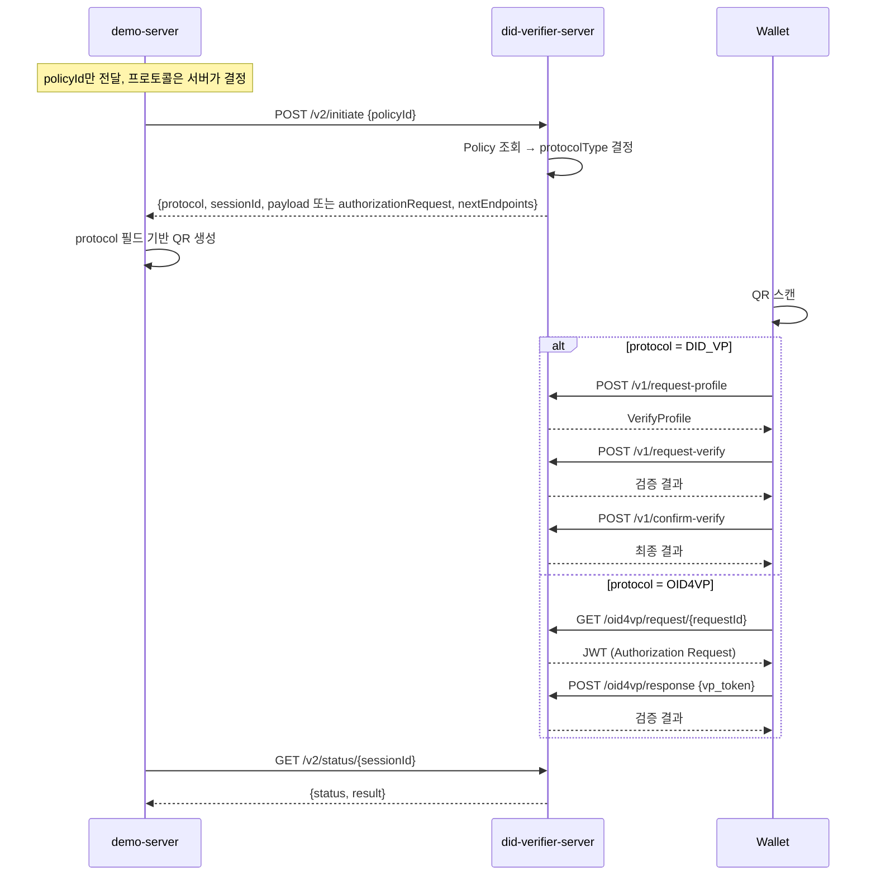
```mermaid
sequenceDiagram
    participant Demo as demo-server
    participant Verifier as did-verifier-server
    participant Wallet as Wallet

    Note over Demo: policyId만 전달, 프로토콜은 서버가 결정

    Demo->>Verifier: POST /v2/initiate {policyId}
    Verifier->>Verifier: Policy 조회 → protocolType 결정
    Verifier-->>Demo: {protocol, sessionId, payload 또는 authorizationRequest, nextEndpoints}
    Demo->>Demo: protocol 필드 기반 QR 생성

    Wallet->>Wallet: QR 스캔

    alt protocol = DID_VP
        Wallet->>Verifier: POST /v1/request-profile
        Verifier-->>Wallet: VerifyProfile
        Wallet->>Verifier: POST /v1/request-verify
        Verifier-->>Wallet: 검증 결과
        Wallet->>Verifier: POST /v1/confirm-verify
        Verifier-->>Wallet: 최종 결과
    else protocol = OID4VP
        Wallet->>Verifier: GET /oid4vp/request/{requestId}
        Verifier-->>Wallet: JWT (Authorization Request)
        Wallet->>Verifier: POST /oid4vp/response {vp_token}
        Verifier-->>Wallet: 검증 결과
    end

    Demo->>Verifier: GET /v2/status/{sessionId}
    Verifier-->>Demo: {status, result}
```

---

## 2. demo-server 시나리오 비교

### 2-1. AS-IS: demo-server 검증 요청

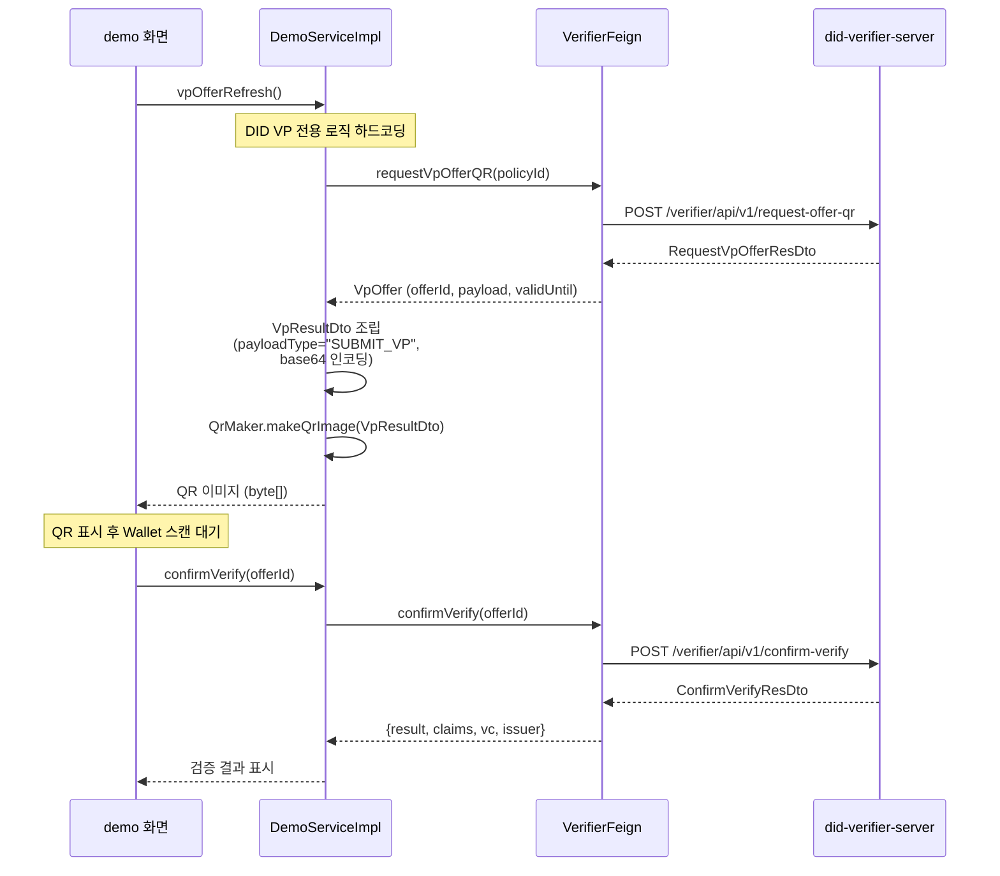
```mermaid
sequenceDiagram
    participant UI as demo 화면
    participant Svc as DemoServiceImpl
    participant Feign as VerifierFeign
    participant Verifier as did-verifier-server

    UI->>Svc: vpOfferRefresh()
    Note over Svc: DID VP 전용 로직 하드코딩

    Svc->>Feign: requestVpOfferQR(policyId)
    Feign->>Verifier: POST /verifier/api/v1/request-offer-qr
    Verifier-->>Feign: RequestVpOfferResDto
    Feign-->>Svc: VpOffer (offerId, payload, validUntil)

    Svc->>Svc: VpResultDto 조립<br/>(payloadType="SUBMIT_VP",<br/>base64 인코딩)
    Svc->>Svc: QrMaker.makeQrImage(VpResultDto)
    Svc-->>UI: QR 이미지 (byte[])

    Note over UI: QR 표시 후 Wallet 스캔 대기

    UI->>Svc: confirmVerify(offerId)
    Svc->>Feign: confirmVerify(offerId)
    Feign->>Verifier: POST /verifier/api/v1/confirm-verify
    Verifier-->>Feign: ConfirmVerifyResDto
    Feign-->>Svc: {result, claims, vc, issuer}
    Svc-->>UI: 검증 결과 표시
```

**AS-IS 문제점:**
- `VerifierFeign`에 DID VP API만 정의 → OID4VP 호출 불가
- `vpOfferRefresh()`가 DID VP 전용 → OID4VP 시나리오 시 별도 메서드 필요
- QR 생성 로직이 `VpResultDto` 구조에 종속
- 프로토콜 추가 시 Feign 인터페이스 + 서비스 메서드 + QR 로직 모두 수정

### 2-2. TO-BE: demo-server 검증 요청

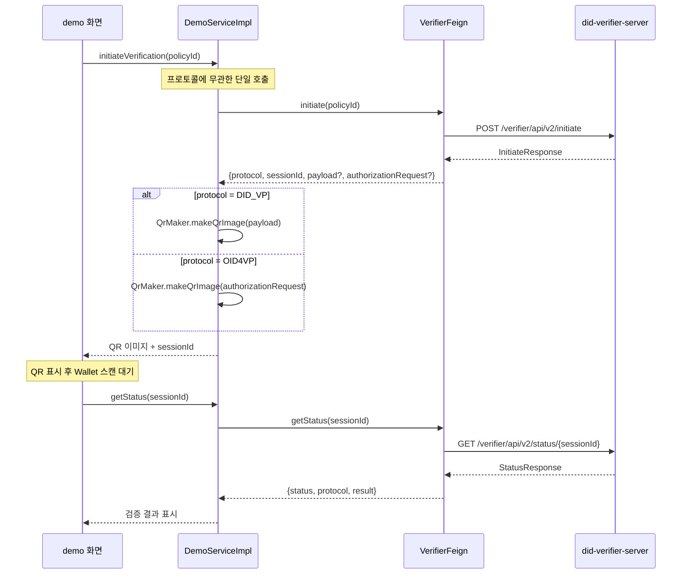
```mermaid
sequenceDiagram
    participant UI as demo 화면
    participant Svc as DemoServiceImpl
    participant Feign as VerifierFeign
    participant Verifier as did-verifier-server

    UI->>Svc: initiateVerification(policyId)
    Note over Svc: 프로토콜에 무관한 단일 호출

    Svc->>Feign: initiate(policyId)
    Feign->>Verifier: POST /verifier/api/v2/initiate
    Verifier-->>Feign: InitiateResponse
    Feign-->>Svc: {protocol, sessionId, payload?, authorizationRequest?}

    alt protocol = DID_VP
        Svc->>Svc: QrMaker.makeQrImage(payload)
    else protocol = OID4VP
        Svc->>Svc: QrMaker.makeQrImage(authorizationRequest)
    end
    Svc-->>UI: QR 이미지 + sessionId

    Note over UI: QR 표시 후 Wallet 스캔 대기

    UI->>Svc: getStatus(sessionId)
    Svc->>Feign: getStatus(sessionId)
    Feign->>Verifier: GET /verifier/api/v2/status/{sessionId}
    Verifier-->>Feign: StatusResponse
    Feign-->>Svc: {status, protocol, result}
    Svc-->>UI: 검증 결과 표시
```

### 2-3. demo-server 코드 변경 요약

| 파일 | AS-IS | TO-BE |
|------|-------|-------|
| **VerifierFeign.java** | `requestVpOfferQR()`, `confirmVerify()`, `getPolicies()` | + `initiate(policyId)`, `getStatus(sessionId)` |
| **DemoServiceImpl.java** | `vpOfferRefresh()` — DID VP 전용 | `initiateVerification(policyId)` — protocol 분기 QR 생성 |
| **QrMaker.java** | `makeQrImage(VpResultDto)` — VP Offer 전용 | `makeQrImage(Object)` — 프로토콜 무관 (기존 시그니처 그대로 활용 가능) |
| **ConfirmVerifyReqDto** | `offerId` 기반 | `sessionId` 기반 (또는 기존 유지) |

---

## 3. did-verifier-server 시나리오 비교

### 3-1. AS-IS: 서버 내부 처리

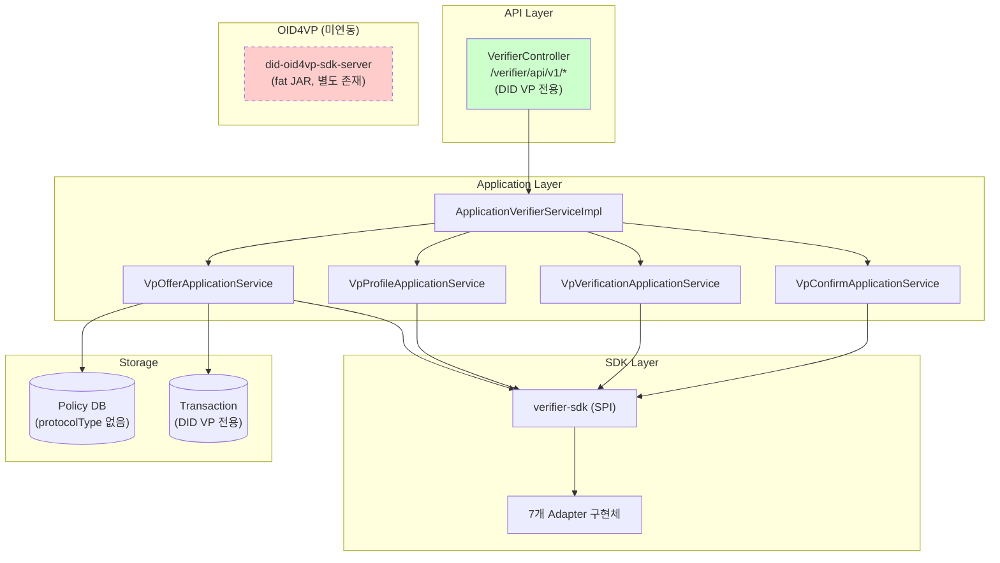
```mermaid
graph TB
    subgraph "API Layer"
        Ctrl["VerifierController<br/>/verifier/api/v1/*<br/>(DID VP 전용)"]
    end

    subgraph "Application Layer"
        Facade["ApplicationVerifierServiceImpl"]
        S1["VpOfferApplicationService"]
        S2["VpProfileApplicationService"]
        S3["VpVerificationApplicationService"]
        S4["VpConfirmApplicationService"]
    end

    subgraph "SDK Layer"
        SDK["verifier-sdk (SPI)"]
        Adapters["7개 Adapter 구현체"]
    end

    subgraph "Storage"
        DB[("Policy DB<br/>(protocolType 없음)")]
        TX[("Transaction<br/>(DID VP 전용)")]
    end

    subgraph "OID4VP (미연동)"
        OID["did-oid4vp-sdk-server<br/>(fat JAR, 별도 존재)"]
    end

    Ctrl --> Facade
    Facade --> S1 & S2 & S3 & S4
    S1 & S2 & S3 & S4 --> SDK --> Adapters
    S1 --> DB
    S1 --> TX

    style Ctrl fill:#ccffcc
    style OID fill:#ffcccc,stroke-dasharray: 5 5
```

### 3-2. TO-BE: 서버 내부 처리

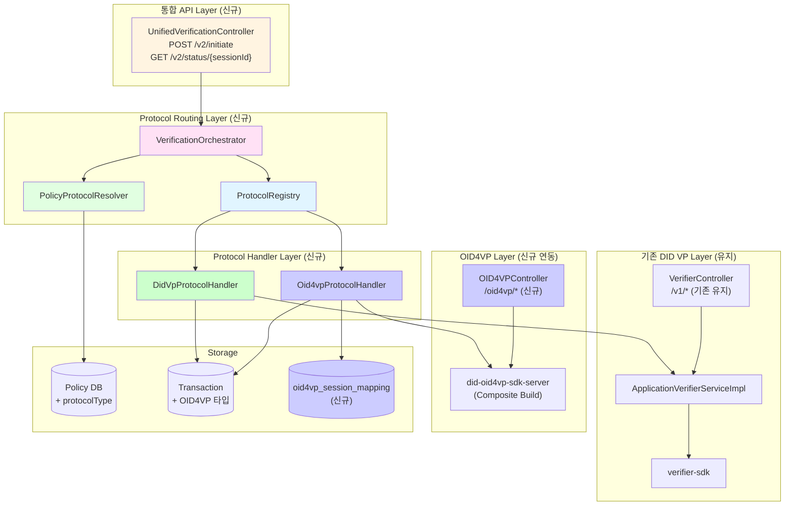
```mermaid
graph TB
    subgraph "통합 API Layer (신규)"
        V2Ctrl["UnifiedVerificationController<br/>POST /v2/initiate<br/>GET /v2/status/{sessionId}"]
    end

    subgraph "Protocol Routing Layer (신규)"
        Orch["VerificationOrchestrator"]
        Resolver["PolicyProtocolResolver"]
        Registry["ProtocolRegistry"]
    end

    subgraph "Protocol Handler Layer (신규)"
        H1["DidVpProtocolHandler"]
        H2["Oid4vpProtocolHandler"]
    end

    subgraph "기존 DID VP Layer (유지)"
        V1Ctrl["VerifierController<br/>/v1/* (기존 유지)"]
        Facade["ApplicationVerifierServiceImpl"]
        SDK["verifier-sdk"]
    end

    subgraph "OID4VP Layer (신규 연동)"
        OIDCtrl["OID4VPController<br/>/oid4vp/* (신규)"]
        OIDSDK["did-oid4vp-sdk-server<br/>(Composite Build)"]
    end

    subgraph "Storage"
        DB[("Policy DB<br/>+ protocolType")]
        TX[("Transaction<br/>+ OID4VP 타입")]
        Mapping[("oid4vp_session_mapping<br/>(신규)")]
    end

    V2Ctrl --> Orch
    Orch --> Resolver --> DB
    Orch --> Registry
    Registry --> H1 --> Facade --> SDK
    Registry --> H2 --> OIDSDK

    H1 --> TX
    H2 --> TX
    H2 --> Mapping

    V1Ctrl --> Facade
    OIDCtrl --> OIDSDK

    style V2Ctrl fill:#fff4e1
    style Orch fill:#ffe1f5
    style Resolver fill:#e1ffe1
    style Registry fill:#e1f5ff
    style H1 fill:#ccffcc
    style H2 fill:#ccccff
    style OIDCtrl fill:#ccccff
    style Mapping fill:#ccccff
```

### 3-3. initiate 처리 비교

#### AS-IS: request-offer-qr

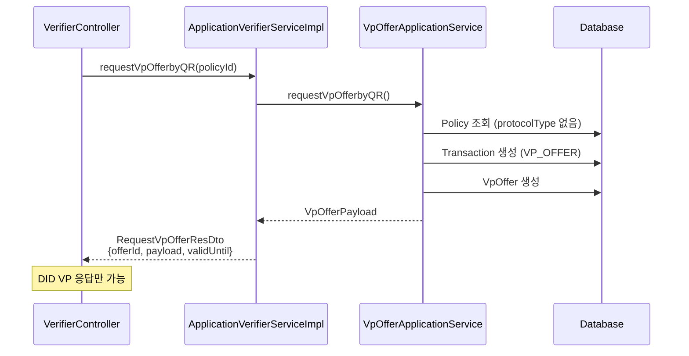
```mermaid
sequenceDiagram
    participant Ctrl as VerifierController
    participant Svc as ApplicationVerifierServiceImpl
    participant Offer as VpOfferApplicationService
    participant DB as Database

    Ctrl->>Svc: requestVpOfferbyQR(policyId)
    Svc->>Offer: requestVpOfferbyQR()

    Offer->>DB: Policy 조회 (protocolType 없음)
    Offer->>DB: Transaction 생성 (VP_OFFER)
    Offer->>DB: VpOffer 생성
    Offer-->>Svc: VpOfferPayload

    Svc-->>Ctrl: RequestVpOfferResDto<br/>{offerId, payload, validUntil}

    Note over Ctrl: DID VP 응답만 가능
```

#### TO-BE: /v2/initiate

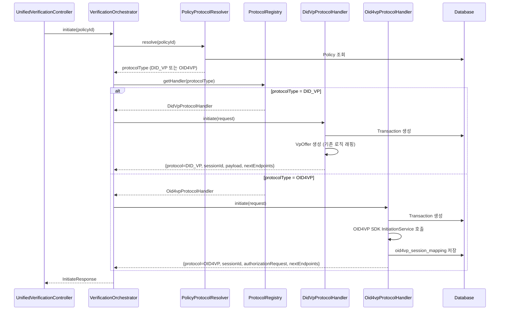
```mermaid
sequenceDiagram
    participant Ctrl as UnifiedVerificationController
    participant Orch as VerificationOrchestrator
    participant Resolver as PolicyProtocolResolver
    participant Registry as ProtocolRegistry
    participant H1 as DidVpProtocolHandler
    participant H2 as Oid4vpProtocolHandler
    participant DB as Database

    Ctrl->>Orch: initiate(policyId)

    Orch->>Resolver: resolve(policyId)
    Resolver->>DB: Policy 조회
    Resolver-->>Orch: protocolType (DID_VP 또는 OID4VP)

    Orch->>Registry: getHandler(protocolType)

    alt protocolType = DID_VP
        Registry-->>Orch: DidVpProtocolHandler
        Orch->>H1: initiate(request)
        H1->>DB: Transaction 생성
        H1->>H1: VpOffer 생성 (기존 로직 래핑)
        H1-->>Orch: {protocol=DID_VP, sessionId, payload, nextEndpoints}
    else protocolType = OID4VP
        Registry-->>Orch: Oid4vpProtocolHandler
        Orch->>H2: initiate(request)
        H2->>DB: Transaction 생성
        H2->>H2: OID4VP SDK InitiationService 호출
        H2->>DB: oid4vp_session_mapping 저장
        H2-->>Orch: {protocol=OID4VP, sessionId, authorizationRequest, nextEndpoints}
    end

    Orch-->>Ctrl: InitiateResponse
```

### 3-4. 서버 엔드포인트 비교

| 엔드포인트 | AS-IS | TO-BE |
|-----------|-------|-------|
| `POST /v2/initiate` | 없음 | **신규** — 통합 진입점 |
| `GET /v2/status/{sessionId}` | 없음 | **신규** — 통합 결과 조회 |
| `POST /v1/request-offer-qr` | DID VP QR 생성 | 유지 (하위 호환) |
| `POST /v1/request-profile` | DID VP 프로필 | 유지 |
| `POST /v1/request-verify` | DID VP 검증 | 유지 |
| `POST /v1/confirm-verify` | DID VP 확인 | 유지 |
| `GET /oid4vp/request/{requestId}` | 없음 | **신규** — OID4VP JAR 조회 |
| `POST /oid4vp/response` | 없음 | **신규** — OID4VP VP Token 제출 |

### 3-5. DB 스키마 비교

#### AS-IS: Policy 테이블

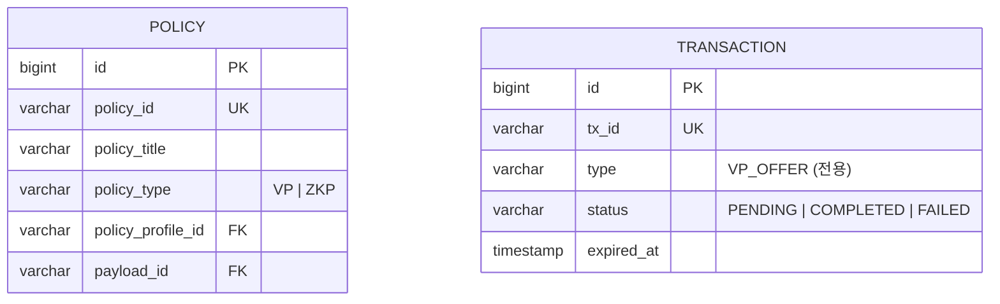
```mermaid
erDiagram
    POLICY {
        bigint id PK
        varchar policy_id UK
        varchar policy_title
        varchar policy_type "VP | ZKP"
        varchar policy_profile_id FK
        varchar payload_id FK
    }

    TRANSACTION {
        bigint id PK
        varchar tx_id UK
        varchar type "VP_OFFER (전용)"
        varchar status "PENDING | COMPLETED | FAILED"
        timestamp expired_at
    }
```

#### TO-BE: Policy 테이블 + 신규 테이블

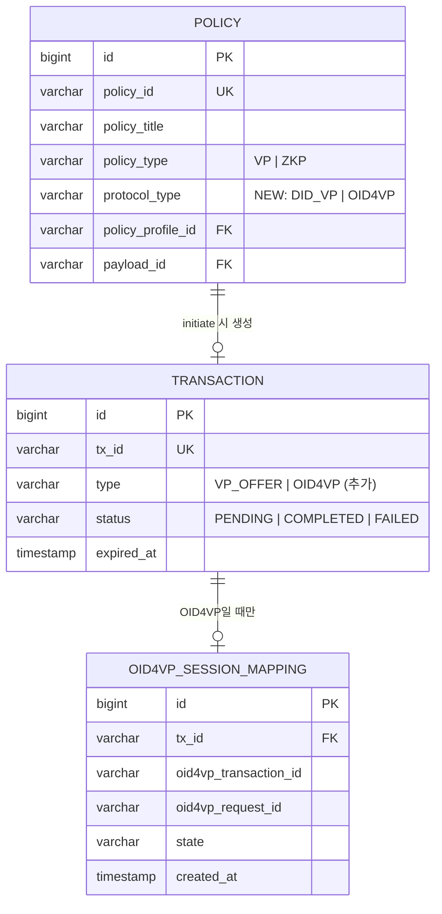
```mermaid
erDiagram
    POLICY {
        bigint id PK
        varchar policy_id UK
        varchar policy_title
        varchar policy_type "VP | ZKP"
        varchar protocol_type "NEW: DID_VP | OID4VP"
        varchar policy_profile_id FK
        varchar payload_id FK
    }

    TRANSACTION {
        bigint id PK
        varchar tx_id UK
        varchar type "VP_OFFER | OID4VP (추가)"
        varchar status "PENDING | COMPLETED | FAILED"
        timestamp expired_at
    }

    OID4VP_SESSION_MAPPING {
        bigint id PK
        varchar tx_id FK
        varchar oid4vp_transaction_id
        varchar oid4vp_request_id
        varchar state
        timestamp created_at
    }

    POLICY ||--o| TRANSACTION : "initiate 시 생성"
    TRANSACTION ||--o| OID4VP_SESSION_MAPPING : "OID4VP일 때만"
```

---

## 4. Wallet 시나리오 비교

### 4-1. AS-IS: Wallet QR 스캔 후 처리

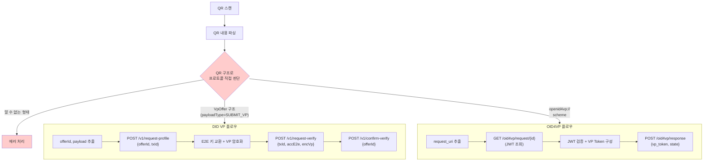
```mermaid
graph TD
    Scan["QR 스캔"] --> Parse["QR 내용 파싱"]
    Parse --> Decision{"QR 구조로<br/>프로토콜 직접 판단"}

    Decision -->|"VpOffer 구조<br/>(payloadType=SUBMIT_VP)"| DID_VP
    Decision -->|"openid4vp://<br/>scheme"| OID4VP
    Decision -->|"알 수 없는 형태"| Error["에러 처리"]

    subgraph DID_VP["DID VP 플로우"]
        D1["offerId, payload 추출"]
        D2["POST /v1/request-profile<br/>{offerId, txId}"]
        D3["E2E 키 교환 + VP 암호화"]
        D4["POST /v1/request-verify<br/>{txId, accE2e, encVp}"]
        D5["POST /v1/confirm-verify<br/>{offerId}"]
        D1 --> D2 --> D3 --> D4 --> D5
    end

    subgraph OID4VP["OID4VP 플로우"]
        O1["request_uri 추출"]
        O2["GET /oid4vp/request/{id}<br/>(JWT 조회)"]
        O3["JWT 검증 + VP Token 구성"]
        O4["POST /oid4vp/response<br/>{vp_token, state}"]
        O1 --> O2 --> O3 --> O4
    end

    style Decision fill:#ffcccc
    style Error fill:#ffcccc
```

### 4-2. TO-BE: Wallet QR 스캔 후 처리

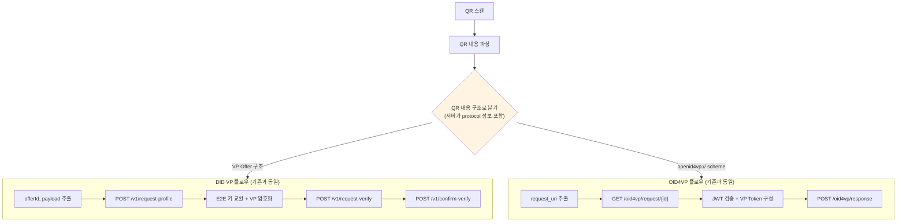
```mermaid
graph TD
    Scan["QR 스캔"] --> Parse["QR 내용 파싱"]
    Parse --> Decision{"QR 내용 구조로 분기<br/>(서버가 protocol 정보 포함)"}

    Decision -->|"VP Offer 구조"| DID_VP
    Decision -->|"openid4vp:// scheme"| OID4VP

    subgraph DID_VP["DID VP 플로우 (기존과 동일)"]
        D1["offerId, payload 추출"]
        D2["POST /v1/request-profile"]
        D3["E2E 키 교환 + VP 암호화"]
        D4["POST /v1/request-verify"]
        D5["POST /v1/confirm-verify"]
        D1 --> D2 --> D3 --> D4 --> D5
    end

    subgraph OID4VP["OID4VP 플로우 (기존과 동일)"]
        O1["request_uri 추출"]
        O2["GET /oid4vp/request/{id}"]
        O3["JWT 검증 + VP Token 구성"]
        O4["POST /oid4vp/response"]
        O1 --> O2 --> O3 --> O4
    end

    style Decision fill:#fff4e1
```

### 4-3. Wallet 변경 요약

| 항목 | AS-IS | TO-BE | 변경 여부 |
|------|-------|-------|----------|
| QR 파싱 | 프로토콜 직접 판단 | 동일 (QR 내용 구조로 판단) | 유사 |
| DID VP 후속 플로우 | `/v1/*` 4단계 | 동일 | **변경 없음** |
| OID4VP 후속 플로우 | 별도 구현 또는 미구현 | `/oid4vp/*` 엔드포인트 사용 | 신규 또는 URL 변경 |
| 후속 엔드포인트 결정 | 하드코딩 | nextEndpoints 동적 수신 가능 | 선택적 개선 |

> **참고**: Wallet은 `/v2/initiate`를 직접 호출하지 않는다. QR 스캔 후 후속 엔드포인트만 사용하므로 Wallet 변경은 최소한이다.

---

## 5. 프로토콜별 후속 플로우 비교

### 5-1. DID VP 후속 플로우 (AS-IS = TO-BE, 변경 없음)

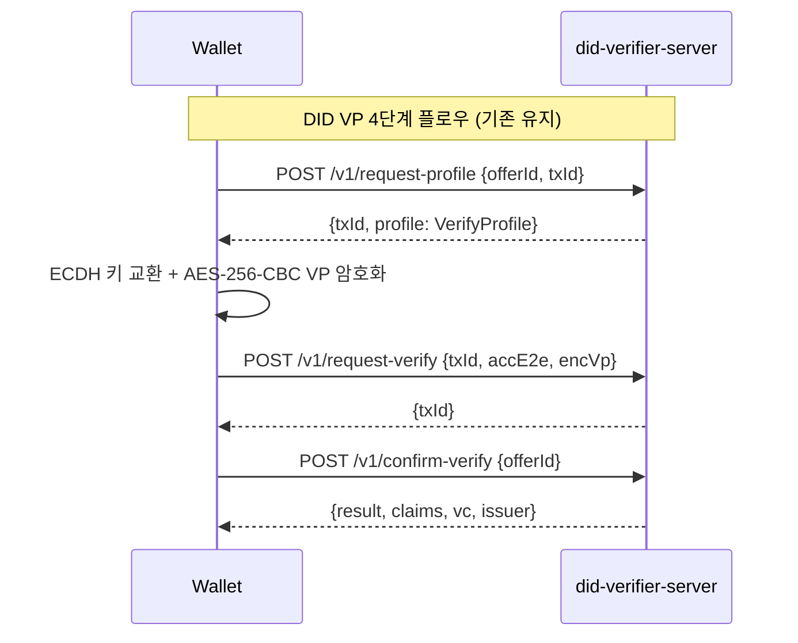
```mermaid
sequenceDiagram
    participant Wallet
    participant Verifier as did-verifier-server

    Note over Wallet,Verifier: DID VP 4단계 플로우 (기존 유지)

    Wallet->>Verifier: POST /v1/request-profile {offerId, txId}
    Verifier-->>Wallet: {txId, profile: VerifyProfile}

    Wallet->>Wallet: ECDH 키 교환 + AES-256-CBC VP 암호화

    Wallet->>Verifier: POST /v1/request-verify {txId, accE2e, encVp}
    Verifier-->>Wallet: {txId}

    Wallet->>Verifier: POST /v1/confirm-verify {offerId}
    Verifier-->>Wallet: {result, claims, vc, issuer}
```

### 5-2. OID4VP 후속 플로우 (TO-BE 신규)

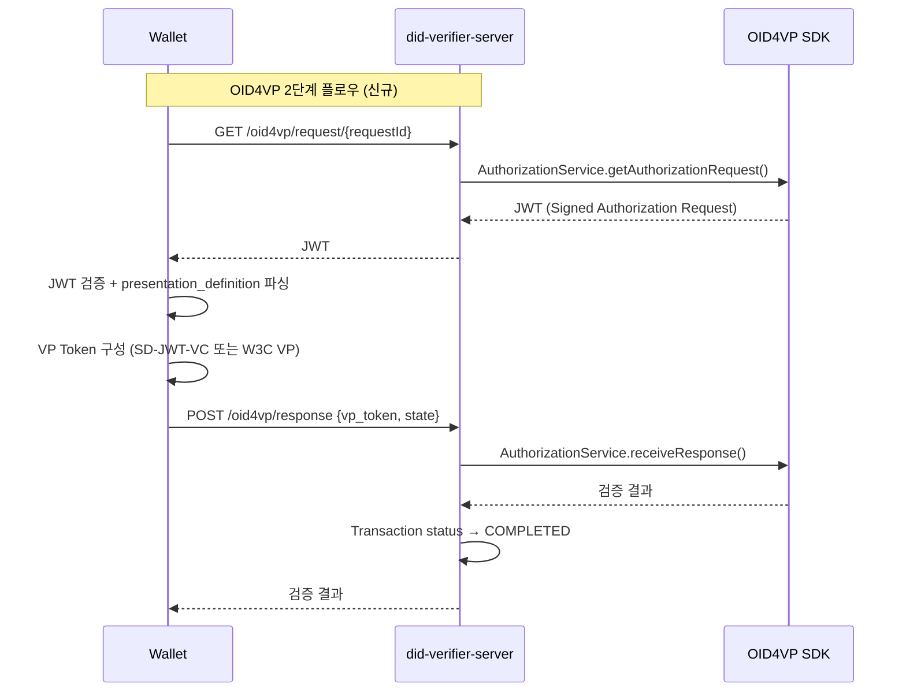
```mermaid
sequenceDiagram
    participant Wallet
    participant Verifier as did-verifier-server
    participant SDK as OID4VP SDK

    Note over Wallet,Verifier: OID4VP 2단계 플로우 (신규)

    Wallet->>Verifier: GET /oid4vp/request/{requestId}
    Verifier->>SDK: AuthorizationService.getAuthorizationRequest()
    SDK-->>Verifier: JWT (Signed Authorization Request)
    Verifier-->>Wallet: JWT

    Wallet->>Wallet: JWT 검증 + presentation_definition 파싱
    Wallet->>Wallet: VP Token 구성 (SD-JWT-VC 또는 W3C VP)

    Wallet->>Verifier: POST /oid4vp/response {vp_token, state}
    Verifier->>SDK: AuthorizationService.receiveResponse()
    SDK-->>Verifier: 검증 결과
    Verifier->>Verifier: Transaction status → COMPLETED
    Verifier-->>Wallet: 검증 결과
```

---

## 6. 결과 수신 비교

### 6-1. AS-IS: 결과 수신 (demo-server)

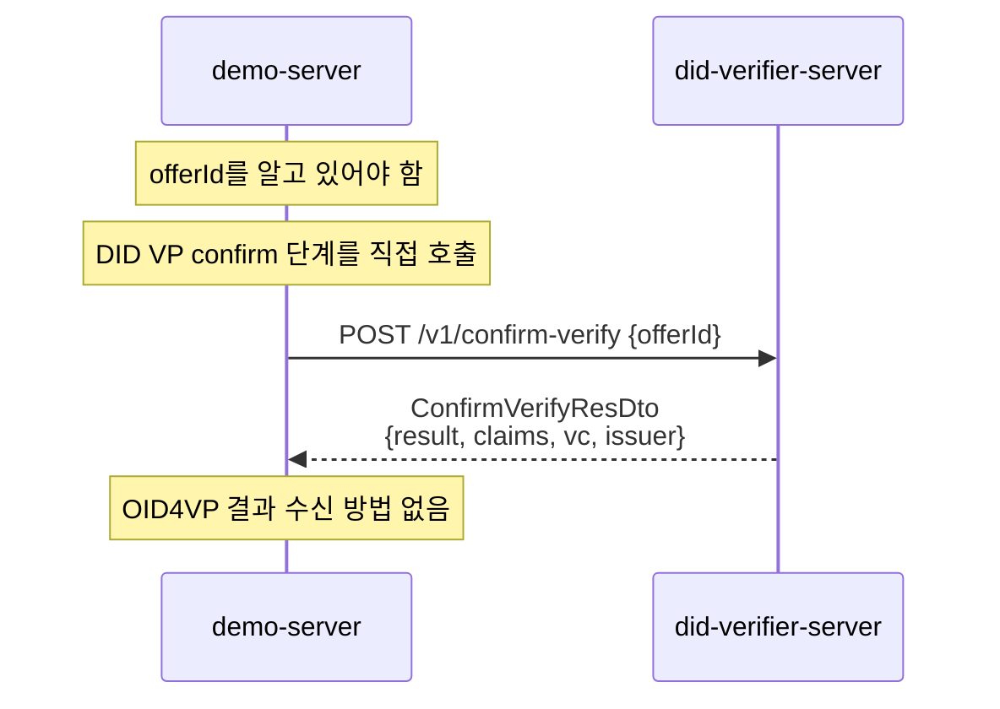
```mermaid
sequenceDiagram
    participant Demo as demo-server
    participant Verifier as did-verifier-server

    Note over Demo: offerId를 알고 있어야 함
    Note over Demo: DID VP confirm 단계를 직접 호출

    Demo->>Verifier: POST /v1/confirm-verify {offerId}
    Verifier-->>Demo: ConfirmVerifyResDto<br/>{result, claims, vc, issuer}

    Note over Demo: OID4VP 결과 수신 방법 없음
```

### 6-2. TO-BE: 결과 수신 (demo-server)

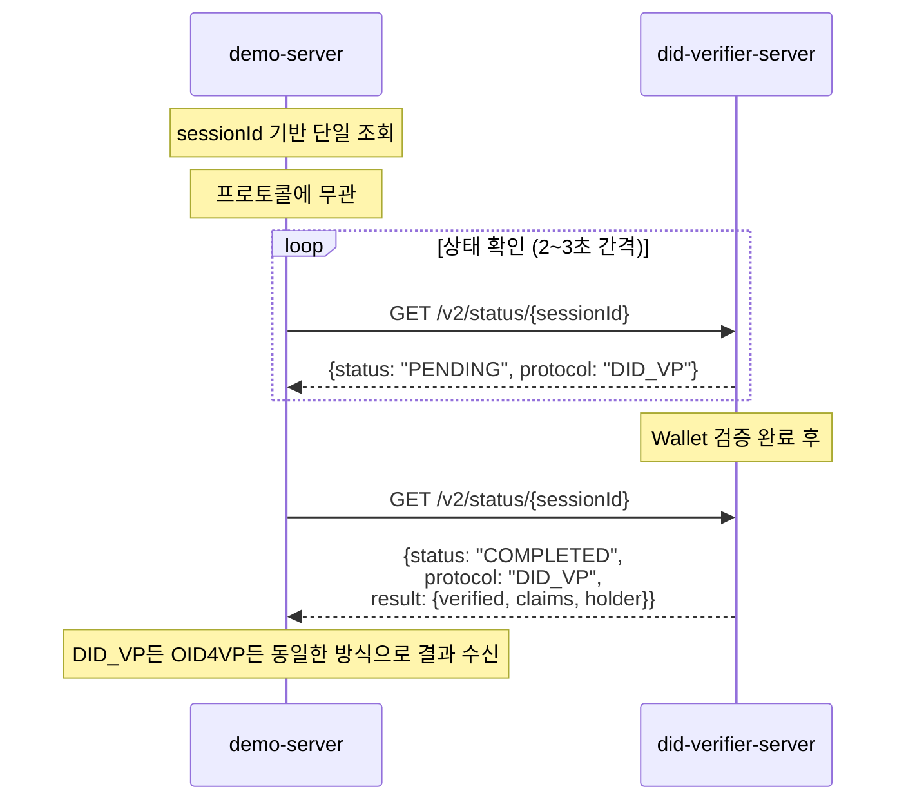
```mermaid
sequenceDiagram
    participant Demo as demo-server
    participant Verifier as did-verifier-server

    Note over Demo: sessionId 기반 단일 조회
    Note over Demo: 프로토콜에 무관

    loop 상태 확인 (2~3초 간격)
        Demo->>Verifier: GET /v2/status/{sessionId}
        Verifier-->>Demo: {status: "PENDING", protocol: "DID_VP"}
    end

    Note over Verifier: Wallet 검증 완료 후

    Demo->>Verifier: GET /v2/status/{sessionId}
    Verifier-->>Demo: {status: "COMPLETED",<br/>protocol: "DID_VP",<br/>result: {verified, claims, holder}}

    Note over Demo: DID_VP든 OID4VP든 동일한 방식으로 결과 수신
```

---

## 7. OID4VP SDK 통합 비교

### 7-1. AS-IS: SDK 모듈 상태

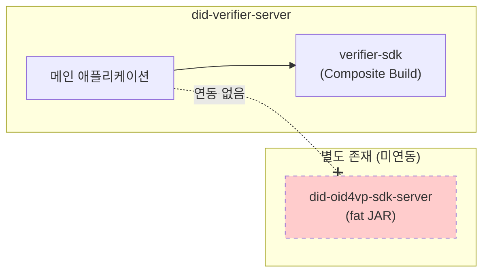
```mermaid
graph LR
    subgraph "did-verifier-server"
        Main["메인 애플리케이션"]
        SDK["verifier-sdk<br/>(Composite Build)"]
        Main --> SDK
    end

    subgraph "별도 존재 (미연동)"
        OID["did-oid4vp-sdk-server<br/>(fat JAR)"]
    end

    Main -.-x|"연동 없음"| OID

    style OID fill:#ffcccc,stroke-dasharray: 5 5
```

### 7-2. TO-BE: SDK 모듈 통합

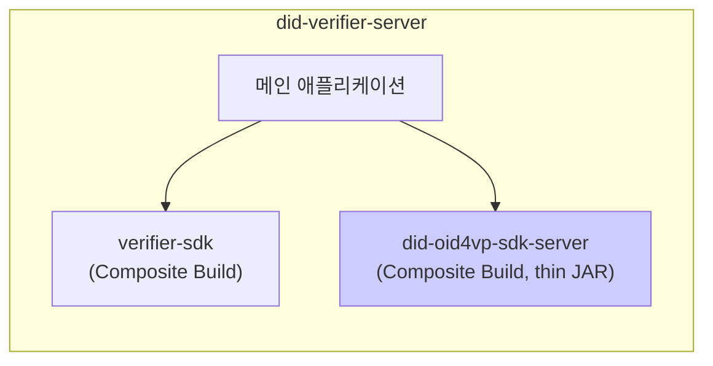
```mermaid
graph LR
    subgraph "did-verifier-server"
        Main["메인 애플리케이션"]
        SDK["verifier-sdk<br/>(Composite Build)"]
        OID["did-oid4vp-sdk-server<br/>(Composite Build, thin JAR)"]
        Main --> SDK
        Main --> OID
    end

    style OID fill:#ccccff
```

| 항목 | AS-IS | TO-BE |
|------|-------|-------|
| **빌드 방식** | fat JAR (독립) | Composite Build (thin JAR) |
| **settings.gradle** | `includeBuild('verifier-sdk')` 만 | + `includeBuild('did-oid4vp-sdk-server')` |
| **의존성 충돌** | 해당 없음 (미연동) | BouncyCastle 1.80 통일, Gson 버전 정리 |
| **Bean 등록** | 해당 없음 | component scan 자동 등록 (`org.omnione.did`) |

---

## 8. 컴포넌트별 변경 범위 요약

### 8-1. 파일 변경 매트릭스

| 컴포넌트 | 신규 | 수정 | 합계 | 핵심 변경 |
|----------|------|------|------|----------|
| **verifier-server** | ~22 | ~10 | ~32 | Protocol 레이어, OID4VP SDK 통합, DB 스키마 |
| **demo-server** | 0~1 | 3~4 | 3~5 | VerifierFeign v2 추가, QR 분기, 결과 폴링 |
| **React Admin** | ~6 | ~4 | ~10 | Demo 페이지 (프로토타입, Wallet 시뮬레이션) |
| **Wallet (앱)** | - | - | - | 이 리포 범위 밖. OID4VP 후속 플로우 대응 |

### 8-2. demo-server 수정 파일 상세

| 파일 | 변경 내용 |
|------|---------|
| `VerifierFeign.java` | `initiate(policyId)`, `getStatus(sessionId)` 메서드 추가 |
| `DemoServiceImpl.java` | `initiateVerification()` 메서드 추가, protocol 분기 QR 생성 |
| `DemoDataController.java` | 통합 검증 엔드포인트 추가 |
| `DTO 1~2개` | `InitiateResponse`, `StatusResponse` 수신용 DTO |

### 8-3. verifier-server 수정 파일 상세

| 카테고리 | 파일 수 | 내용 |
|---------|---------|------|
| 빌드 설정 | 3 | settings.gradle, build.gradle, oid4vp build.gradle |
| DB 마이그레이션 | 2 | protocol_type 컬럼, oid4vp_session_mapping 테이블 |
| Domain | 3 | ProtocolType Enum, Oid4vpSessionMapping Entity, Repository |
| Protocol 레이어 | 7 | Handler, Registry, Resolver, Orchestrator, StatusQueryService |
| Controller/DTO | 5 | UnifiedController, OID4VPController, DTO 3개 |
| 설정/프로토타입 | 5 | Config, yml, data.sql, Property |
| 기존 코드 수정 | 7 | Policy Entity, TransactionType, UrlConstant, 4개 ApplicationService |

---

## 9. 주요 결정 사항 (확정)

| # | 결정 | 내용 |
|---|------|------|
| 1 | 프로토콜 결정 주체 | **서버** (Policy.protocolType 기반) |
| 2 | API 버전 | **`/v2` 신설**, 기존 `/v1` 유지 |
| 3 | ProtocolHandler 범위 | **`initiate()` 전용**, 후속 플로우는 프로토콜별 독립 |
| 4 | 세션 통합 | **Transaction.txId = sessionId**, OID4VP SDK 세션은 매핑 테이블 |
| 5 | 결과 수신 | **`GET /v2/status/{sessionId}`** 폴링 (프로토콜 무관) |
| 6 | OID4VP SDK 통합 | **Composite Build** (thin JAR 전환) |

---

## 부록: 향후 비교 추가 예정

- [ ] Admin 화면 AS-IS / TO-BE (Policy protocolType 관리)
- [ ] Demo 화면 AS-IS / TO-BE (QR 생성 + Wallet 시뮬레이션)
- [ ] 에러 처리 시나리오 비교
- [ ] 성능/캐싱 전략 비교

---

**문서 버전**: 1.0
**최종 업데이트**: 2026-03-11
