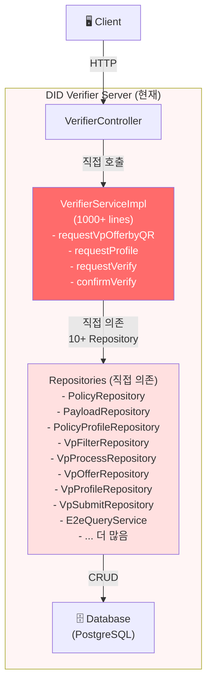
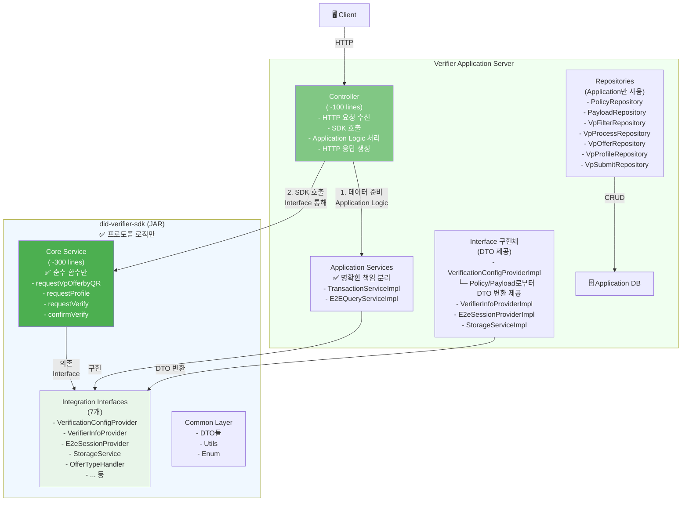
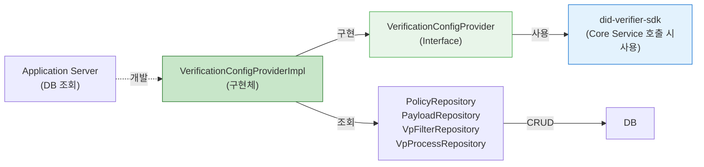
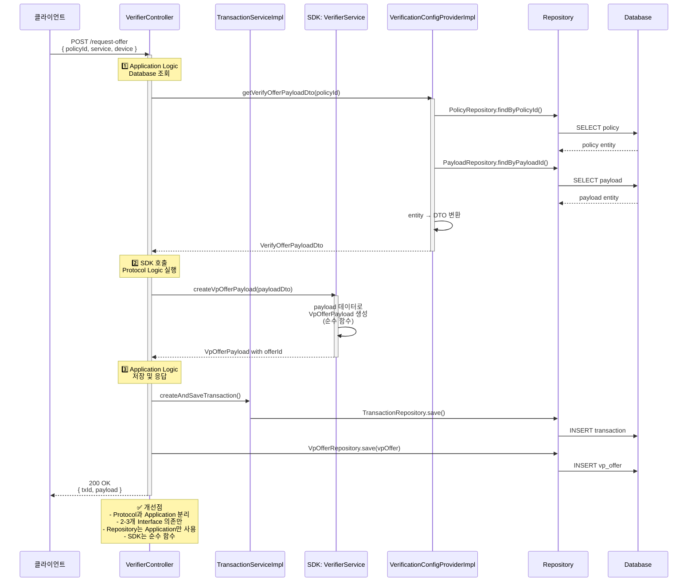
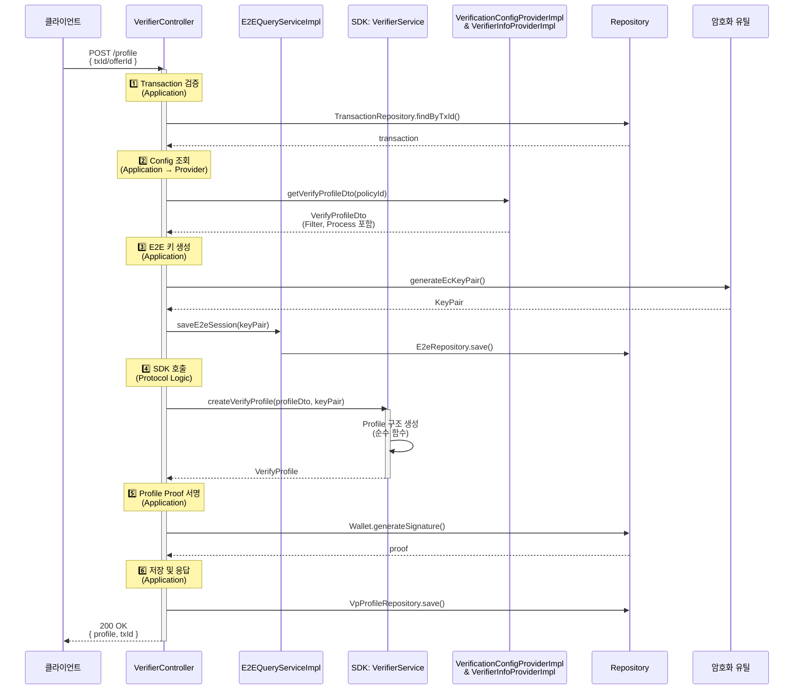
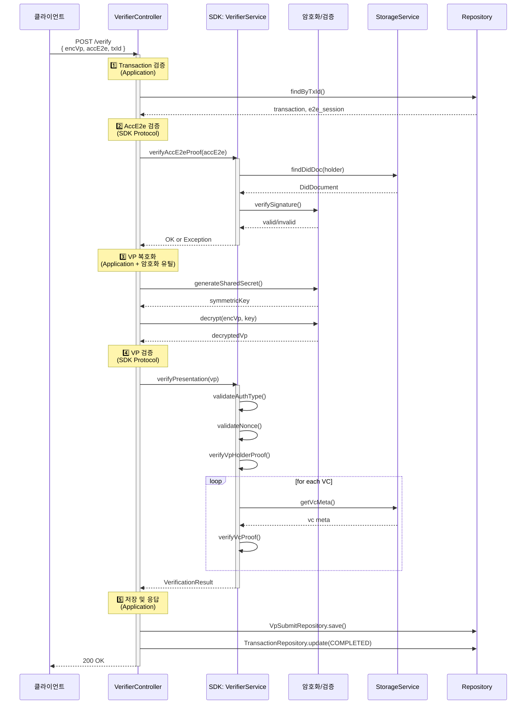
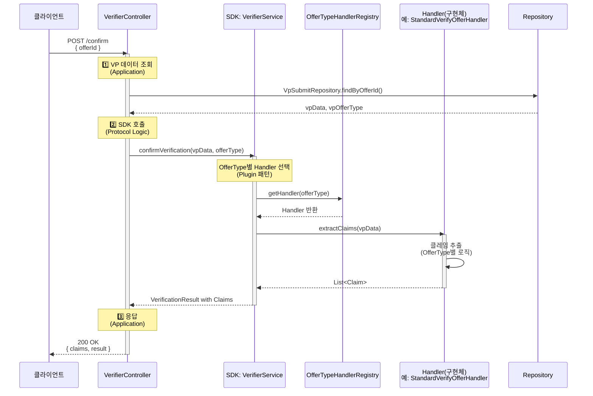
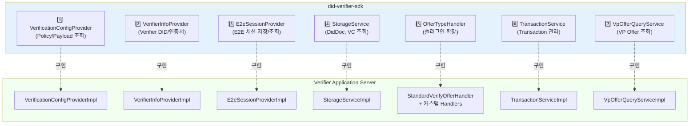
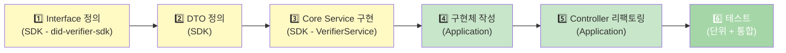
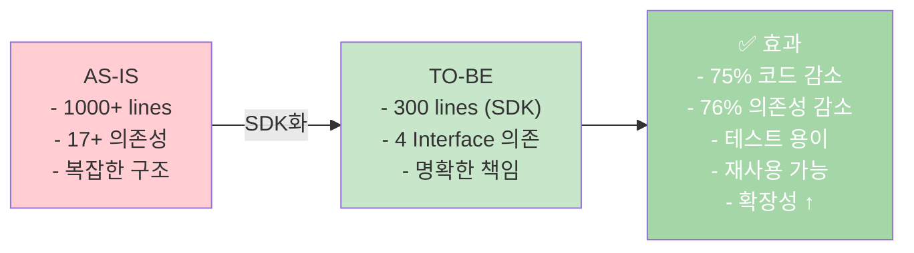

# DID Verifier Server SDK화 - 실제 코드 기반 설계문서

## 1. 전체 아키텍처

### 1.1 변경 전 (AS-IS)



### 1.2 변경 후 (TO-BE)



---

## 2. Interface 정의 (SDK - Integration Layer)

### 2.1 VerificationConfigProvider



**Interface 정의:**
```java
// did-verifier-sdk에 정의
public interface VerificationConfigProvider {
    
    // 4 메서드만 필요
    VerifyOfferPayloadDto getVerifyOfferPayloadDto(String policyId);
    
    VerifyProfileDto getVerifyProfileDto(String policyId);
    
    FilterConfigDto getFilterConfig(String policyId);
    
    ProcessConfigDto getProcessConfig(String policyId);
}

// DTO들 (SDK 정의, Application이 구현할 때 채워줌)
@Data
class VerifyOfferPayloadDto {
    String service;
    String device;
    String mode;
    List<String> endpoints;
    Integer validSecond;
    String offerType;
}

@Data
class VerifyProfileDto {
    String policyId;
    FilterConfigDto filter;
    ProcessConfigDto process;
}
```

---

## 3. 함수별 호출 흐름 개선

### 3.1 requestVpOfferbyQR (개선된 흐름)



### 3.2 requestProfile (개선된 흐름)



### 3.3 requestVerify (개선된 흐름)



### 3.4 confirmVerify (개선된 흐름 - Plugin 패턴)



---

## 4. Interface 목록 및 책임

### 4.1 SDK가 정의하는 Interface (7개)



### 4.2 각 Interface의 책임

| Interface | 책임 | Application 구현 |
|-----------|------|-----------------|
| **VerificationConfigProvider** | Policy/Payload/Filter/Process 조회 | DB 또는 Admin API 호출 |
| **VerifierInfoProvider** | Verifier DID, 인증서 조회 | YAML 설정 또는 DB |
| **E2eSessionProvider** | E2E 세션 저장/조회 | Redis 또는 DB |
| **StorageService** | DidDoc, VC, VcMeta 조회 | Blockchain 또는 Repository |
| **OfferTypeHandler** | OfferType별 클레임 추출 (플러그인) | 각 타입별 구현 |
| **TransactionService** | Transaction 생성/조회/상태 변경 | Repository 사용 |
| **VpOfferQueryService** | VP Offer 조회/저장 | Repository 사용 |

---

## 5. 의존성 감소 비교

### 5.1 Before (AS-IS)

```
VerifierServiceImpl
├─ PolicyRepository
├─ PayloadRepository
├─ PolicyProfileRepository
├─ VpFilterRepository
├─ VpProcessRepository
├─ VpOfferRepository
├─ VpProfileRepository
├─ VpSubmitRepository
├─ E2eQueryService
├─ TransactionService
├─ FileWalletService
├─ StorageService
├─ DidDocService
├─ VerifierInfoQueryService
├─ ZkpPolicyProfileRepository
├─ ZkpProofRequestRepository
├─ ObjectMapper
└─ ... 더 있음

⚠️ 총 17+ 의존성
```

### 5.2 After (TO-BE)

```
SDK: VerifierService
├─ VerificationConfigProvider (Interface)
├─ VerifierInfoProvider (Interface)
├─ E2eSessionProvider (Interface)
├─ StorageService (Interface)
└─ 비즈니스 로직

✅ 4개 Interface 의존만

Application: VerifierController
├─ VerifierService (SDK)
├─ TransactionServiceImpl
├─ VpOfferQueryService
├─ VpOfferRepository
├─ VpProfileRepository
├─ VpSubmitRepository
└─ ... 기타 Repository 5-6개

✅ 명확하고 관리 가능한 의존성
```

---

## 6. 코드 라인 수 비교

```mermaid
bar
    title "코드 라인 수 변화"
    x-axis [VerifierServiceImpl, Controller, Total]
    y-axis "Lines" 0 1200
    bar [1000, 200, 1200] "AS-IS"
    bar [300, 100, 400] "TO-BE"
```

| 항목 | AS-IS | TO-BE | 감소 |
|------|-------|-------|------|
| VerifierServiceImpl | 1000+ lines | 300 lines (SDK) | 70% ↓ |
| VerifierController | 200 lines | 100 lines | 50% ↓ |
| 의존성 개수 | 17+ | 4 (Interface) | 76% ↓ |
| 테스트 Mock 필요 | 17개 | 4개 | 76% ↓ |

---

## 7. 실제 변환 예시

### 7.1 requestVpOfferbyQR 변환

#### BEFORE (현재)

```java
@Service
public class VerifierServiceImpl {
    @Autowired private PolicyRepository policyRepository;
    @Autowired private PayloadRepository payloadRepository;
    @Autowired private VpOfferRepository vpOfferRepository;
    @Autowired private TransactionService transactionService;
    @Autowired private VpOfferQueryService vpOfferQueryService;
    // ... 12개 더
    
    @Override
    public RequestOfferResDto requestVpOfferbyQR(RequestOfferReqDto reqDto) {
        // 1. DB에서 Policy 조회
        Policy policy = policyRepository.findByPolicyId(reqDto.getPolicyId())
            .orElseThrow(() -> new OpenDidException(ErrorCode.VP_POLICY_NOT_FOUND));
        
        // 2. DB에서 Payload 조회
        Payload payload = payloadRepository.findByPayloadId(policy.getPayloadId())
            .orElseThrow(() -> new OpenDidException(ErrorCode.VP_PAYLOAD_NOT_FOUND));
        
        // 3. Transaction 생성
        Transaction transaction = createAndSaveTransaction();
        
        // 4. Offer 생성 (여기부터 Protocol Logic)
        VerifyOfferPayload vpPayload = policyToVerifyOfferPayload(payload);
        String offerId = UUID.randomUUID().toString();
        vpPayload.setOfferId(offerId);
        
        // 5. VpOffer 저장
        vpOfferQueryService.insertVpOffer(VpOffer.builder()
            .transactionId(transaction.getId())
            .offerId(offerId)
            .vpPolicyId(policy.getPolicyId())
            .offerType(vpPayload.getType().toString())
            .payload(JsonUtil.serializeToJson(vpPayload))
            .build());
        
        return RequestOfferResDto.builder()
            .txId(transaction.getTxId())
            .payload(vpPayload)
            .build();
    }
}
```

#### AFTER (개선)

```java
// ========== SDK: did-verifier-sdk ==========
@Service
@RequiredArgsConstructor
public class VerifierService {
    private final VerificationConfigProvider configProvider;  // 2개 Interface만
    private final VerifierInfoProvider infoProvider;
    
    public VerifyOfferPayload createVpOfferPayload(
            VerifyOfferPayloadDto payloadDto) {
        
        // 순수 함수: 데이터 가공만
        return VerifyOfferPayload.builder()
            .service(payloadDto.getService())
            .device(payloadDto.getDevice())
            .mode(payloadDto.getMode())
            .endpoints(payloadDto.getEndpoints())
            .locked(false)
            .validUntil(calculateValidUntil(payloadDto.getValidSecond()))
            .type(payloadDto.getOfferType())
            .build();
    }
    
    private String calculateValidUntil(Integer validSeconds) {
        return Instant.now()
            .plusSeconds(validSeconds)
            .toString();
    }
}

// ========== Application Server: VerifierController ==========
@RestController
@RequiredArgsConstructor
public class VerifierController {
    private final VerifierService verifierService;  // SDK
    private final VerificationConfigProvider configProvider;  // Interface 의존
    private final TransactionService transactionService;
    private final VpOfferRepository vpOfferRepository;
    private final VpOfferQueryService vpOfferQueryService;
    
    @PostMapping("/request-offer")
    public ResponseEntity<RequestOfferResDto> requestVpOfferbyQR(
            @RequestBody RequestOfferReqDto reqDto) {
        
        try {
            // 1️⃣ Application Logic: 설정 조회
            VerifyOfferPayloadDto payloadDto = configProvider
                .getVerifyOfferPayloadDto(reqDto.getPolicyId());
            
            // 2️⃣ SDK 호출: Protocol Logic
            VerifyOfferPayload payload = verifierService
                .createVpOfferPayload(payloadDto);
            
            // 3️⃣ Application Logic: 저장
            Transaction transaction = transactionService
                .insertTransaction(Transaction.builder()
                    .type(TransactionType.VP_SUBMIT)
                    .txId(UUID.randomUUID().toString())
                    .status(TransactionStatus.PENDING)
                    .build());
            
            String vpOfferId = UUID.randomUUID().toString();
            payload.setOfferId(vpOfferId);
            
            vpOfferQueryService.insertVpOffer(VpOffer.builder()
                .transactionId(transaction.getId())
                .offerId(vpOfferId)
                .payload(JsonUtil.serializeToJson(payload))
                .build());
            
            return ResponseEntity.ok(RequestOfferResDto.builder()
                .txId(transaction.getTxId())
                .payload(payload)
                .build());
                
        } catch (OpenDidException e) {
            log.error("Error: {}", e.getErrorCode().getMessage());
            throw e;
        }
    }
}

// ========== Application Server: VerificationConfigProviderImpl ==========
@Service
@RequiredArgsConstructor
public class VerificationConfigProviderImpl 
        implements VerificationConfigProvider {
    
    private final PolicyRepository policyRepository;
    private final PayloadRepository payloadRepository;
    private final VpFilterRepository vpFilterRepository;
    private final VpProcessRepository vpProcessRepository;
    
    @Override
    public VerifyOfferPayloadDto getVerifyOfferPayloadDto(String policyId) {
        // DB에서 조회
        Policy policy = policyRepository.findByPolicyId(policyId)
            .orElseThrow(() -> new OpenDidException(ErrorCode.VP_POLICY_NOT_FOUND));
        
        Payload payload = payloadRepository.findByPayloadId(policy.getPayloadId())
            .orElseThrow(() -> new OpenDidException(ErrorCode.VP_PAYLOAD_NOT_FOUND));
        
        // Entity → DTO 변환
        return VerifyOfferPayloadDto.builder()
            .service(payload.getService())
            .device(payload.getDevice())
            .mode(payload.getMode().toString())
            .endpoints(parseEndpoints(payload.getEndpoints()))
            .validSecond(payload.getValidSecond())
            .offerType(payload.getOfferType().toString())
            .build();
    }
}
```

---

## 8. 다음 단계

### 8.1 작업 순서



### 8.2 파일 생성 계획

```
did-verifier-sdk/src/main/java/org/omnione/did/sdk/verifier/
├── integration/
│   └── provider/
│       ├── VerificationConfigProvider.java
│       ├── VerifierInfoProvider.java
│       ├── E2eSessionProvider.java
│       ├── StorageService.java
│       ├── OfferTypeHandler.java
│       ├── TransactionService.java
│       └── VpOfferQueryService.java
├── core/
│   └── service/
│       ├── VerifierService.java
│       ├── OfferTypeHandlerRegistry.java
│       └── ...
└── common/
    ├── dto/
    │   ├── VerifyOfferPayloadDto.java
    │   ├── VerifyProfileDto.java
    │   ├── FilterConfigDto.java
    │   ├── ProcessConfigDto.java
    │   └── ...
    └── enums/
        └── ...

did-verifier-server/src/main/java/org/omnione/did/verifier/v1/agent/
├── service/
│   ├── provider/
│   │   ├── VerificationConfigProviderImpl.java
│   │   ├── VerifierInfoProviderImpl.java
│   │   ├── E2eSessionProviderImpl.java
│   │   ├── StorageServiceImpl.java
│   │   └── ...
│   ├── handler/
│   │   ├── StandardVerifyOfferHandler.java
│   │   └── CustomOfferHandlers.java
│   └── VerifierServiceImpl.java (리팩토링)
└── controller/
    └── VerifierController.java (리팩토링)
```

---

## 9. 요약: 개선 효과



---

이제 이 설계를 기반으로 실제 코드를 작성하면 됩니다!
궁금한 점이나 수정할 부분이 있으면 언제든 말씀해주세요. 🚀
