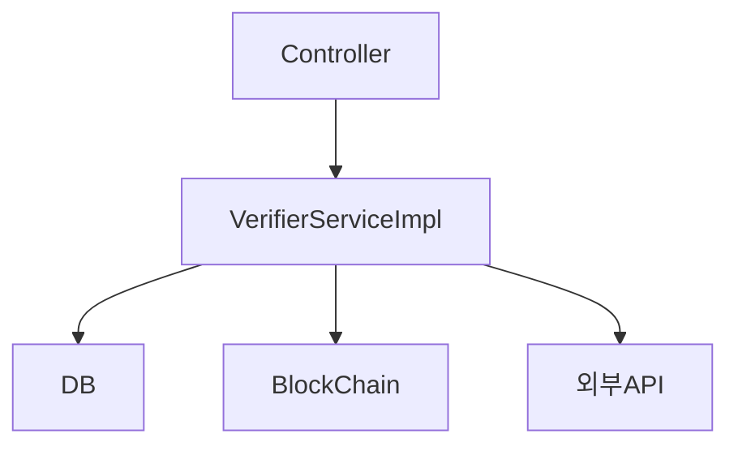
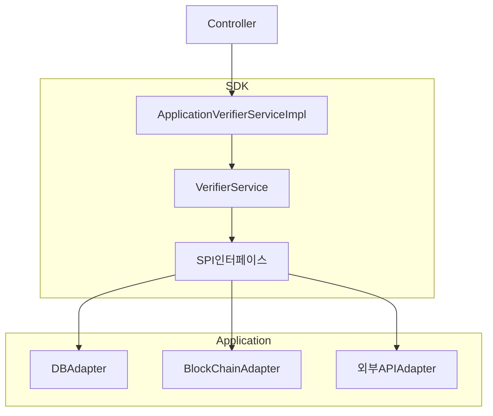
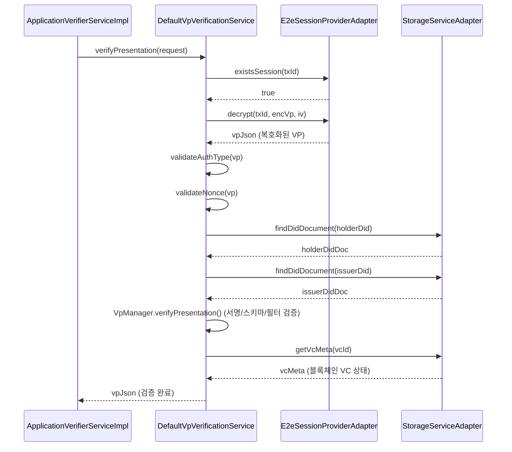

# Verifier Server 리팩토링 공유

> 10분 내외, 가볍게 뭐 했는지 공유하는 자리

---

## 왜 했냐면

기존 코드가 `VerifierServiceImpl` 파일 하나에 너무 많은 게 들어가 있었어요.
뭔가 고치면 다른 게 터지고, 테스트도 없고, 나중에 누가 봐도 파악하기가 힘든 구조였음.

---

## 뭘 바꿨냐면

### Before



한 파일이 다 하고 있었음

---

### After



SDK랑 Application을 분리하고, 인터페이스로 연결함

---

## 핵심 변경 3가지

1. **SDK 분리** — 검증 핵심 로직을 별도 모듈(`verifier-sdk`)로 뺌
2. **Adapter Pattern** — SDK가 인터페이스만 알고, 구현은 Application에서
3. **Legacy 삭제** — `VerifierServiceImpl.java` 완전 제거

---

## 설계 패턴

두 가지 패턴을 썼어요.

**Facade** — `DefaultVerifierService` 하나로 SDK 내부 5개 서비스를 묶어서 Application에서는 이것 하나만 쓰면 됨

**Adapter** — SDK가 `StorageService`, `E2eSessionProvider` 같은 인터페이스만 정의하고, 실제 구현(DB 접근, 암호화 등)은 Application의 Adapter가 담당

```
SDK 내부                          Application
────────────────────────         ──────────────────────────
DefaultVerifierService (Facade)
  ├── DefaultVpOfferService
  ├── DefaultVpProfileService    ← StorageServiceAdapter (DB)
  ├── DefaultVpVerification          implements StorageService
  └── DefaultConfirmService      ← E2eSessionProviderAdapter
                                 ← CryptoHelperAdapter
                                 ← TransactionManagerAdapter
                                    ... (총 7개)
```

---

## VP 검증 흐름 (대표 예시)

"사용자가 VP를 제출했을 때 SDK 내부에서 뭘 하냐?" 에 대한 답



핵심은 SDK가 실제로 DB나 암호화 처리를 직접 안 함. 인터페이스(Adapter)만 호출하고, 구현은 Application이 책임짐.

---

## 결과

- 통합 테스트 13개 추가, 전부 통과
- SDK 로직 건드려도 Application 쪽 영향 최소화
- 앞으로 다른 구현체 붙이기도 훨씬 편함

---

## 참고 문서

- `VERIFIER_ARCHITECTURE.md` — 전체 구조
- `verifier-sdk/SDK_GUIDE.md` — SDK API 상세
