# Verifier SDK 아키텍처 가이드

**버전**: 1.0.0
**최종 업데이트**: 2026-02-26

---

## 목차

1. [개요](#1-개요)
2. [전체 구조](#2-전체-구조)
3. [패키지 구조](#3-패키지-구조)
4. [레이어별 클래스 설명](#4-레이어별-클래스-설명)
5. [클래스 의존 관계](#5-클래스-의존-관계)
6. [주요 시퀀스 다이어그램](#6-주요-시퀀스-다이어그램)
7. [어댑터 패턴 상세](#7-어댑터-패턴-상세)
8. [예외 처리 체계](#8-예외-처리-체계)
9. [E2E 암호화 흐름](#9-e2e-암호화-흐름)
10. [ZKP 검증 흐름](#10-zkp-검증-흐름)
11. [빌드 및 의존성](#11-빌드-및-의존성)

---

## 1. 개요

### SDK화의 배경

기존 Verifier Server는 VP 검증 비즈니스 로직이 Application 코드에 직접 포함된 모놀리식 구조였습니다.
이를 **SDK와 Application으로 분리**하여 다음을 달성합니다.

- VP/ZKP 검증 프로토콜을 재사용 가능한 독립 라이브러리로 분리
- Application은 인프라(DB, Blockchain, 암호화 구현)만 담당
- SDK는 프로토콜 로직에만 집중
- 동일한 SDK를 여러 Application에서 재사용 가능

### 핵심 원칙

```
SDK: "무엇을(What)" → 프로토콜 순서, 검증 규칙
Application: "어떻게(How)" → DB 조회, Blockchain 연동, 암호화 구현
```

---

## 2. 전체 구조

```mermaid
graph TB
    subgraph "Application Layer (did-verifier-server)"
        direction TB
        Controller["VerifierController<br/>(REST API)"]
        AppService["ApplicationVerifierService<br/>(비즈니스 오케스트레이션)"]

        subgraph "Adapters (SDK 인터페이스 구현체)"
            A1["VerificationConfigProviderAdapter<br/>→ DB에서 Policy 조회"]
            A2["E2eSessionProviderAdapter<br/>→ DB에서 E2E 세션 관리"]
            A3["VerifierInfoProviderAdapter<br/>→ yml에서 Verifier 정보"]
            A4["StorageServiceAdapter<br/>→ Blockchain/DB에서 DID Doc"]
            A5["TransactionManagerAdapter<br/>→ DB에서 Transaction 관리"]
            A6["CryptoHelperAdapter<br/>→ OpenDID SDK 암호화 위임"]
            A7["NonceGeneratorImpl<br/>→ SecureRandom 기반"]
        end

        DB[("PostgreSQL")]
        BC["Blockchain / LSS"]
    end

    subgraph "Verifier SDK (verifier-sdk-1.0.0.jar)"
        direction TB

        subgraph "SPI (Service Provider Interface)"
            SPI_VS["VerifierService (Facade)"]
            SPI_VOS["VpOfferService"]
            SPI_VPS["VpProfileService"]
            SPI_VVS["VpVerificationService"]
            SPI_VCS["VerificationConfirmService"]
            SPI_ZKP["ZkpProofVerificationService"]
        end

        subgraph "Default Implementations"
            D_VS["DefaultVerifierService"]
            D_VOS["DefaultVpOfferService"]
            D_VPS["DefaultVpProfileService"]
            D_VVS["DefaultVpVerificationService"]
            D_VCS["DefaultVerificationConfirmService"]
            D_ZKP["DefaultZkpProofVerificationService"]
        end

        subgraph "API (Application이 구현해야 할 인터페이스)"
            API1["VerificationConfigProvider"]
            API2["E2eSessionProvider"]
            API3["VerifierInfoProvider"]
            API4["StorageService"]
            API5["TransactionManager"]
            API6["CryptoHelper"]
            API7["NonceGenerator"]
        end

        subgraph "DTO"
            DTO1["VpOfferPayload"]
            DTO2["VerificationProfile"]
            DTO3["VpVerificationRequest"]
            DTO4["VerificationConfirmResult"]
            DTO5["ZkpVerificationRequest/Result"]
        end
    end

    subgraph "OpenDID External JARs"
        EXT1["did-core-sdk-server-2.0.0.jar"]
        EXT2["did-crypto-sdk-server-2.0.0.jar"]
        EXT3["did-datamodel-sdk-server-2.0.0.jar"]
        EXT4["did-zkp-sdk-server-2.0.0.jar"]
    end

    Controller --> AppService
    AppService --> D_VS
    AppService --> A1 & A2 & A3 & A4 & A5 & A6 & A7

    D_VS --> D_VOS & D_VPS & D_VVS & D_VCS & D_ZKP
    D_VOS --> API1 & API5
    D_VPS --> API1 & API3 & API7
    D_VVS --> API2 & API4 & API6
    D_ZKP --> API2 & API4 & API3 & API6

    A1 -.implements.-> API1
    A2 -.implements.-> API2
    A3 -.implements.-> API3
    A4 -.implements.-> API4
    A5 -.implements.-> API5
    A6 -.implements.-> API6
    A7 -.implements.-> API7

    A1 --> DB
    A2 --> DB
    A5 --> DB
    A4 --> BC
    A6 --> EXT2
    D_VVS --> EXT1
    D_ZKP --> EXT4

    style SPI_VS fill:#ffe1e1
    style D_VS fill:#fff4e1
    style API1 fill:#e1f5ff
    style API2 fill:#e1f5ff
    style API3 fill:#e1f5ff
    style API4 fill:#e1f5ff
    style API5 fill:#e1f5ff
    style API6 fill:#e1f5ff
    style API7 fill:#e1f5ff
```

---

## 3. 패키지 구조

```
verifier-sdk/src/main/java/org/omnione/did/verifier/v1/
│
├── spi/                          # Service Provider Interface (서비스 정의)
│   ├── VerifierService.java      # Facade - 전체 진입점
│   ├── VpOfferService.java       # VP Offer 생성 서비스
│   ├── VpProfileService.java     # Verify Profile 생성 서비스
│   ├── VpVerificationService.java# VP 검증 서비스
│   ├── VerificationConfirmService.java # 검증 확인 서비스
│   └── ZkpProofVerificationService.java # ZKP 검증 서비스
│
├── api/                          # Application이 구현해야 하는 인터페이스
│   ├── VerificationConfigProvider.java # Policy 제공
│   ├── E2eSessionProvider.java   # E2E 세션 관리
│   ├── VerifierInfoProvider.java # Verifier 정보 제공
│   ├── StorageService.java       # DID Doc / VC Meta 조회
│   ├── TransactionManager.java   # Transaction 생명주기
│   ├── CryptoHelper.java         # 암호화 유틸리티
│   └── NonceGenerator.java       # Nonce 생성
│
├── service/                      # SPI 기본 구현체 (Default)
│   ├── DefaultVerifierService.java
│   ├── DefaultVpOfferService.java
│   ├── DefaultVpProfileService.java
│   ├── DefaultVpVerificationService.java
│   ├── DefaultVerificationConfirmService.java
│   └── DefaultZkpProofVerificationService.java
│
├── dto/                          # 데이터 전송 객체
│   ├── VpOfferPayload.java       # VP Offer 결과
│   ├── VerificationProfile.java  # Verify Profile
│   ├── VerificationPolicy.java   # 검증 정책
│   ├── VpVerificationRequest.java# VP 검증 요청
│   ├── VerificationConfirmResult.java # 검증 결과
│   ├── ReqE2e.java               # E2E 요청 정보
│   ├── FilterInfo.java           # VC 필터 조건
│   ├── ProcessInfo.java          # 프로세스 정보
│   ├── ProviderDetail.java       # 제공자 상세
│   ├── KeyPairInfo.java          # 키쌍 정보
│   ├── ZkpVerificationRequest.java
│   ├── ZkpVerificationResult.java
│   ├── ZkpPolicy.java
│   ├── ZkpInnerProfile.java
│   ├── ProofRequestProfile.java
│   ├── ProofRequestProfileRequest.java
│   ├── PresentMode.java          # Direct / Indirect
│   └── OfferType.java            # VerifyOffer / VerifyProofOffer
│
└── exception/                    # 예외 클래스
    ├── VerifierSdkException.java # SDK 전용 예외
    └── VerifierSdkErrorCode.java # 에러 코드 Enum (SSDKVRF)

did-verifier-server/src/main/java/org/omnione/did/verifier/v1/agent/
│
├── adapter/                      # SDK API 인터페이스 구현체
│   ├── VerificationConfigProviderAdapter.java
│   ├── E2eSessionProviderAdapter.java
│   ├── VerifierInfoProviderAdapter.java
│   ├── StorageServiceAdapter.java
│   ├── TransactionManagerAdapter.java
│   ├── CryptoHelperAdapter.java
│   └── NonceGeneratorImpl.java
│
├── config/                       # SDK 설정 및 빈 구성
│   └── SdkConfig.java            # DefaultVerifierService 빈 등록
│
└── service/
    └── ApplicationVerifierService.java # SDK 호출 오케스트레이션
```

---

## 4. 레이어별 클래스 설명

### 4.1 SPI 레이어 (SDK 서비스 인터페이스)

| 인터페이스 | 역할 | 주요 메서드 |
|-----------|------|-----------|
| `VerifierService` | 전체 Facade (진입점) | `createVpOfferPayload`, `createVerifyProfile`, `verifyPresentation`, `confirmVerification`, `verifyZkpProof` |
| `VpOfferService` | VP Offer 생성 | `createVpOfferPayload` (Dynamic QR), `createStaticVpOfferPayload` (Static QR) |
| `VpProfileService` | Verify Profile 생성 | `createVerifyProfile` |
| `VpVerificationService` | VP 검증 | `verifyPresentation`, `decryptVp` |
| `VerificationConfirmService` | 검증 결과 확인 | `confirmVerification` (VP), `confirmVerification` (VP+ZKP) |
| `ZkpProofVerificationService` | ZKP 검증 | `createProofRequestProfile`, `verifyZkpProof`, `decryptZkpProof` |

### 4.2 API 레이어 (Application 구현 인터페이스)

| 인터페이스 | 역할 | 구현체 (Application) |
|-----------|------|---------------------|
| `VerificationConfigProvider` | Policy/Filter/Process 조회 | `VerificationConfigProviderAdapter` → DB |
| `E2eSessionProvider` | E2E 키쌍 생성/관리/복호화 | `E2eSessionProviderAdapter` → DB |
| `VerifierInfoProvider` | Verifier DID / DID Document | `VerifierInfoProviderAdapter` → yml, 파일 |
| `StorageService` | DID Doc, VC Meta, ZKP Schema 조회 | `StorageServiceAdapter` → Blockchain/LSS |
| `TransactionManager` | Transaction ID 생성/조회 | `TransactionManagerAdapter` → DB |
| `CryptoHelper` | ECDH, AES, SHA-256, Multibase | `CryptoHelperAdapter` → did-crypto-sdk |
| `NonceGenerator` | Nonce 생성 | `NonceGeneratorImpl` → SecureRandom |

### 4.3 DTO 레이어

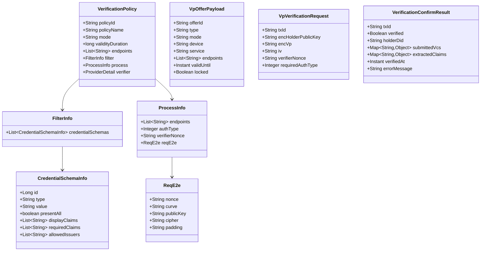

---

## 5. 클래스 의존 관계

### 5.1 SDK 내부 의존 관계

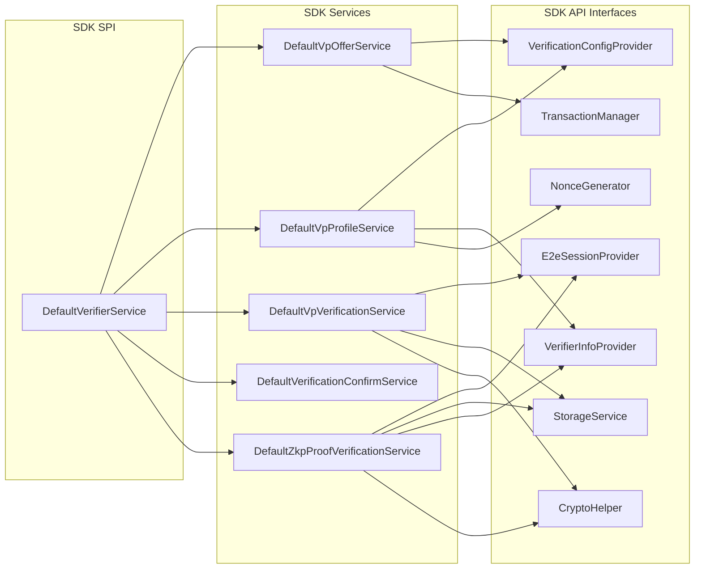

### 5.2 Application → SDK 의존 관계

```mermaid
graph LR
    subgraph "Application"
        AppService["ApplicationVerifierService"]
        A1["VerificationConfigProviderAdapter"]
        A2["E2eSessionProviderAdapter"]
        A3["VerifierInfoProviderAdapter"]
        A4["StorageServiceAdapter"]
        A5["TransactionManagerAdapter"]
        A6["CryptoHelperAdapter"]
        A7["NonceGeneratorImpl"]
    end

    subgraph "SDK"
        SDK["DefaultVerifierService"]
        API1["VerificationConfigProvider"]
        API2["E2eSessionProvider"]
        API3["VerifierInfoProvider"]
        API4["StorageService"]
        API5["TransactionManager"]
        API6["CryptoHelper"]
        API7["NonceGenerator"]
    end

    subgraph "Infrastructure"
        DB["PostgreSQL"]
        BC["Blockchain / LSS"]
        DID_SDK["did-crypto-sdk"]
    end

    AppService -- "생성 주입" --> SDK

    A1 -.->|implements| API1
    A2 -.->|implements| API2
    A3 -.->|implements| API3
    A4 -.->|implements| API4
    A5 -.->|implements| API5
    A6 -.->|implements| API6
    A7 -.->|implements| API7

    A1 --> DB
    A2 --> DB
    A5 --> DB
    A4 --> BC
    A6 --> DID_SDK
```

---

## 6. 주요 시퀀스 다이어그램

### 6.1 VP Offer 생성 (QR 코드 발급)

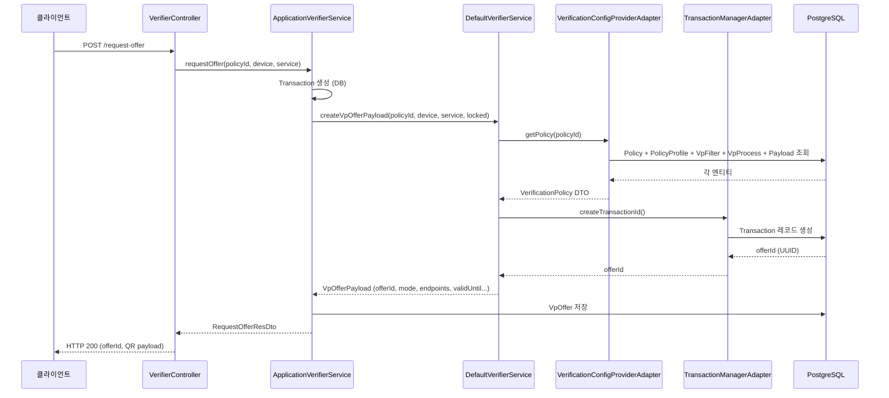

### 6.2 Verify Profile 생성

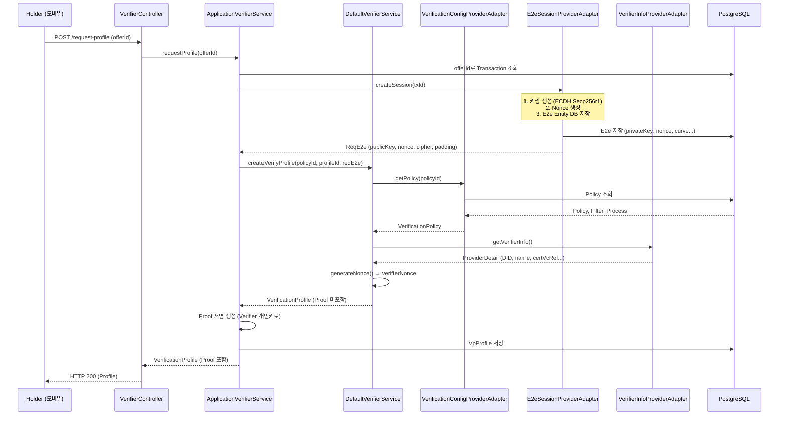

### 6.3 VP 제출 및 검증

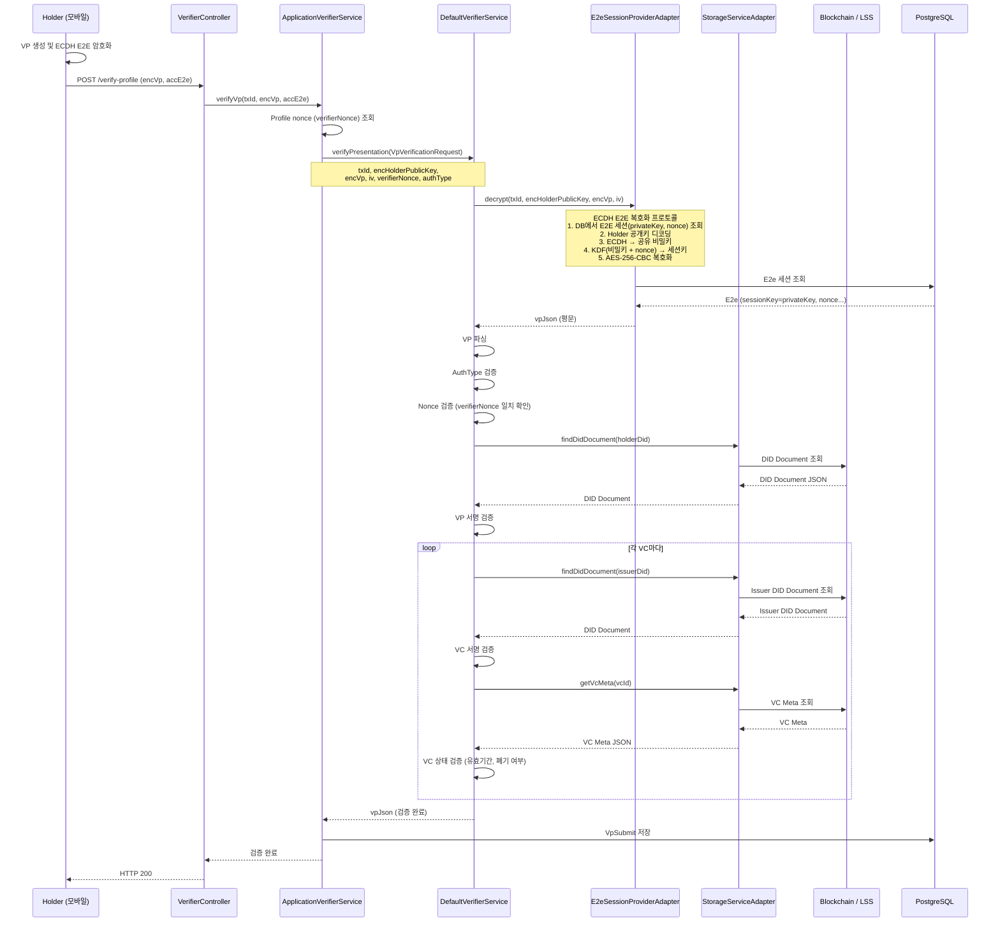

### 6.4 검증 결과 확인

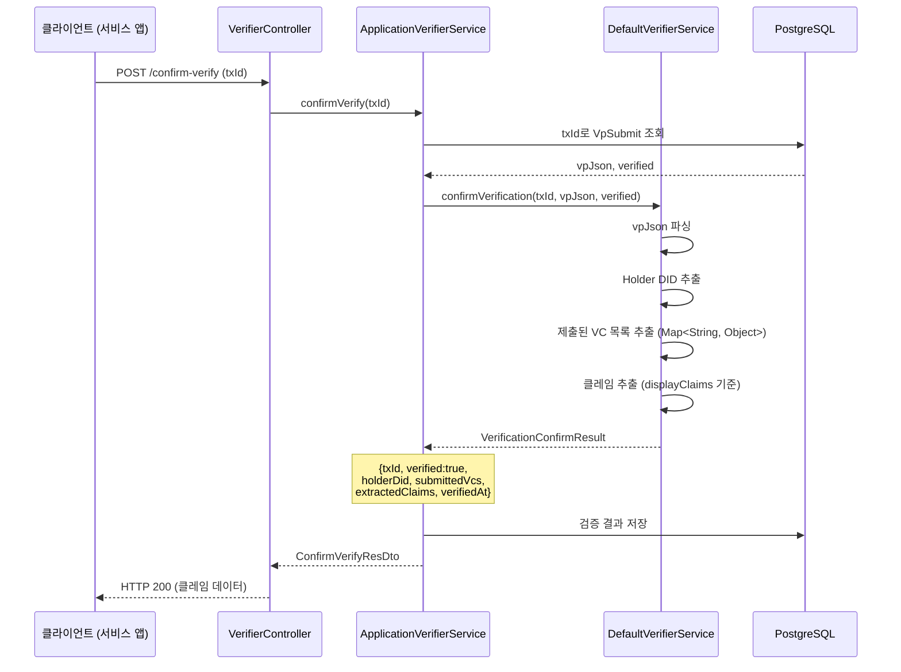

---

## 7. 어댑터 패턴 상세

Application은 **Adapter 패턴**으로 SDK의 7개 API 인터페이스를 구현합니다.

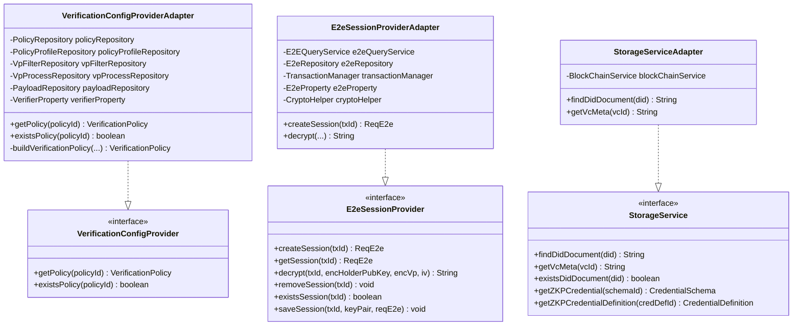

### 어댑터 책임 요약

| 어댑터 | 구현 인터페이스 | 주요 의존 |
|--------|---------------|-----------|
| `VerificationConfigProviderAdapter` | `VerificationConfigProvider` | `PolicyRepository`, `VpFilterRepository`, `VpProcessRepository`, `PayloadRepository` |
| `E2eSessionProviderAdapter` | `E2eSessionProvider` | `E2eRepository`, `CryptoHelper`, `E2eProperty` |
| `VerifierInfoProviderAdapter` | `VerifierInfoProvider` | `VerifierProperty` (yml), 키 저장소 |
| `StorageServiceAdapter` | `StorageService` | `BlockChainService` (Blockchain/LSS 연동) |
| `TransactionManagerAdapter` | `TransactionManager` | `TransactionRepository` |
| `CryptoHelperAdapter` | `CryptoHelper` | `did-crypto-sdk-server-2.0.0.jar` |
| `NonceGeneratorImpl` | `NonceGenerator` | `SecureRandom` |

---

## 8. 예외 처리 체계

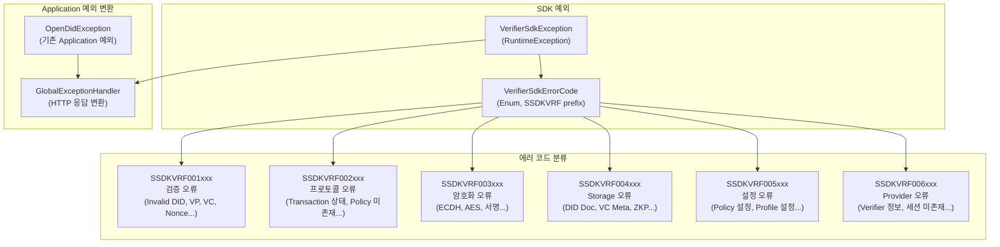

### 에러 코드 표

| 코드 범위 | 분류 | 예시 |
|-----------|------|------|
| `SSDKVRF001xxx` | 검증 오류 | `SDK_INVALID_VP`, `SDK_INVALID_NONCE` |
| `SSDKVRF002xxx` | 프로토콜 오류 | `SDK_POLICY_NOT_FOUND`, `SDK_TRANSACTION_EXPIRED` |
| `SSDKVRF003xxx` | 암호화 오류 | `SDK_ECDH_KEY_AGREEMENT_FAILED`, `SDK_DECRYPTION_FAILED` |
| `SSDKVRF004xxx` | Storage 오류 | `SDK_DID_DOCUMENT_NOT_FOUND`, `SDK_VC_META_NOT_FOUND` |
| `SSDKVRF005xxx` | 설정 오류 | `SDK_CONFIGURATION_ERROR`, `SDK_INVALID_POLICY_CONFIGURATION` |
| `SSDKVRF006xxx` | Provider 오류 | `SDK_SESSION_NOT_FOUND`, `SDK_VERIFIER_INFO_NOT_FOUND` |

---

## 9. E2E 암호화 흐름

VP 제출 시 Holder의 VP는 E2E 암호화되어 전송됩니다.
ECDH (Elliptic Curve Diffie-Hellman) 프로토콜을 사용합니다.

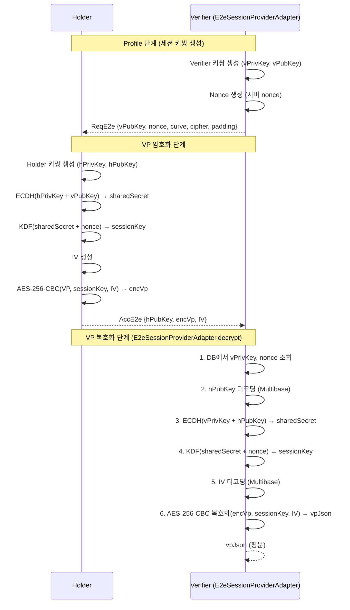

---

## 10. ZKP 검증 흐름

Zero-Knowledge Proof를 사용한 프라이버시 보존 검증 흐름입니다.

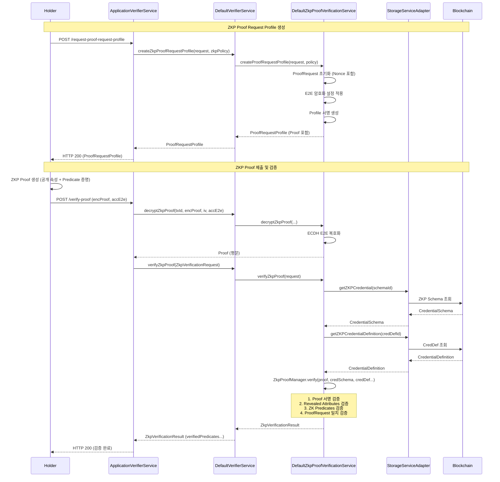

---

## 11. 빌드 및 의존성

### SDK 의존 라이브러리

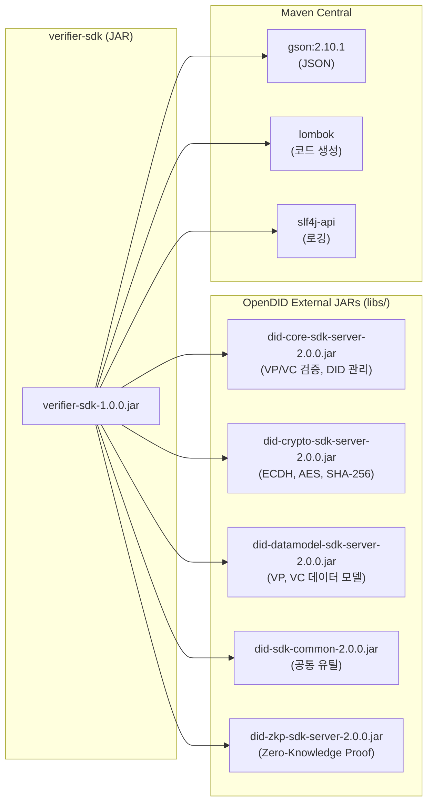

### 빌드 방법

```bash
# SDK JAR 단독 빌드
cd source/did-verifier-server/verifier-sdk
./gradlew jar
# 결과: build/libs/verifier-sdk-1.0.0-SNAPSHOT.jar

# Application 전체 빌드 (SDK 포함)
cd source/did-verifier-server
./gradlew bootJar
```

### Application에서 SDK 참조 방법

```gradle
// source/did-verifier-server/build.gradle
dependencies {
    implementation project(':verifier-sdk')
    // 또는 JAR 파일 직접 참조
    // implementation fileTree(dir: 'libs', include: ['verifier-sdk-1.0.0.jar'])
}
```

### SDK 초기화 코드 (Spring Config)

```java
// agent/config/SdkConfig.java
@Configuration
@RequiredArgsConstructor
public class SdkConfig {

    private final VerificationConfigProvider configProvider;      // Adapter
    private final VerifierInfoProvider verifierInfoProvider;      // Adapter
    private final E2eSessionProvider sessionProvider;             // Adapter
    private final StorageService storageService;                  // Adapter
    private final TransactionManager transactionManager;          // Adapter
    private final NonceGenerator nonceGenerator;                  // Impl
    private final CryptoHelper cryptoHelper;                      // Adapter

    @Bean
    public VerifierService verifierService() {
        return new DefaultVerifierService(
            configProvider,
            verifierInfoProvider,
            sessionProvider,
            storageService,
            transactionManager,
            nonceGenerator,
            cryptoHelper
        );
    }
}
```

---

## 참고 문서

- [SDK_GUIDE.md](../source/did-verifier-server/verifier-sdk/SDK_GUIDE.md) - SDK 상세 API 가이드
- [APPLICATION_ARCHITECTURE.md](../APPLICATION_ARCHITECTURE.md) - Application 전체 아키텍처
- [API Documentation](api/Verifier_API_ko.md) - REST API 명세
